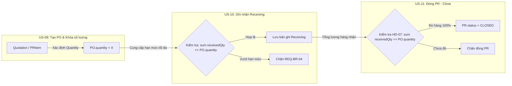

# Human Decision Brief — T-094 Quantity Source

**Tài liệu:** Đánh giá kỹ thuật & đề xuất quyết định kiến trúc (Human Decision Brief)  
**Mã nghiệp vụ liên quan:** `T-094`, `US-09`, `US-10`, `US-11`, `REQ-BR-12`, `REQ-BR-03`, `REQ-BR-04`, `HD-07`, `HD-08`  
**Dự án:** AI Procurement & Purchase Approval System — Group 01  
**Ngày lập:** 2026-09-21  
**Decision ID:** **HD-08**  
**Human Decision:** **DECIDED (Option A Selected)**  
**Decision Date:** 2026-09-21  
**Implementation Status:** **PENDING**  
**Schema Change:** **PENDING**  
**Migration / DB Sync:** **PENDING**  


---

## 1. Current State (Hiện trạng kỹ thuật đã xác minh)

Sau khi hoàn thành **TASK-001**, **TASK-002** và **US-09 BACKEND CORE**, hiện trạng dữ liệu và mã nguồn đã được kiểm chứng bằng runtime evidence:

1. **Model `PurchaseOrder`** (tại `backend/prisma/schema.prisma` và bảng PostgreSQL trên Supabase):
   - `id`: String @id
   - `purchaseRequestId`: String (FK -> `PurchaseRequest`)
   - `quotationId`: String (FK -> `Quotation`)
   - `poNumber`: String @unique
   - `creatorId`: String (FK -> `User`)
   - `totalAmount`: Decimal (khóa 100% từ Quotation server-side)
   - **`quantity`: Int** (`NOT NULL` — đã được bổ sung ở TASK-002 để làm điều kiện chặn cho US-10 Receiving và US-11 Close PR)
   - `status`: String @default("SENT")
   - `created_at`: DateTime

2. **Model `Quotation`** (tại `backend/prisma/schema.prisma` và bảng PostgreSQL trên Supabase):
   - `id`: String @id
   - `purchaseRequestId`: String (FK -> `PurchaseRequest`)
   - `supplierId`: String (FK -> `Supplier`)
   - `totalAmount`: Decimal (tổng giá trị báo giá)
   - `deliveryDays`: Int
   - `warrantyTerms`: String?
   - `fileUrl`: String
   - `isAnomaly`: Boolean
   - `anomalyReason`: String?
   - **HIỆN TẠI KHÔNG CÓ TRƯỜNG `quantity`** (và cũng không có `unitPrice`).

3. **Backend Service & API (`US-09`)**:
   - Khắc phục triệt để lỗi **BUG-001 (HD-04)**: Chặn 100% việc tạo PO nếu PR chưa ở trạng thái `APPROVED`.
   - Server-side quotation resolution (**REQ-BR-12**): API `/api/po` chỉ nhận ID, truy vấn dữ liệu từ DB, bỏ qua hoàn toàn các giá trị đơn giá/số lượng client gửi lên.
   - Khóa giá thương mại (**REQ-BR-03**): `PO.totalAmount` khóa 100% theo `Quotation.totalAmount`.
   - 19/19 automated tests PASS (`backend/tests/test_us09_po.py`).

---

## 2. Business Rule (Quy tắc nghiệp vụ cốt lõi)

Căn cứ theo tài liệu đặc tả chính thức:
- **T-094** (`docs/project/backlog.md` & `docs/IMPLEMENTATION_PLAN.md`): *"Đảm bảo đơn giá và số lượng trên PO khớp Quotation"*.
- **REQ-BR-12** (`docs/01-discovery/requirements.md`): *"Purchase Order phải sử dụng Supplier và thông tin thương mại từ Quotation đã được Procurement lựa chọn. Mọi thay đổi so với Quotation phải được xác nhận theo quy trình được phép"*.
- **REQ-BR-03** (`docs/01-discovery/requirements.md`): *"Khóa giá thương mại 100% từ Quotation đã chọn, client không được tự ý sửa đổi giá trên PO"*.
- **US-09 AC3** (`docs/03-product/user-story.md`): *"Given thông tin Quotation đã được lựa chọn cho Purchase Order, When Purchase Order được tạo, Then thông tin được sử dụng để tạo PO được giữ nguyên"*.
- **REQ-BR-04 / ASM-06 / US-10 AC2**: *"Tổng số lượng nhận hàng trong Receiving không được vượt quá số lượng trên PO (`sum(receivedQty) <= PO.quantity`)"*.
- **HD-07 / US-11 AC1**: *"Purchase Request chỉ được phép đóng (Close PR) khi toàn bộ hàng hóa trên PO đã được nhận đầy đủ (`sum(receivedQty) == PO.quantity`)"*.

---

## 3. Data Model Gap (Khoảng cách mô hình dữ liệu)

### Vấn đề cốt lõi:
- **Nghịch lý thiết kế**: Yêu cầu nghiệp vụ `T-094` ghi nhận: *"số lượng trên PO khớp Quotation"*. Tuy nhiên, mô hình `Quotation` trong `schema.prisma` từ đầu chỉ quản lý giá trị tổng (`totalAmount`), ngày giao hàng, bảo hành và file đính kèm, **không chứa trường số lượng (`quantity`)**.
- Trong khi đó, **TASK-002** vừa thêm trường `quantity Int` vào bảng `PurchaseOrder` (cột `NOT NULL` trên Supabase PostgreSQL) để phục vụ việc kiểm tra nhận hàng ở **US-10** và đóng PR ở **US-11**.
- **Hệ quả kỹ thuật**:
  - Khi tạo bản ghi `PurchaseOrder` trên PostgreSQL thật, Prisma Client bắt buộc phải có giá trị số nguyên cho `quantity`.
  - Backend tuyệt đối **KHÔNG ĐƯỢC** lấy `quantity` từ client gửi lên (vi phạm REQ-BR-12).
  - Backend tuyệt đối **KHÔNG ĐƯỢC** suy diễn giá trị tùy tiện như `quantity = 1` (vi phạm tính xác thực dữ liệu).
  - Model `Quotation` trên DB hiện tại lại không thể cung cấp `quantity`.

Do đó, phát sinh **DATA MODEL GAP** ngăn cản việc hoàn tất 100% T-094 trên Supabase PostgreSQL thật cho đến khi có **Human Decision** phê duyệt phương án xử lý nguồn dữ liệu `quantity`.

---

## 4. Option A — Thêm trường `quantity Int` vào Model `Quotation`

### Mô tả giải pháp:
1. Sửa file `backend/prisma/schema.prisma`, thêm vào model `Quotation`:
   ```prisma
   model Quotation {
     ...
     totalAmount       Decimal         @db.Decimal(18, 2)
     quantity          Int             @default(1)
     ...
   }
   ```
2. Thực thi `prisma db push` để cập nhật bảng `Quotation` trên Supabase PostgreSQL.
3. Sinh lại Prisma Client Python.
4. Cập nhật `AIService.compare_quotations` và API so sánh báo giá để lưu `quantity` vào DB Quotation.
5. `ProcurementService.create_po()` sẽ đọc trực tiếp: `PO.quantity = quotation.quantity`.

### Ưu điểm:
- Đáp ứng 100% nghĩa đen của task **T-094**: Số lượng PO lấy trực tiếp, đối soát 1:1 từ Quotation.
- Truy vết (Traceability) cực kỳ minh bạch và trực quan: `Quotation.quantity` -> `PurchaseOrder.quantity`.
- Không phụ thuộc vào cấu trúc của PRItem hay bất kỳ bảng trung gian nào.

### Rủi ro & Tác động:
- Cần chạy một lượt migration schema trên Supabase PostgreSQL.
- Cần cập nhật hàm seed dữ liệu ở TASK-003 để bổ sung trường `quantity` cho các bản ghi mẫu Quotation.
- Cần bổ sung cột/trường `Số lượng` vào giao diện so sánh Quotation ở Frontend (nếu cần hiển thị).

---

## 5. Option B — Giữ nguyên `Quotation`, lấy `quantity` từ `PRItem.quantity`

### Mô tả giải pháp:
1. Giữ nguyên mô hình `Quotation` hiện tại, không thay đổi database schema của Quotation.
2. Xác định cơ chế nghiệp vụ: Báo giá (`Quotation`) là báo giá trọn gói để đáp ứng đúng danh mục mặt hàng yêu cầu trong Purchase Request. Do đó, số lượng đặt mua trên PO được kế thừa trực tiếp từ dòng yêu cầu mua sắm ban đầu trong `PRItem.quantity` (hoặc tổng `quantity` các items thuộc PR).
3. `ProcurementService.create_po()` sẽ truy vấn:
   `PO.quantity = sum(item.quantity for item in pr.items)` (hoặc lấy từ `PRItem` chính của PR).
   `PO.totalAmount = quotation.totalAmount`.

### Ưu điểm:
- **Zero Schema Change**: Không cần can thiệp hay chạy migration sửa bảng `Quotation` trên Supabase PostgreSQL.
- Phù hợp với thực tế nhiều quy trình thu mua: Nhà cung cấp báo giá theo RFQ dựa trên đúng số lượng hàng được yêu cầu trong PR.
- Tận dụng trường `PRItem.quantity Int` đã có sẵn trong schema từ đầu.

### Rủi ro & Tác động:
- Cần cập nhật tài liệu giải trình cho giảng viên/hội đồng: Giải thích rõ lý do T-094 lấy đơn giá từ Quotation và số lượng từ PRItem (kế thừa từ PR sang PO thông qua Quotation đã duyệt).
- Nếu một PR có nhiều PRItem khác nhau (multi-item), việc tính tổng số lượng gộp chung vào 1 trường `PO.quantity` có thể gây khó khăn nếu các mặt hàng có đơn vị tính khác nhau.

---

## 6. Option C — Thiết kế bảng Quotation Line Items riêng (`QuotationItem`)

### Mô tả giải pháp:
1. Tách cấu trúc báo giá thành 2 cấp độ chuyên nghiệp chuẩn ERP:
   - `Quotation` (Header: nhà cung cấp, ngày giao hàng, điều khoản, tổng tiền).
   - `QuotationItem` (Line items: `itemName`, `quantity`, `unitPrice`, liên kết FK với `PRItem`).
2. Tương tự, tách `PurchaseOrder` thành `PurchaseOrder` (Header) và `PurchaseOrderItem` (Lines).
3. Tạo migration lớn trên Supabase PostgreSQL.

### Ưu điểm:
- Chuẩn mực nhất về mặt kiến trúc hệ thống quản trị mua hàng (ERP-grade design).
- Hỗ trợ hoàn hảo cho việc thu mua nhiều mặt hàng chi tiết trong cùng một đơn hàng.

### Rủi ro & Tác động:
- **CỰC KỲ NGUY HIỂM VỀ MẶT THỜI GIAN / TIẾN ĐỘ**: Đòi hỏi đập đi xây lại toàn bộ schema, API bóc tách AI, so sánh Quotation, tạo PO, Receiving theo line item, và toàn bộ giao diện Frontend.
- Không thể hoàn thành trong khoảng thời gian còn lại trước deadline bảo vệ đồ án.

---

## 7. Impact Analysis (Ma trận phân tích tác động 16 tiêu chí)

| STT | Tiêu chí đánh giá | Option A (Thêm `Quotation.quantity`) | Option B (Lấy từ `PRItem.quantity`) | Option C (Tách `QuotationItem`) |
|:---:|:---|:---|:---|:---|
| **1** | **T-094** (Khớp giá & số lượng) | **Thỏa mãn 100% trực tiếp**: Lấy cả giá và lượng từ Quotation. | **Thỏa mãn gián tiếp**: Giá từ Quotation, lượng từ PRItem. | **Thỏa mãn hoàn hảo** trên từng dòng mặt hàng. |
| **2** | **US-09** (Tạo PO) | PO đọc `quote.totalAmount` và `quote.quantity`. Cực kỳ đơn giản. | PO đọc `quote.totalAmount` và `pr.items.quantity`. Dễ cài đặt. | Phải map từng dòng item giữa PR, Quote và PO. Phức tạp cao. |
| **3** | **US-05** (Thu thập báo giá) | Cần trích xuất thêm trường `quantity` trong báo giá. | Không cần thay đổi luồng thu thập báo giá hiện tại. | Phải lưu mảng items chi tiết cho mỗi báo giá. |
| **4** | **US-06** (So sánh báo giá) | Bảng so sánh có thêm cột số lượng để đối chiếu. | Giữ nguyên bảng so sánh theo tổng giá và tiêu chí hiện tại. | Phải làm giao diện so sánh theo từng line item. |
| **5** | **US-07** (AI Recommendation) | AI xem xét cả đơn giá x số lượng để phân tích. | Giữ nguyên logic prompt so sánh hiện tại. | Phải cấu trúc prompt phân tích đa dòng phức tạp. |
| **6** | **US-08** (AI cảnh báo bất thường)| Đơn giá = `totalAmount / quantity` -> Kiểm tra bất thường chính xác. | Đơn giá = `totalAmount / PRItem.qty` -> Kiểm tra tương đương. | Cảnh báo bất thường trên từng item riêng lẻ. |
| **7** | **US-10** (Receiving Guard) | Đối soát `receivedQty <= PO.quantity` thông suốt. | Đối soát `receivedQty <= PO.quantity` thông suốt. | Đối soát nhận hàng trên từng item chi tiết. |
| **8** | **US-11** (Close PR Guard) | Đối soát `sum(receivedQty) == PO.quantity` thông suốt. | Đối soát `sum(receivedQty) == PO.quantity` thông suốt. | Đối soát đóng PR khi tất cả line items nhận đủ. |
| **9** | **Prisma Schema** | Sửa 1 dòng trong model `Quotation`: `quantity Int @default(1)`. | **Không sửa schema**. | Tạo thêm 2 model mới, sửa quan hệ 4 model cũ. |
| **10** | **Supabase PostgreSQL** | Chạy `prisma db push` thêm 1 cột `quantity` (10 giây). | **Không tác động database**. | Chạy migration lớn, cấu trúc lại khóa ngoại. |
| **11** | **Backend API** | Cập nhật router `/api/quotations` và `/api/po`. | Chỉ cập nhật logic lấy quantity trong service `create_po`. | Viết lại toàn bộ controller PR, Quote, PO, Receiving. |
| **12** | **Frontend** | Hiển thị thêm số lượng trong card báo giá (tùy chọn). | **Không cần sửa frontend** hiện tại. | Phải thiết kế lại toàn bộ bảng và form đa dòng. |
| **13** | **Tests** | Bổ sung test kiểm tra `quote.quantity == po.quantity`. | Bổ sung test kiểm tra `pr_item.quantity == po.quantity`. | Viết lại toàn bộ test suite. |
| **14** | **Demo Flow** | Luồng demo mượt mà, dễ giải thích cho giảng viên. | Luồng demo mượt mà, logic thực tế dễ hiểu. | Rất khó demo đúng trong thời gian ngắn nếu phát sinh lỗi. |
| **15** | **Traceability** | Truy vết 1:1 trực tiếp theo yêu cầu của giáo trình. | Truy vết qua liên kết PR -> PRItem -> PO. | Truy vết chi tiết nhưng vượt mức yêu cầu môn học. |
| **16** | **Thời gian thực hiện** | **~15 - 20 phút** (rất an toàn cho deadline). | **~10 - 15 phút** (rất an toàn cho deadline). | **> 2 - 3 ngày** (nguy cơ trễ deadline nghiêm trọng). |

---

## 8. Recommendation for Human Decision (Khuyến nghị kỹ thuật)

Dưới góc độ kỹ thuật và bối cảnh môn học:

1. **LOẠI TRỪ OPTION C**: Option C (tách bảng Line Items) là giải pháp đúng chuẩn công nghiệp nhưng hoàn toàn không khả thi về mặt thời gian, gây nguy cơ đổ vỡ dây chuyền cho toàn bộ dự án sát ngày nộp bài.

2. **SO SÁNH OPTION A VÀ OPTION B**:
   - **Option A (Thêm `Quotation.quantity Int`)**:
     - *Ưu điểm lớn nhất*: Giữ đúng 100% câu chữ của backlog task `T-094` và báo cáo viva. Khi giảng viên hỏi *"Hệ thống kiểm tra số lượng trên PO khớp Quotation như thế nào?"*, sinh viên có thể chỉ trực tiếp vào database: `PurchaseOrder.quantity == Quotation.quantity`.
     - *Độ phức tạp*: Thấp. Chỉ thêm 1 cột đơn giản vào schema và sync DB trong 1 lệnh `prisma db push`.
   - **Option B (Lấy từ `PRItem.quantity`)**:
     - *Ưu điểm lớn nhất*: Không cần đụng vào schema hay DB migration.
     - *Điểm cần lưu ý*: Cần giải trình trong phần thuyết trình rằng Quotation kế thừa số lượng từ PRItem và PO nhận số lượng đó.

👉 **Khuyến nghị kỹ thuật từ Agent**: **OPTION A** là phương án tối ưu nhất để vừa thỏa mãn yêu cầu nghiệm thu môn học (T-094 khớp chữ), vừa đơn giản, an toàn và dễ bảo vệ trước hội đồng chấm thi.

---

## 9. Required Human Decision (Kết quả phê duyệt chính thức)

Thành viên phụ trách và Human PO / Engineering đã chính thức đưa ra quyết định:

> **"Số lượng (`quantity`) trên Purchase Order trong T-094 sẽ được xác định từ nguồn dữ liệu nào?"**

- [x] **LỰA CHỌN 1 — CHỌN OPTION A (ĐÃ PHÊ DUYỆT / CHỐT CHÍNH THỨC — HD-08)**: Bổ sung `Quotation.quantity` làm nguồn dữ liệu server-side cho `PurchaseOrder.quantity`.  
  *(Lưu ý về Default Value: Việc có sử dụng `@default(1)` hay không sẽ được xác định trong bước implementation/schema design tiếp theo dựa trên requirement và flow tạo quotation; không áp đặt giá trị mặc định làm business rule cứng).*
- [ ] ~~**LỰA CHỌN 2 — CHỌN OPTION B**~~: Giữ nguyên schema `Quotation`, xác định nguồn dữ liệu của `PO.quantity` kế thừa từ `PRItem.quantity`. *(Không chọn)*
- [ ] ~~**LỰA CHỌN 3 — CHỌN OPTION C**~~: Tái cấu trúc sang mô hình Line Items chi tiết. *(Không chọn)*

**Trạng thái thực thi sau quyết định:**
- **Decision Status:** DECIDED (HD-08)
- **Schema Modification:** PENDING (Chưa sửa `schema.prisma`)
- **Database Push:** PENDING (Chưa chạy `prisma db push`)
- **Backend Service Logic:** PENDING (Chưa sửa runtime logic gán `PO.quantity = quotation.quantity`)


---

## 10. Downstream Impact (Tác động mắt xích US-09 → US-10 → US-11)

Quyết định này là điều kiện tiên quyết (Prerequisite) để triển khai thông suốt 2 User Story tiếp theo:



- **Đối với US-10 (Ghi nhận Receiving)**: Bảng `Receiving` lưu `receivedQty`. Nếu `PO.quantity` không có giá trị chính xác từ nguồn server-side tin cậy, quy tắc chặn nhận hàng vượt định mức (**REQ-BR-04**) sẽ không thể thực thi chính xác.
- **Đối với US-11 (Close PR)**: Quyết định kiến trúc **HD-07** bắt buộc PR chỉ được đóng khi tổng số lượng nhận thực tế bằng đúng số lượng đặt hàng trên PO (`sum(receivedQty) == PO.quantity`). Nếu nguồn `PO.quantity` bị sai lệch hoặc rỗng, luồng kết thúc quy trình mua sắm sẽ bị tê liệt hoàn toàn.

---
*Tài liệu này được tạo tự động bởi Antigravity AI Assistant nhằm mục đích phân tích kỹ thuật độc lập và hỗ trợ ra quyết định. Không có bất kỳ thay đổi nào đối với source code, schema hoặc database được thực hiện trong bước này.*
