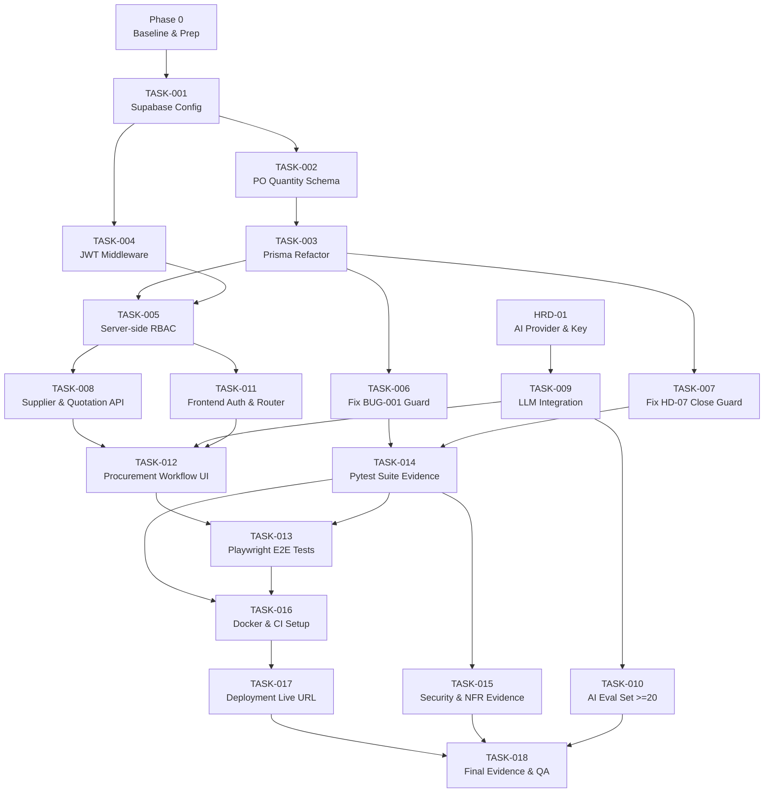

# IMPLEMENTATION PLAN
**Project:** AI Procurement & Purchase Approval System  
**Course:** Thực hành lập trình ứng dụng trong doanh nghiệp bằng AI  
**Group:** Group 01 · Branch: `final-delivery`  
**Plan Date:** 2026-09-21  

> **This is an implementation plan, not evidence that the planned work has already been completed.**  
> All task statuses default to PLANNED unless source code evidence confirms otherwise.

---

## 1. Purpose

> **Source of Truth Notice:** File `docs/IMPLEMENTATION_PLAN.md` là SOURCE OF TRUTH DUY NHẤT của toàn bộ kế hoạch triển khai dự án. Bản nháp `docs/IMPLEMENTATION_PLAN_DRAFT.md` đã được dọn dẹp và xóa bỏ sau khi nhóm đối soát xác nhận.

Tài liệu này là bản kế hoạch triển khai chính thức (Implementation Plan), dùng để:
- Lập kế hoạch triển khai với dependency kỹ thuật, thứ tự thực thi và phân công công việc rõ ràng cho nhóm 5 thành viên.
- Phân định rõ ràng **cấu trúc 2 tầng trách nhiệm User Story** theo yêu cầu của giảng viên môn học:
  * **Tầng 1 — 5 Primary Presentation Stories:** Mỗi thành viên sở hữu đúng 1 User Story để trình bày độc lập (~5 phút) và bảo vệ Viva.
  * **Tầng 2 — 6 Supporting Implementation Stories:** Phân bổ cho 5 thành viên dưới dạng công việc kỹ thuật bổ trợ, bảo đảm 100% phạm vi hệ thống/MVP trong Project Backlog được triển khai và kiểm thử đầy đủ.
- Phân biệt tuyệt đối giữa **Backlog Tasks (T-xxx)** (nghiệp vụ do giảng viên/Project Backlog quy định) và **Implementation Tasks (TASK-xxx)** (công việc kỹ thuật của nhóm).
- Thiết lập chuỗi truy xuất nguồn gốc hai chiều xuyên suốt:  
  `Requirement → Business Rule → User Story → Backlog Task (T-xxx) → Implementation Task (TASK-xxx) → Code Module → Automated Test → Execution Evidence → Git Commit/PR → 5-Minute Demo → Viva Defense`.
- Làm căn cứ kỹ thuật chính thức và duy nhất cho toàn bộ quá trình coding, testing, nghiệm thu và chấm điểm.

---

## 2. Project Context & Ownership Model

### 2.1. Cấu trúc phân công 2 tầng (Two-Tier Story Assignment)

Nhóm có **5 thành viên**. Giảng viên yêu cầu tại buổi bảo vệ cuối kỳ, **mỗi thành viên chỉ trình bày 1 User Story trong khoảng 5 phút**. Do đó, toàn bộ 11 User Story của Project Backlog được phân bổ theo mô hình 2 tầng sau:

#### A. 5 PRIMARY PRESENTATION STORIES (Khung trình bày chính 5 phút)
Mỗi thành viên làm **Primary Owner duy nhất cho đúng 1 User Story**. Thành viên này chịu trách nhiệm toàn diện từ khâu đặc tả, điều phối kỹ thuật, kiểm thử, thu thập bằng chứng, chuẩn bị kịch bản demo 5 phút và trả lời vấn đáp Viva:

| Thành viên | Primary Presentation Story | Epic liên quan | Yêu cầu cốt lõi |
|---|---|---|---|
| Nguyễn Trương Thuỳ **Dương** | **US-01** — Tạo và chuẩn hóa Purchase Request | EPIC-01 (Purchase Request) | Form tạo PR, AI hỗ trợ điền & chuẩn hóa, kiểm tra thông tin bắt buộc trước submit. |
| Nguyễn Trúc **Lam** | **US-03** — Xem và xử lý Approval | EPIC-02 (Approval & Budget) | Manager inbox, phê duyệt/từ chối/yêu cầu sửa PR, server-side RBAC guard, audit trail. |
| Nguyễn Thị Thuỳ **Dung** | **US-05** — Quản lý Supplier và thu thập Quotation | EPIC-03 (Supplier & Quotation) | Quản lý nhà cung cấp, thu thập và liên kết báo giá khi PR đã được Approved. |
| Trần Thị Kiều **Giang** | **US-07** — AI phân tích và Recommendation | EPIC-03 (Supplier & Quotation) | Mô hình Hybrid LLM so sánh báo giá, đề xuất nhà cung cấp tối ưu kèm giải thích logic. |
| Trần Thị Thu **Hà** | **US-09** — Lựa chọn Supplier và tạo Purchase Order | EPIC-04 (Purchase Order) | Chọn báo giá trúng thầu, tạo PO khớp số lượng/đơn giá, chặn tạo PO khi PR chưa duyệt (HD-04). |

#### B. 6 SUPPORTING IMPLEMENTATION STORIES (Công việc kỹ thuật bổ trợ)
6 User Story còn lại **thuộc phạm vi hệ thống/MVP và bắt buộc phải triển khai** theo yêu cầu môn học. Nhóm phân bổ các User Story này dưới dạng **Supporting Implementation Work** dựa trên quan hệ nghiệp vụ trực tiếp và cân bằng khối lượng kỹ thuật:

> **Important Note on Supporting Assignment:** "Supporting Assignee is an implementation responsibility only and does not create a second Primary Presentation Story." (Trách nhiệm của Supporting Assignee chỉ thuần túy là thực hiện phần việc kỹ thuật được phân bổ, tuyệt đối không tạo thành Primary Presentation Story thứ hai của bất kỳ thành viên nào).

| User Story bổ trợ | Tên User Story | Backlog Tasks | Supporting Assignee (Người hỗ trợ triển khai) | Cơ sở nghiệp vụ & kỹ thuật |
|---|---|---|---|---|
| **US-02** | Theo dõi Purchase Request | T-021 | **Dương** (hỗ trợ bởi Lam) | Gắn liền trực tiếp với vòng đời Purchase Request do Dương phụ trách ở US-01. |
| **US-04** | Kiểm tra Budget | T-041, T-042 | **Lam** (hỗ trợ bởi Dương) | Gắn liền với quy trình duyệt PR của Manager ở US-03 (hiển thị Budget Warning và từ chối khi vượt ngân sách). |
| **US-06** | So sánh Quotation | T-061, T-062, T-063 | **Dung** (hỗ trợ bởi Giang) | Dữ liệu so sánh lấy trực tiếp từ các Quotation thu thập ở US-05 do Dung phụ trách; Giang hỗ trợ hiển thị so sánh. |
| **US-08** | AI cảnh báo bất thường | T-081, T-082, T-083 | **Giang** (hỗ trợ bởi Dung) | Gắn liền dịch vụ AI của Giang ở US-07 (phát hiện giá lệch ≥20% so với đơn giá lịch sử); Dung hỗ trợ dữ liệu lịch sử giá. |
| **US-10** | Ghi nhận Receiving | T-101, T-102, T-103 | **Hà** (hỗ trợ bởi Dung) | Kế thừa trực tiếp từ Purchase Order ở US-09 của Hà; Dung hỗ trợ giao diện ghi nhận hàng giao từ NCC. |
| **US-11** | Close Purchase Request | T-111 | **Hà** (hỗ trợ bởi Lam) | Điều kiện đóng PR phụ thuộc vào PO (US-09) và tổng lượng hàng nhận (US-10) theo guard HD-07; Lam hỗ trợ luồng kết thúc PR. |

### 2.2. Các quy tắc phân công bất di bất dịch
1. **Duy nhất 1 Primary Presentation Story:** Tuyệt đối không gán thêm Primary Owner thứ hai cho bất kỳ ai. Mỗi thành viên chỉ đại diện cho 1 User Story duy nhất trong bài thuyết trình 5 phút.
2. **Không bỏ sót 6 Supporting Stories:** 6 User Story bổ trợ không phải là "tùy chọn" hay "bị hủy", mà là các module chức năng bắt buộc hoàn thiện để hệ thống chạy thông suốt end-to-end.
3. **Phân biệt rành mạch T-xxx và TASK-xxx:** 
   - `T-xxx`: Business Task do Project Backlog quy định (27 tasks từ T-011 đến T-111).
   - `TASK-xxx`: Technical Implementation Task do nhóm quy hoạch (18 tasks từ TASK-001 đến TASK-018).
4. **Primary Owner ≠ Technical Role:** Trách nhiệm của Primary Owner kéo dài xuyên suốt toàn bộ vòng đời (Requirements → Design → Code → Unit Test → E2E Test → Evidence → Commit/PR → Demo → Viva).

---

## 3. Current Baseline (Verified from Source Code)

| Area | Current State (FACT — từ source) | Target State |
|---|---|---|
| **Database** | `procurement_service.py` dùng `MockDatabase` (Python dict in-memory). `schema.prisma` khai báo `provider = "postgresql"` nhưng backend chưa tích hợp Prisma Client runtime. | Supabase PostgreSQL, Prisma Client runtime persistence. |
| **PO Quantity** | `schema.prisma` model `PurchaseOrder` **không có trường `quantity`**. | Thêm `quantity Int` vào model `PurchaseOrder` và migrate. |
| **PR Approval Guard** | `create_po()` **không kiểm tra** `pr.status == "APPROVED"`. Lỗi BUG-001 tồn tại. | Enforce guard bắt buộc kiểm tra PR APPROVED (HD-04 / REQ-BR-10). |
| **Close PR Guard** | `close_pr()` **không kiểm tra** receiving completion. | Enforce guard `SUM(receivedQty) >= PO.quantity` (HD-07 / REQ-BR-11). |
| **Authentication** | `auth.py` trả về chuỗi giả lập `"mock-jwt-token-for-{email}"`. Chưa có JWT thật. | Supabase Auth login, FastAPI verify JWT signature & expiry locally. |
| **RBAC** | Không có middleware. Endpoint tin tưởng `approverRole` do client gửi trong body. | Server-side role resolution từ DB, guards trả về 401 Unauthorized / 403 Forbidden. |
| **AI Feature** | `ai_service.py` dùng Regex và hardcoded prices. Chưa gọi LLM API ngoài. | Hybrid Architecture: Real LLM API (Gemini/OpenAI) + Pydantic validation + deterministic backend guards. |
| **Frontend** | `App.tsx` là single-page monolith (~418 dòng), không có login, không lưu JWT state, không có routing. | React Router (v6/v7), Supabase Auth login, JWT Bearer interceptor, role-aware UI pages. |
| **Tests** | `test_business_rules.py` có 4 unit tests sơ khai. Chưa test HD-04, HD-07. Chưa có test execution evidence (CI HTML log). | Pytest automated test suite đầy đủ cho 100% business rules, xuất HTML report. |
| **E2E Testing** | Các file Playwright spec trong `docs/06-testing/` có selector không khớp `App.tsx`. | Playwright E2E chạy thực tế trên frontend hoàn chỉnh, test các critical flows, xuất HTML report. |
| **CI/CD & Docker** | Chưa có `Dockerfile`, chưa có `.github/workflows/`, chưa có Live Deployment URL. | Dockerfile chuẩn hóa, GitHub Actions CI pipeline, Backend & Frontend deployed Live URL. |

---

## 4. Implementation Principles

1. **Backend & Business Rules là Single Source of Truth:** Frontend và Figma chỉ phục vụ UI/UX; mọi quyết định trạng thái, quyền hạn, dữ liệu đều do backend kiểm soát.
2. **AI không thay thế Business Authority:** AI chỉ phân tích, chuẩn hóa văn bản và đưa ra gợi ý/khuyến nghị; không được cấp quyền ghi trực tiếp vào DB hoặc thay đổi trạng thái quy trình.
3. **Tuyệt đối không tin tưởng Client Payload:** Quyền của người dùng (RBAC) phải được truy vấn từ Database trên server dựa trên `user_id` đã được giải mã từ JWT hợp lệ.
4. **Mọi Business Rule quan trọng phải có Automated Test:** Mọi quy tắc phê duyệt, giới hạn ngân sách (BR-01), phân cấp phê duyệt (BR-02), điều kiện tạo PO (HD-04) và điều kiện đóng PR (HD-07) phải có unit test tự động bảo vệ.
5. **Completed Task phải có bằng chứng thực nghiệm (Execution Evidence):** Một task chỉ được xem là hoàn thành khi có bằng chứng thực tế (screenshot, execution log, test report); không chấp nhận báo cáo suông.
6. **Không tuyên bố PASS nếu chưa chạy thực tế:** Trạng thái mặc định là PLANNED hoặc NOT VERIFIED. Chỉ chuyển PASS khi có execution log thật.
7. **Phân biệt rõ ràng:** `Decision ≠ Implementation ≠ Evidence` — Ba khái niệm độc lập, không được đánh đồng.
8. **Không code khi Acceptance Criteria chưa rõ ràng:** Luôn tuân thủ Definition of Ready trước khi bắt tay viết code.
9. **Secrets và API Keys không commit vào Git:** Tuyệt đối không đưa credentials, private keys hoặc API keys vào repository; luôn sử dụng biến môi trường qua `.env`.
10. **Figma là tham chiếu UI, không phải Business Rules:** Nếu có sự mâu thuẫn giữa thiết kế Figma và đặc tả nghiệp vụ backend, backend rules luôn được ưu tiên áp dụng.
11. **Ghi nhận Human Decision khi có mâu thuẫn:** Không tự ý suy diễn hoặc bịa đặt yêu cầu khi gặp điểm nghẽn chưa có quyết định của nhóm.
12. **Duy trì tính toàn vẹn của Source of Truth:** Bản kế hoạch này (`docs/IMPLEMENTATION_PLAN.md`) là tài liệu duy nhất có hiệu lực thi hành; các bản nháp khác chỉ dùng tham chiếu lịch sử.

---

## 5. Phase Overview

| Phase | Name | Goal | Dependencies | Main Outputs | Exit Criteria |
|---|---|---|---|---|---|
| **Phase 0** | Baseline & Environment Prep | Đồng bộ môi trường local, cấu hình `.env.example`, chuẩn bị tài khoản Supabase & API keys. | None | Mọi thành viên chạy được backend & frontend local. | Backend start không crash, Git branch sạch sẽ. |
| **Phase 1** | Database & Persistence | Kết nối Supabase Postgres thật, migrate schema có trường `quantity`. | Phase 0 | Prisma schema cập nhật, migration script, kết nối DB thật. | `prisma db push` thành công, tables xuất hiện trên Supabase. |
| **Phase 2** | Authentication Foundation | Tích hợp Supabase Auth, verify JWT token thật trên FastAPI. | Phase 1 | Middleware xác thực JWT trên FastAPI. | Endpoint trả về HTTP 401 khi thiếu hoặc sai token. |
| **Phase 3** | Server-Side RBAC | Phân quyền vai trò người dùng (Employee, Manager, Procurement, Finance) trên server. | Phase 2 | Role resolution từ DB + `@require_role` decorator. | Endpoint trả về HTTP 403 khi sai quyền người dùng. |
| **Phase 4** | Core Business Rules & Guards | Cài đặt các guard nghiệp vụ cốt lõi: HD-04 (BUG-001) và HD-07 (Receiving guard). | Phase 1 | Logic guard trong `procurement_service.py` + unit tests. | Pytest cho HD-04 và HD-07 PASS 100%. |
| **Phase 5** | Supplier & Quotation Services | Xây dựng API quản lý nhà cung cấp và thu thập/so sánh báo giá (US-05, US-06). | Phase 1, Phase 3 | REST APIs cho Supplier CRUD, Quotation upload & linking. | API endpoints hoạt động với DB thật, có log xác thực. |
| **Phase 6** | AI Feature & Evaluation Suite | Thay thế Regex bằng Hybrid LLM API thật và xây dựng bộ AI Evaluation Set ≥20 cases. | Phase 0 (HRD-01) | `ai_service.py` gọi LLM thật, Pydantic parser, AI Eval test suite. | AI Eval script chạy thành công ≥20 test cases, format chuẩn. |
| **Phase 7** | Frontend Modularization & UI | Tái cấu trúc frontend: React Router, Supabase Auth Login, xây dựng UI cho 11 User Stories. | Phase 2, 3, 4, 5, 6 | Ứng dụng web đa trang, phân quyền màn hình theo role, form thao tác. | Toàn bộ luồng nghiệp vụ thao tác được trên giao diện web. |
| **Phase 8** | Automated Backend Testing | Xây dựng bộ test tự động toàn diện và trích xuất execution evidence. | Phase 4, 5, 6 | Pytest test suite toàn diện, HTML test report. | Tất cả unit/integration tests PASS, log lưu trữ đầy đủ. |
| **Phase 9** | Critical-Path E2E Testing | Tự động hóa kiểm thử luồng chính end-to-end bằng Playwright trên giao diện thật. | Phase 7, Phase 8 | Bộ kịch bản Playwright E2E, HTML execution report. | Các critical path flows PASS trên web app thật. |
| **Phase 10** | Security & NFR Verification | Kiểm tra và thu thập bằng chứng phi chức năng (401/403 guards, SQL injection, secrets). | Phase 3, Phase 8 | Báo cáo `security-nfr.md` kèm execution logs. | 100% bằng chứng bảo mật được ghi nhận thực tế. |
| **Phase 11** | Docker, CI/CD & Deployment | Đóng gói container Docker, cấu hình GitHub Actions CI, deploy Backend & Frontend lên Live URL. | Phase 8, Phase 9 | `Dockerfile`, `.github/workflows/ci.yml`, Live URLs công khai. | CI pipeline build & test green, hệ thống truy cập được qua internet. |
| **Phase 12** | Evidence Packaging & Final QA | Đóng gói toàn bộ evidence, cập nhật Compliance Matrix theo thực tế, hoàn thiện Runbook. | Phase 11 | Compliance Matrix cập nhật, Final QA Report, Runbook & Viva Notes. | 100% deliverables sẵn sàng cho buổi bảo vệ cuối kỳ. |

> **Lưu ý về Phase 12:** Mục tiêu là cập nhật Compliance Matrix dựa trên **bằng chứng thực tế thu được**, không được ép trạng thái thành COMPLETE/GREEN nếu chưa có bằng chứng tương ứng.

---

## 6. Detailed Implementation Tasks

---

### TASK-001 — Configure Supabase & Verify Prisma Connection

- **Related Epic:** CROSS-CUTTING (Database Foundation)
- **Related User Story:** Cung cấp nền tảng lưu trữ cho toàn bộ 11 User Stories
- **Related Backlog Tasks:** N/A (Technical Infrastructure)
- **Primary Presentation Owner:** Shared Infrastructure
- **Supporting Implementation Assigned:** Tất cả thành viên
- **Dependency:** Phase 0 (Chuẩn bị repository và biến môi trường local)
- **Deliverable:** Kết nối Supabase PostgreSQL thành công, file `schema.prisma` được đồng bộ.
- **Test / Evidence:** Script kiểm tra kết nối DB (`SELECT 1`), log `prisma db push`.
- **Status:** PLANNED

**Current State:** Backend đang chạy trên `MockDatabase` in-memory dict trong `procurement_service.py`. Dữ liệu biến mất sau mỗi lần restart server. `schema.prisma` đã khai báo PostgreSQL nhưng chưa kết nối thực tế.  
**Target State:** Supabase PostgreSQL project được khởi tạo. Biến `DATABASE_URL` trong `.env` hoạt động ổn định. Schema được push thành công lên Supabase.

**Dependencies:** Phase 0  
**Potential Blockers:** Cần tài khoản Supabase; xác định region phù hợp (ưu tiên Singapore).

**Files / Modules Expected to Change:**
- `backend/.env` (cấu hình `DATABASE_URL` — không commit Git)
- `backend/.env.example` (cập nhật mẫu biến môi trường)
- `backend/pyproject.toml` (xác thực dependency `prisma`)

**Implementation Work:**
1. Tạo project trên Supabase, lấy chuỗi kết nối PostgreSQL pooled / direct connection.
2. Thêm chuỗi kết nối vào `backend/.env` (đảm bảo `.env` nằm trong `.gitignore`).
3. Chạy lệnh `prisma generate` để sinh Prisma Client cho Python.
4. Chạy lệnh `prisma db push` để tạo bảng dữ liệu trên Supabase Postgres.
5. Xác minh bảng dữ liệu trên Supabase Table Editor hoặc Prisma Studio.

**Tests Required:**
- Integration Test: Script Python kiểm tra kết nối DB và thực hiện truy vấn `SELECT 1`.

**Evidence Required:**
- Screenshot giao diện Supabase Table Editor hiển thị danh sách các bảng.
- Terminal log của lệnh `prisma db push` thành công không lỗi.

**Acceptance Criteria:**
- [ ] Supabase project hoạt động bình thường.
- [ ] `prisma generate` sinh client không phát sinh lỗi.
- [ ] `prisma db push` tạo đầy đủ các bảng theo `schema.prisma`.
- [ ] Backend khởi động không bị crash vì lỗi kết nối DB.

**Definition of Done:**
- [ ] Kết nối Supabase hoàn tất và được kiểm chứng.
- [ ] Acceptance Criteria đạt 100%.
- [ ] Evidence lưu vào thư mục `docs/evidence/`.
- [ ] `.env.example` được cập nhật đầy đủ.

---

### TASK-002 — Add `quantity` to PurchaseOrder Schema & Apply Migration

- **Related Epic:** EPIC-04 (Purchase Order), EPIC-05 (Receiving & Close)
- **Related User Story:** US-09 (Primary Presentation của Hà), US-11 (Supporting Story)
- **Related Backlog Tasks:** T-093, T-094, T-111
- **Primary Presentation Owner:** Hà (Primary của US-09)
- **Supporting Implementation Assigned:** Hà, Dung
- **Dependency:** TASK-001
- **Deliverable:** Prisma schema có trường `quantity Int` trên model `PurchaseOrder`, migration thành công.
- **Test / Evidence:** Schema inspection log, screenshot cột `quantity` trên Supabase, runtime information_schema inspection.
- **Status:** COMPLETED (PO.quantity Added & Migrated)

**Current State:** Model `PurchaseOrder` trong `schema.prisma` và Supabase PostgreSQL **đã có trường `quantity Int` (NOT NULL)** (hoàn thành tại TASK-002, entry AI-025).  
**Data Model Gap T-094 Resolution:**
- **Human Decision T-094:** **RESOLVED** (Xem [HD-08](file:///d:/LTUD/group-01-project-main/docs/DECISION_LOG.md#L137) và [Human Decision Brief](file:///d:/LTUD/group-01-project-main/docs/HUMAN_DECISION_T094_QUANTITY.md)).
- **Selected Option:** **Option A — Bổ sung `Quotation.quantity` làm nguồn dữ liệu server-side cho `PurchaseOrder.quantity`**.
- **Implementation `Quotation.quantity`:** **PENDING** (sẽ thực hiện trong bước tiếp theo được phê duyệt).

**Dependencies:** TASK-001  
**Potential Blockers:** Đã giải quyết xong việc thêm `PurchaseOrder.quantity`. Khoảng cách dữ liệu giữa `Quotation` và `PurchaseOrder` đã được chốt qua HD-08.

**Files / Modules Expected to Change:**
- `backend/prisma/schema.prisma` (thêm trường `quantity Int` vào model `PurchaseOrder` — ĐÃ XONG)

> **Lưu ý phạm vi:** TASK-002 chỉ phụ trách định nghĩa schema và migration CSDL cho `PurchaseOrder.quantity`. Việc bổ sung `Quotation.quantity` theo quyết định HD-08 và chuyển đổi runtime CSDL sẽ được thực hiện trong các bước tiếp theo.

**Implementation Work:**
1. Mở `backend/prisma/schema.prisma`, thêm dòng `quantity Int` vào `model PurchaseOrder` — **DONE**.
2. Chạy `prisma db push` — **DONE** (exit code 0, in sync in 10.35s).
3. Chạy `prisma generate` để cập nhật Prisma Client — **DONE** (268ms).
4. Kiểm tra trên Supabase Table Editor / information_schema xác nhận cột `quantity` đã xuất hiện — **DONE**.

**Tests Required:**
- Schema Test: Kiểm tra metadata của Prisma Client có nhận diện thuộc tính `quantity` — **PASS**.

**Evidence Required:**
- Screenshot Supabase Dashboard / information_schema query hiển thị cột `quantity` trong bảng `PurchaseOrder` — **PASS**.
- Log lệnh migration chạy thành công — **PASS**.

**Acceptance Criteria:**
- [x] `schema.prisma` có trường `quantity Int` trên `PurchaseOrder`.
- [x] Bảng `PurchaseOrder` trên Supabase có cột `quantity` kiểu `int4`.
- [x] `prisma generate` sinh client tương thích.

**Definition of Done:**
- [x] Schema cập nhật và push thành công lên database.
- [x] Evidence lưu vào tài liệu báo cáo TASK-002 và AI Usage Log (AI-025).


---

### TASK-003 — Refactor Backend Data Access to Use Prisma Client

- **Related Epic:** CROSS-CUTTING (Data Access Layer)
- **Related User Story:** Nền tảng truy xuất dữ liệu cho toàn bộ 11 User Stories
- **Related Backlog Tasks:** N/A (Data Layer Architecture)
- **Primary Presentation Owner:** Shared Infrastructure
- **Supporting Implementation Assigned:** Tất cả thành viên
- **Dependency:** TASK-001, TASK-002
- **Deliverable:** `procurement_service.py` chuyển đổi hoàn toàn từ MockDatabase sang Prisma Client.
- **Test / Evidence:** Integration test thực hiện CRUD các entity trên Supabase.
- **Status:** IN PROGRESS (STEP 0: DONE, STEP 1: DONE, STEP 2A: DONE, HD-REQ-05/06: APPROVED, STEP 2B: DONE, STEP 3A: DONE, HD-REQ-07/08: APPROVED, STEP 3B.1: DONE, STEP 3B.2: DONE, STEP 3B.3A: DONE, HD-REQ-09/10: APPROVED, STEP 3B.3: DONE, STEP 3B.4A: DONE, STEP 3B.4B: DONE, STEP 3B.4C: DONE, STEP 3B.5A: DONE, STEP 3B.5: DONE)

**Current State:**
- Step 0 (Audit & Mapping): DONE (`AI-033`).
- Step 1 (Prisma Shared Client & FastAPI Lifespan): DONE (`AI-034`).
- Step 2A (Seed Data Audit & Design): DONE (`AI-035`).
- Step 2B (Seed Data Implementation): DONE (`AI-037`). Idempotent base seed verified on Supabase PostgreSQL (2 Departments, 3 Suppliers, 5 Users with bcrypt hash, 2 Budgets FY2026 Q1).
- Step 3A (Read-Only Audit PR/PRItem/Approval): DONE (`AI-038`).
- **Human Decisions Recorded:**
  - **HD-REQ-05:** APPROVED — Option A (demo password `"password123"` bcrypt-hashed in `User.passwordHash`, no plaintext in DB).
  - **HD-REQ-06:** APPROVED — Option A (Initial Budget Period: `fiscalYear = 2026`, `quarter = 1` as technical seeding convention).
  - **HD-REQ-07:** APPROVED — Server-side Email → `User.id` Resolution for PR, Approval, and PO entities.
  - **HD-REQ-08:** APPROVED — 2026 Q1 Active Budget Period Technical Convention for PR Creation & Budget Resolution.
  - **HD-REQ-09:** APPROVED — Option B (Mandatory `approverEmail` in `ApprovePRSchema`, server-side `approverEmail → User.id` UUID resolution, role authorization from `User.role` in DB, no role-to-demo-user fallback).
  - **HD-REQ-10:** APPROVED — Approval Status Guard (`approve_pr` strictly restricted to `PENDING_MANAGER_APPROVAL` or `PENDING_FINANCE_APPROVAL`; all other statuses rejected).
- **Step 3B.1 (Data Access Helpers):** DONE (`AI-040`). `resolve_user_id_by_email` và `resolve_active_budget` implemented & verified with 10 unit tests (38/38 full regression PASS).
- **Step 3B.2 (PR/PRItem Creation Migration):** DONE (`AI-043`). PurchaseRequest & PRItem creation migrated to Supabase PostgreSQL via Prisma Client with row-level locking (`SELECT ... FOR UPDATE`), atomic budget reservation, Decimal precision, HD-REQ-07, HD-REQ-08, and 10 integration tests verified.
- **Step 3B.3A (Approval Migration Read-Only Audit):** DONE (`AI-044`, `AI-045`). Đã hoàn thành audit toàn diện Prisma Approval model, MockDB Approval, logic `approve_pr()`, business rules (US-03, REQ-BR-02 threshold > 50M VND), phát hiện identity gap và status guard, và ghi nhận phê duyệt HD-REQ-09 & HD-REQ-10.
- **Step 3B.3 (Approval Migration Implementation):** DONE (`AI-046`). PR Approval flow đã được migrate hoàn toàn sang Supabase PostgreSQL qua `ProcurementService.approve_pr_prisma()` (15/15 integration tests PASS).
- **Step 3B.4A (Supplier & Quotation Read-Only Audit):** DONE (`AI-047`). Hoàn thành audit toàn diện Supplier & Quotation domain trước migration. Kết quả PASS WITH FINDINGS.
- **Step 3B.4B (Implementation Design & Plan Revision):** DONE (`AI-048`). Hoàn thiện thiết kế chi tiết: API table, transaction boundary, test suite `test_supplier_quotation_prisma.py` (15 integration tests), ranh giới regression và database cleanup.
- **Step 3B.4C (Supplier & Quotation Implementation):** DONE (`AI-049`). Supplier & Quotation CRUD/compare đã được migrate hoàn toàn sang Supabase PostgreSQL qua `ProcurementService.*_prisma` (15/15 integration tests PASS).
- **Step 3B.5A (Purchase Order & Price Lock Read-Only Audit):** DONE (`AI-050`). Khảo sát chi tiết hiện trạng runtime PO, Schema model `PurchaseOrder`, ràng buộc T-091..T-094, identity resolution và concurrency risks. Human phê duyệt Option A cho chiến lược sinh mã `poNumber`.
- **Step 3B.5 (Purchase Order Migration Implementation):** DONE (`AI-051`).
  - Triển khai `ProcurementService.create_po_prisma` và `list_pos_prisma` bất đồng bộ; chuyển `POST /api/po` và `GET /api/po` sang gọi Prisma client.
  - T-093 PR APPROVED Guard: Khóa dòng `PurchaseRequest` bằng `SELECT ... FOR UPDATE` bên trong transaction `prisma.tx()`, bắt buộc `pr.status == 'APPROVED'`.
  - 1 PR -> 1 PO Constraint: Kiểm tra `tx.purchaseorder.find_first(purchaseRequestId == pr_id)` trong cùng transaction có row lock.
  - T-094 Price & Quantity Lock: Khóa cố định 100% `totalAmount` và `quantity` từ bản ghi `Quotation` trong PostgreSQL; bỏ qua hoàn toàn mọi giá trị thương mại do client gửi.
  - HD-REQ-07 Identity Resolution: Resolve `creatorEmail` sang `User.id` (UUID) thông qua `resolve_user_id_by_email`.
  - HD-08 Option A `poNumber`: Sinh mã duy nhất dạng `PO-NUM-2026-YYYYMMDD-<8-char-hex>` kèm cơ chế retry (tối đa 3 lần qua transaction độc lập mới) khi gặp unique collision, loại bỏ hoàn toàn race condition của `count() + 1`.
  - Atomic Transaction: Tạo PO và cập nhật `PurchaseRequest.status = 'PO_CREATED'` trong cùng 1 transaction; tự động rollback toàn bộ nếu có lỗi. Zero dual-write vào `db.pos`.
  - Tests & Verification: Tạo `backend/tests/test_po_prisma.py` với 18 integration tests đạt 100% PASS (18/18 in 194.92s). Selected Prisma suite đạt 72/72 tests PASS.
  - Database Hygiene: Dọn sạch 100% test data (0 orphan POs, 0 orphan PRs, 0 orphan Quotations, 3 seeded suppliers, tempReserved = 0).
  - Migration Boundary: PO đã được migrate sang PostgreSQL. Các domain downstream Receiving (STEP 3B.6) và Close PR (STEP 3B.7) tiếp tục đọc MockDB cho tới các bước migration tương ứng.
- Runtime business logic in `procurement_service.py` currently has PR creation, PR Approval, Supplier, Quotation, and Purchase Order migrated to PostgreSQL. Receiving and Close PR remain on MockDB awaiting subsequent migration steps.

**Target State:** Toàn bộ thao tác đọc/ghi dữ liệu (PR, Approval, Supplier, Quotation, PO, Receiving) thực thi qua Prisma Client bất đồng bộ (`prisma.purchaserequest`, `prisma.purchaseorder`, v.v.).

**Dependencies:** TASK-001, TASK-002  
**Potential Blockers:** Chuyển đổi từ code đồng bộ (sync) sang bất đồng bộ (async/await) có thể ảnh hưởng đến các router endpoints. Seed data cần được thiết lập ở Step 2B trước khi chuyển đổi core CRUD.

**Files / Modules Expected to Change:**
- `backend/app/services/procurement_service.py` (thay thế MockDatabase bằng Prisma client)
- `backend/app/main.py` (quản lý lifecycle connect/disconnect của Prisma client)
- `backend/app/routers/*.py` (cập nhật async call nếu cần)

**Implementation Work:**
1. Khởi tạo Prisma Client instance dùng chung trong ứng dụng FastAPI (`app.state.prisma`).
2. Tái cấu trúc hàm `create_pr()`, `get_pr()`, `update_pr_status()` dùng Prisma.
3. Tái cấu trúc hàm `create_po()`, `get_po()` lưu và đọc trường `quantity`.
4. Tái cấu trúc hàm `create_receiving()`, `close_pr()` truy vấn relation PR → PO → Receiving.
5. Loại bỏ hoàn toàn sự phụ thuộc vào class `MockDatabase`.

**Tests Required:**
- Integration Test: Viết script test luồng tạo PR, query PR từ Supabase, xác nhận dữ liệu tồn tại sau khi restart test process.

**Evidence Required:**
- Terminal log chạy test CRUD thành công với Supabase PostgreSQL.
- Screenshot bản ghi PR mới tạo xuất hiện trong bảng `PurchaseRequest` trên Supabase.

**Acceptance Criteria:**
- [ ] Backend không còn import hoặc sử dụng `MockDatabase`.
- [ ] Dữ liệu được lưu trữ bền vững vào Supabase PostgreSQL.
- [ ] Các mối quan hệ (foreign keys) giữa PR, Quotation, PO, Receiving được truy vấn đúng qua relation.

**Definition of Done:**
- [ ] Code refactor hoàn tất và sạch sẽ.
- [ ] Integration tests PASS.
- [ ] Evidence lưu vào `docs/evidence/`.

---

### TASK-004 — Implement JWT Verification Middleware

- **Related Epic:** CROSS-CUTTING (Security & Auth)
- **Related User Story:** Nền tảng xác thực cho toàn bộ 11 User Stories (đặc biệt US-01, US-03, US-05, US-09)
- **Related Backlog Tasks:** N/A (Security Infrastructure)
- **Primary Presentation Owner:** Shared Infrastructure
- **Supporting Implementation Assigned:** Tất cả thành viên
- **Dependency:** TASK-001
- **Deliverable:** Middleware xác thực JWT token từ Supabase Auth, trích xuất `user_id` chuẩn hóa.
- **Test / Evidence:** Pytest kiểm tra token hợp lệ, token hết hạn, token giả mạo (401 Unauthorized).
- **Status:** PLANNED

**Current State:** `auth.py` trả về fake token dạng `"mock-jwt-token-for-{email}"`. Các endpoint được bảo vệ không verify chữ ký mã hóa của token.  
**Target State:** FastAPI cài đặt middleware / dependency `get_current_user`: giải mã chữ ký JWT từ Supabase Auth, kiểm tra thời hạn (expiry), trích xuất `user_id` (UUID). Từ chối mọi request không có token hoặc token không hợp lệ với mã lỗi HTTP 401 Unauthorized.

**Dependencies:** TASK-001  
**Potential Blockers:** Cần cấu hình đúng `SUPABASE_JWT_SECRET` hoặc Public Key từ Supabase Dashboard.

**Files / Modules Expected to Change:**
- `backend/app/auth.py` hoặc `backend/app/dependencies/auth.py` (hàm verify JWT)
- `backend/app/main.py` (tích hợp dependency bảo vệ router)
- `backend/.env` (thêm `SUPABASE_JWT_SECRET` — không commit Git)
- `backend/.env.example`

**Implementation Work:**
1. Lấy JWT Secret từ Supabase Project Settings → API.
2. Viết dependency `get_current_user` giải mã Bearer token từ Header `Authorization`.
3. Kiểm tra tính hợp lệ của chữ ký (signature) và thời hạn sống của token (`exp`).
4. Trả về `user_id` đã được xác thực cho context của request.
5. Trả về `HTTPException(status_code=401, detail="Invalid or expired token")` nếu xác thực thất bại.

**Tests Required:**
- Unit Test: Gửi request không có Header `Authorization` → kiểm tra nhận HTTP 401.
- Unit Test: Gửi request với fake token → kiểm tra nhận HTTP 401.
- Unit Test: Gửi request với token hợp lệ → kiểm tra trích xuất đúng `user_id`.

**Evidence Required:**
- Pytest log kiểm thử thành công các trường hợp 401 Unauthorized.

**Acceptance Criteria:**
- [ ] Không chấp nhận token giả lập cũ.
- [ ] Token hợp lệ được trích xuất thành công `user_id`.
- [ ] Token sai/hết hạn bị từ chối với mã HTTP 401.

**Definition of Done:**
- [ ] Middleware hoạt động ổn định.
- [ ] Unit tests 401 PASS và có log lưu trữ.

---

### TASK-005 — Implement Server-Side RBAC

- **Related Epic:** EPIC-02 (Approval & Budget), EPIC-04 (Purchase Order)
- **Related User Story:** US-03 (Primary của Lam), US-09 (Primary của Hà)
- **Related Backlog Tasks:** T-032, T-033, T-093
- **Primary Presentation Owner:** Lam (Primary của US-03)
- **Supporting Implementation Assigned:** Lam, Hà, Tất cả
- **Dependency:** TASK-003, TASK-004
- **Deliverable:** Decorator / Dependency `@require_role` tra cứu vai trò từ Database và chặn truy cập trái phép với HTTP 403 Forbidden.
- **Test / Evidence:** Pytest log chặn user role EMPLOYEE khi gọi endpoint duyệt đơn (403 Forbidden).
- **Status:** PLANNED

**Current State:** Backend tin tưởng giá trị `approverRole` do client gửi trong request body. Người dùng bất kỳ có thể tự xưng là `MANAGER` để phê duyệt đơn.  
**Target State:** Thực hiện đúng quyết định HD-02: `Verified JWT → user_id → application profile/database → role → RBAC`. Backend truy vấn role thật của user từ bảng User/Profile trong database; từ chối truy cập bằng HTTP 403 Forbidden nếu không đủ thẩm quyền.

**Dependencies:** TASK-003, TASK-004  
**Potential Blockers:** Cần bảng `User` hoặc `Profile` liên kết với `auth.users` của Supabase.

**Files / Modules Expected to Change:**
- `backend/app/dependencies/rbac.py` (hàm kiểm tra role)
- `backend/app/routers/approval.py` (gắn guard `@require_role(["MANAGER", "FINANCE"])`)
- `backend/app/routers/po.py` (gắn guard `@require_role(["PROCUREMENT_OFFICER"])`)

**Implementation Work:**
1. Tạo dependency `require_role(allowed_roles: list[str])`.
2. Truy vấn role từ bảng User trong CSDL dựa vào `user_id` từ TASK-004.
3. So sánh role của user với danh sách `allowed_roles`.
4. Nếu hợp lệ: cho phép request tiếp tục xử lý.
5. Nếu không hợp lệ: raise `HTTPException(status_code=403, detail="Permission denied")`.

**Tests Required:**
- Integration Test: Tạo user role `EMPLOYEE`, thử gọi API Approve PR → nhận HTTP 403 Forbidden.
- Integration Test: Tạo user role `MANAGER`, gọi API Approve PR → xử lý thành công.

**Evidence Required:**
- Pytest execution log thể hiện rõ ràng mã lỗi 403 Forbidden khi phân quyền thất bại.

**Acceptance Criteria:**
- [ ] Tuyệt đối không đọc role từ request body của client.
- [ ] Role được tra cứu an toàn từ CSDL server-side.
- [ ] User không đủ quyền bị chặn với mã HTTP 403 Forbidden.

**Definition of Done:**
- [ ] RBAC guard hoàn thiện trên các route nhạy cảm.
- [ ] Tests 403 PASS và có log lưu trữ.

---

### TASK-006 — Fix BUG-001: Enforce PR APPROVED Guard in `create_po()`

- **Related Epic:** EPIC-04 (Purchase Order)
- **Related User Story:** US-09 (Primary Presentation của Hà)
- **Related Backlog Tasks:** T-093, T-094
- **Primary Presentation Owner:** Hà (Primary của US-09)
- **Supporting Implementation Assigned:** Hà, Lam
- **Dependency:** TASK-003
- **Deliverable:** Guard bắt buộc kiểm tra `pr.status == "APPROVED"` trước khi tạo Purchase Order trong `create_po()`.
- **Test / Evidence:** Pytest log kiểm thử HD-04 PASS (chặn tạo PO khi PR ở trạng thái DRAFT hoặc REJECTED).
- **Status:** PLANNED

**Current State:** Lỗi nghiêm trọng BUG-001: Hàm `create_po()` trong `procurement_service.py` không kiểm tra trạng thái của Purchase Request, cho phép tạo PO ngay cả khi PR đang là DRAFT hoặc đã bị REJECTED.  
**Target State:** Thực hiện đúng quyết định bắt buộc HD-04 / REQ-BR-10: `create_po()` kiểm tra trạng thái PR; nếu `pr.status != "APPROVED"`, lập tức raise `ValueError("Purchase Request must be APPROVED before creating a Purchase Order")`.

**Dependencies:** TASK-003  
**Potential Blockers:** Không có.

**Files / Modules Expected to Change:**
- `backend/app/services/procurement_service.py` (hàm `create_po()`)
- `backend/tests/test_business_rules.py` (thêm test cases cho HD-04)

**Implementation Work:**
1. Trong hàm `create_po()`, sau khi truy vấn PR từ CSDL:
   ```python
   if pr.status != "APPROVED":
       raise ValueError(f"Cannot create PO. Purchase Request {pr_id} status is {pr.status}, must be APPROVED.")
   ```
2. Thêm unit test kiểm tra tạo PO từ PR trạng thái DRAFT → mong đợi bắt được ValueError.
3. Thêm unit test kiểm tra tạo PO từ PR trạng thái APPROVED → tạo thành công PO.

**Tests Required:**
- Unit Test: Thử tạo PO khi PR `status == "DRAFT"` → ValueError.
- Unit Test: Thử tạo PO khi PR `status == "REJECTED"` → ValueError.
- Unit Test: Tạo PO khi PR `status == "APPROVED"` → Thành công.

**Evidence Required:**
- Pytest output log hiển thị rõ test case HD-04 PASS 100%.

**Acceptance Criteria:**
- [ ] Không thể tạo PO từ PR chưa được duyệt dưới bất kỳ hình thức nào.
- [ ] Thông báo lỗi rõ ràng, tường minh.
- [ ] Test case HD-04 tự động chạy trong test suite.

**Definition of Done:**
- [ ] Code guard được commit vào Git.
- [ ] Pytest log lưu vào `docs/evidence/`.

---

### TASK-007 — Fix HD-07: Enforce Receiving Completion Guard in `close_pr()`

- **Related Epic:** EPIC-05 (Receiving & Close)
- **Related User Story:** US-11 (Close Purchase Request — Supporting Story) [Dữ liệu đầu vào kế thừa từ US-10: Ghi nhận Receiving]
- **Related Backlog Tasks:** T-111 (Kiểm tra điều kiện Close) [Upstream context: T-101, T-102]
- **Primary Presentation Owner:** None (US-11 là Supporting Story; Hà là Primary của US-09)
- **Supporting Implementation Assigned:** Hà (Lead phụ trách supporting US-10 & US-11), Lam (hỗ trợ kiểm thử luồng Close)
- **Dependency:** TASK-002, TASK-003
- **Deliverable:** Logic tổng hợp và kiểm tra `SUM(receivedQty) >= PO.quantity` trong `close_pr()`.
- **Test / Evidence:** Pytest log kiểm thử HD-07 PASS (chặn đóng PR khi chưa nhận đủ hàng; cho phép đóng khi đã nhận đủ).
- **Status:** PLANNED

**Current State:** Hàm `close_pr()` trong `procurement_service.py` hiện tại đóng PR ngay lập tức mà không kiểm tra xem hàng hóa đã được nhận đủ hay chưa.  
**Target State:** Thực hiện đúng quyết định nghiệp vụ HD-07 / REQ-BR-11: `close_pr()` truy vấn tất cả các bản ghi Receiving liên quan đến PO của PR, tính tổng số lượng đã nhận `SUM(receivedQty)`. Nếu `SUM(receivedQty) < PO.quantity`, lập tức từ chối đóng PR và báo lỗi.

> **Lưu ý nghiệp vụ quan trọng về quan hệ US-10 và US-11:**  
> - **US-10 (Ghi nhận Receiving):** Là bước nghiệp vụ đi trước, cung cấp dữ liệu ghi nhận việc giao nhận hàng hóa từ nhà cung cấp (tạo ra các bản ghi Receiving trong database).  
> - **US-11 (Close Purchase Request) & TASK-007:** Chịu trách nhiệm thực thi guard condition kiểm tra điều kiện đóng PR dựa trên dữ liệu do US-10 tạo ra. Tuyệt đối không đánh đồng TASK-007 là toàn bộ US-10.

**Dependencies:** TASK-002 (trường `quantity` trong schema PO), TASK-003 (Prisma relation PR → PO → Receiving).  
**Potential Blockers:** TASK-002 và TASK-003 phải hoàn thành để query relation hoạt động trên CSDL thật.

**Files / Modules Expected to Change:**
- `backend/app/services/procurement_service.py` (hàm `close_pr()`)
- `backend/tests/test_business_rules.py` (thêm test cases cho HD-07)

**Implementation Work:**
1. Trong hàm `close_pr()`, truy vấn PR cùng danh sách các `PurchaseOrder` liên quan và danh sách `Receiving` của từng PO.
2. Với mỗi PO, tính `total_received = sum(r.receivedQty for r in po.receivingDocs)`.
3. So sánh: nếu `total_received < po.quantity`, raise `ValueError(f"Cannot close PR. Received {total_received}/{po.quantity} items.")`.
4. Nếu nhận đủ hoặc vượt số lượng: cho phép chuyển trạng thái PR thành `CLOSED`.

**Tests Required:**
- Unit Test: Thử đóng PR khi mới nhận một phần hàng (partial receiving, ví dụ nhận 5/10) → ValueError.
- Unit Test: Đóng PR khi đã nhận đủ số lượng (ví dụ nhận 10/10 hoặc 2 đợt 5+5) → Thành công.

**Evidence Required:**
- Pytest output log hiển thị rõ test case HD-07 PASS 100%.

**Acceptance Criteria:**
- [ ] Chặn đóng PR nếu tổng số lượng thực nhận nhỏ hơn số lượng đặt trên PO.
- [ ] Cho phép đóng PR khi hàng đã nhận đủ hoặc vượt số lượng.
- [ ] Thông báo lỗi nêu rõ số lượng thực nhận so với số lượng đặt hàng.

**Definition of Done:**
- [ ] Code guard hoàn tất và hoạt động với CSDL thật.
- [ ] Unit tests PASS và có log lưu trữ.

---

### TASK-008 — Supplier & Quotation Backend API

- **Related Epic:** EPIC-03 (Supplier & Quotation)
- **Related User Story:** US-05 (Primary Presentation của Dung), US-06 (Supporting Story)
- **Related Backlog Tasks:** T-051, T-052, T-053, T-054, T-061, T-062, T-063
- **Primary Presentation Owner:** Dung (Primary của US-05)
- **Supporting Implementation Assigned:** Dung, Giang, Hà
- **Dependency:** TASK-003, TASK-005
- **Deliverable:** Trọn bộ RESTful API quản lý Supplier CRUD, tải lên và liên kết Quotation với PR, truy xuất bảng so sánh Quotation.
- **Test / Evidence:** Pytest & API integration logs kiểm tra CRUD Supplier và Quotation linking.
- **Status:** PLANNED

**Current State:** Backend hiện tại chỉ có các mock functions cơ bản; chưa có REST endpoints đầy đủ cho Supplier và Quotation, chưa lưu trữ báo giá đa nhà cung cấp bền vững vào DB.  
**Target State:** Cung cấp đầy đủ API cho Procurement Officer:
- `GET /api/suppliers`, `POST /api/suppliers` (CRUD nhà cung cấp).
- `POST /api/quotations` (tạo và liên kết báo giá với PR đã Approved).
- `GET /api/purchase-requests/{id}/quotations` (lấy danh sách các báo giá của PR để lập bảng so sánh).

**Dependencies:** TASK-003, TASK-005  
**Potential Blockers:** Quyết định HRD-03 (nơi lưu trữ file đính kèm báo giá nếu cần).

**Files / Modules Expected to Change:**
- `backend/app/routers/supplier.py` (tạo mới router Supplier)
- `backend/app/routers/quotation.py` (tạo mới router Quotation)
- `backend/app/services/procurement_service.py` (bổ sung service logic)

**Implementation Work:**
1. Tạo schema Pydantic cho `SupplierCreate`, `SupplierResponse`, `QuotationCreate`, `QuotationResponse`.
2. Cài đặt các endpoints trong `routers/supplier.py`.
3. Cài đặt endpoint tạo Quotation: kiểm tra điều kiện PR phải ở trạng thái `APPROVED` trước khi nhận quotation.
4. Cài đặt endpoint truy xuất danh sách quotation của một PR phục vụ màn hình so sánh (US-06).

**Tests Required:**
- Integration Test: Thêm nhà cung cấp mới → kiểm tra lưu thành công vào Supabase.
- Integration Test: Thêm quotation vào PR chưa Approved → nhận lỗi 400 Bad Request.
- Integration Test: Thêm 3 quotation vào 1 PR Approved → query danh sách nhận đủ 3 quotation.

**Evidence Required:**
- API response logs và screenshot truy vấn dữ liệu từ Supabase.

**Acceptance Criteria:**
- [ ] Supplier CRUD hoạt động hoàn chỉnh.
- [ ] Quotation chỉ liên kết được vào PR đã `APPROVED`.
- [ ] Trả về đầy đủ dữ liệu so sánh cho frontend.

**Definition of Done:**
- [ ] API endpoints sẵn sàng cho frontend kết nối.
- [ ] Test cases PASS.

---

### TASK-009 — Integrate Real LLM API into `ai_service.py`

- **Related Epic:** EPIC-01 (Purchase Request), EPIC-03 (Supplier & Quotation)
- **Related User Story:** US-07 (Primary của Giang), US-01 (Primary của Dương), US-08 (Supporting Story)
- **Related Backlog Tasks:** T-013, T-014, T-071, T-072, T-081, T-082, T-083
- **Primary Presentation Owner:** Giang (Primary của US-07)
- **Supporting Implementation Assigned:** Giang, Dương
- **Dependency:** Phase 0 (Cần chốt AI Provider và API Key theo HRD-01)
- **Deliverable:** Module `ai_service.py` gọi LLM API thật (Gemini/OpenAI), phân tích cấu trúc qua Pydantic và cơ chế fallback an toàn.
- **Test / Evidence:** Unit test kiểm tra parse output Pydantic, test xử lý khi API gặp sự cố (fallback).
- **Status:** PLANNED (Chờ giải quyết HRD-01 để lấy API Key)

**Current State:** `ai_service.py` hoàn toàn dùng biểu thức chính quy (Regex) và đơn giá fix cứng trong code. Không thể trích xuất ngữ nghĩa thực tế từ yêu cầu hoặc báo giá.  
**Target State:** Triển khai kiến trúc Hybrid AI theo quyết định HD-03:
- Tích hợp LLM API (Google Gemini hoặc OpenAI API).
- AI chuẩn hóa và gợi ý thông tin còn thiếu cho Purchase Request (US-01 / T-013, T-014).
- AI phân tích, xếp hạng và đưa ra recommendation cho các Quotation kèm lý do giải thích (US-07 / T-071, T-072).
- AI phân tích đơn giá và cảnh báo bất thường khi giá cao hơn ≥20% so với lịch sử (US-08 / T-081, T-082, T-083).
- Toàn bộ kết quả LLM được ép kiểu và kiểm tra qua Pydantic schema; nếu LLM timeout hoặc trả về sai format, tự động kích hoạt fallback rules an toàn.

**Dependencies:** HRD-01 (Cung cấp API Key)  
**Potential Blockers:** Quota hoặc chi phí API Key; độ trễ mạng khi gọi API ngoài.

**Files / Modules Expected to Change:**
- `backend/app/services/ai_service.py` (tích hợp client LLM và schemas)
- `backend/app/schemas/ai.py` (định nghĩa Pydantic schemas cho output AI)
- `backend/.env` và `.env.example` (thêm biến `LLM_API_KEY`, `LLM_MODEL`)

**Implementation Work:**
1. Tạo Pydantic models: `PRNormalizationResult`, `QuotationAnalysisResult`, `PriceAnomalyWarning`.
2. Xây dựng prompt templates chặt chẽ (hướng dẫn trả về JSON chuẩn).
3. Cài đặt hàm gọi LLM với timeout hợp lý (ví dụ: 10s).
4. Viết tầng validation: validate output từ LLM với Pydantic model.
5. Cài đặt cơ chế fallback dự phòng khi API lỗi.

**Tests Required:**
- Unit Test: Mock LLM response đúng format → Pydantic validate thành công.
- Unit Test: Mock LLM trả về invalid JSON → kích hoạt fallback, không gây crash server.
- Integration Test: Gọi LLM thật với prompt mẫu → nhận kết quả phân tích hợp lệ.

**Evidence Required:**
- AI execution logs ghi nhận prompt gửi đi và response trả về từ LLM API.

**Acceptance Criteria:**
- [ ] Gọi thành công LLM API bên ngoài.
- [ ] Output tuân thủ 100% Pydantic schema đã định nghĩa.
- [ ] Không bao giờ làm crash backend khi LLM API gặp lỗi.

**Definition of Done:**
- [ ] Service AI hoàn thiện và tích hợp vào router.
- [ ] Unit tests và fallback tests PASS.

---

### TASK-010 — Build AI Evaluation Set (≥20 Cases)

- **Related Epic:** EPIC-03 (Supplier & Quotation)
- **Related User Story:** US-07 (Primary Presentation của Giang)
- **Related Backlog Tasks:** T-071, T-072
- **Primary Presentation Owner:** Giang (Primary của US-07)
- **Supporting Implementation Assigned:** Giang, Dương
- **Dependency:** TASK-009
- **Deliverable:** Bộ dữ liệu kiểm thử đánh giá chất lượng AI gồm ≥20 test cases đa dạng và script đánh giá tự động.
- **Test / Evidence:** File báo cáo kết quả đánh giá AI Evaluation Report.
- **Status:** PLANNED

**Current State:** Chưa có bộ dữ liệu mẫu để đánh giá chất lượng phân tích của mô hình AI.  
**Target State:** Xây dựng bộ test set gồm ít nhất 20 trường hợp thực tế (≥20 test cases) bao gồm:
- Các trường hợp chuẩn hóa Purchase Request (thiếu mô tả, thiếu ngày, mô tả mơ hồ).
- Các trường hợp so sánh Quotation (giá thấp nhưng giao trễ, giá cao nhưng bảo hành dài, nhà cung cấp uy tín thấp).
- Các trường hợp phát hiện đơn giá bất thường (lệch ≥20% so với lịch sử).
- Script chạy tự động đánh giá tỷ lệ thành công của output format và tính hợp lý của recommendation.

> **Lưu ý:** Không tự đặt ra tiêu chí cứng "pass rate 80%" nếu môn học không quy định; tập trung vào việc chứng minh độ phủ test cases (≥20 cases) và khả năng xử lý ổn định của hệ thống.

**Dependencies:** TASK-009  
**Potential Blockers:** Không có.

**Files / Modules Expected to Change:**
- `backend/tests/ai_eval/eval_cases.json` (danh sách ≥20 test cases)
- `backend/tests/ai_eval/run_eval.py` (script thực thi đánh giá)
- `docs/evidence/ai_eval_report.md` (kết quả chạy thực tế)

**Implementation Work:**
1. Thiết kế 20+ kịch bản test chi tiết với dữ liệu đầu vào và kỳ vọng đầu ra.
2. Viết script `run_eval.py` lặp qua từng test case, gọi service AI và chấm điểm kết quả.
3. Xuất báo cáo tổng kết chi tiết từng case.

**Tests Required:**
- Automated Script: Chạy toàn bộ 20+ cases qua script `run_eval.py`.

**Evidence Required:**
- File báo cáo `ai_eval_report.md` ghi nhận ngày chạy, số lượng cases đã test và kết quả chi tiết.

**Acceptance Criteria:**
- [ ] Có đầy đủ ít nhất 20 test cases độc lập.
- [ ] Script chạy tự động từ đầu đến cuối không bị gián đoạn.
- [ ] Báo cáo kết quả rõ ràng, minh bạch.

**Definition of Done:**
- [ ] Dữ liệu test và script được commit vào repository.
- [ ] Báo cáo đánh giá được lưu trữ trong thư mục evidence.

---

### TASK-011 — Frontend: React Router & Supabase Auth Login

- **Related Epic:** CROSS-CUTTING (Frontend Architecture)
- **Related User Story:** Cung cấp khung điều hướng và đăng nhập cho toàn bộ 11 User Stories
- **Related Backlog Tasks:** N/A (Frontend Framework)
- **Primary Presentation Owner:** Shared Infrastructure
- **Supporting Implementation Assigned:** Tất cả thành viên
- **Dependency:** TASK-004, TASK-005
- **Deliverable:** Ứng dụng frontend được cấu hình React Router, màn hình Login với Supabase Auth, quản lý JWT token và Role state.
- **Test / Evidence:** Manual UI test & screenshot luồng login, lưu token vào context/storage, chuyển trang theo role.
- **Status:** PLANNED

**Current State:** `App.tsx` là một component đơn khối (~418 dòng), giao diện chuyển đổi qua các tab nội bộ giả lập, không có URL routing, không có màn hình đăng nhập thực sự.  
**Target State:** 
- Cài đặt React Router (v6/v7) với các route rõ ràng: `/login`, `/requests`, `/approvals`, `/quotations`, `/orders`.
- Tích hợp Supabase JavaScript SDK (`@supabase/supabase-js`) để đăng nhập tài khoản thật.
- Lưu trữ access token và tự động đính kèm vào Header `Authorization: Bearer <token>` khi gọi backend API.
- Điều hướng người dùng đến đúng màn hình chức năng dựa trên vai trò của họ.

**Dependencies:** TASK-004, TASK-005  
**Potential Blockers:** Cần `SUPABASE_URL` và `SUPABASE_ANON_KEY` trong file môi trường frontend `.env`.

**Files / Modules Expected to Change:**
- `frontend/src/App.tsx` (cấu hình Routes)
- `frontend/src/pages/Login.tsx` (tạo mới trang đăng nhập)
- `frontend/src/context/AuthContext.tsx` (quản lý state phiên đăng nhập)
- `frontend/src/api/client.ts` (cấu hình Axios/Fetch interceptor đính kèm JWT)
- `frontend/.env` và `.env.example`

**Implementation Work:**
1. Cài đặt các thư viện cần thiết: `react-router-dom`, `@supabase/supabase-js`.
2. Tạo `AuthContext` quản lý session, user profile và hàm `login()`, `logout()`.
3. Xây dựng trang `Login.tsx` cho phép nhập email/password đăng nhập qua Supabase.
4. Cấu hình Axios interceptor: tự động gắn `Authorization: Bearer ${token}` vào mỗi request gửi lên backend.
5. Tạo component `ProtectedRoute` bảo vệ các trang yêu cầu quyền hạn.

**Tests Required:**
- Manual UI Test: Đăng nhập sai mật khẩu → hiển thị thông báo lỗi.
- Manual UI Test: Đăng nhập thành công → chuyển hướng vào dashboard và kiểm tra token trong localStorage/memory.

**Evidence Required:**
- Screenshot màn hình đăng nhập và màn hình dashboard sau khi đăng nhập thành công.
- Screenshot Network tab trên trình duyệt hiển thị Header `Authorization: Bearer ...` khi gọi API backend.

**Acceptance Criteria:**
- [ ] Đăng nhập thành công bằng tài khoản Supabase thật.
- [ ] Chuyển trang hoạt động mượt mà qua URL routing.
- [ ] Token được gửi chính xác trong các request API backend.

**Definition of Done:**
- [ ] Khung frontend hoàn tất, các thành viên có thể gắn màn hình của mình vào.
- [ ] Evidence lưu trữ đầy đủ.

---

### TASK-012 — Frontend: Implement Procurement Workflow UI

- **Related Epic:** ALL EPICS (EPIC-01 → EPIC-05)
- **Related User Story:** Cả 11 User Stories (5 Primary Stories + 6 Supporting Stories)
- **Related Backlog Tasks:** T-011, T-012, T-021, T-031, T-034, T-042, T-051, T-053, T-061, T-062, T-073, T-083, T-091, T-092, T-101, T-103
- **Primary Presentation Owner:** Từng thành viên đảm nhiệm giao diện cho Story của mình:
  * Dương: US-01 (Tạo PR + AI normalize), US-02 (Theo dõi trạng thái PR)
  * Lam: US-03 (Manager Approval inbox), US-04 (Budget Warning banner)
  * Dung: US-05 (Supplier management & Quotation upload), US-06 (Bảng so sánh Quotation)
  * Giang: US-07 (Thẻ đề xuất AI Recommendation), US-08 (Cảnh báo bất thường giá)
  * Hà: US-09 (Lựa chọn báo giá & Tạo PO), US-10 (Giao diện Receiving), US-11 (Nút đóng PR)
- **Supporting Implementation Assigned:** Tất cả thành viên phối hợp
- **Dependency:** TASK-011
- **Deliverable:** Bộ giao diện người dùng hoàn chỉnh cho toàn bộ quy trình mua sắm từ tạo yêu cầu đến đóng đơn.
- **Test / Evidence:** Screenshot từng màn hình chức năng, manual end-to-end user walk-through log.
- **Status:** PLANNED

**Current State:** Giao diện đơn giản trong `App.tsx` chưa thể hiện đầy đủ các trường dữ liệu và chưa có sự tương tác sống động với API backend thật.  
**Target State:** Các trang giao diện chuyên biệt, trực quan, có gán đầy đủ `data-testid` phục vụ kiểm thử Playwright tự động:
- `CreatePR.tsx`: Form nhập liệu PR, nút gọi AI hỗ trợ chuẩn hóa, hiển thị cảnh báo thiếu trường bắt buộc.
- `PRList.tsx`: Danh sách PR kèm badge trạng thái theo thời gian thực (DRAFT, SUBMITTED, APPROVED, ORDERED, CLOSED).
- `ApprovalInbox.tsx`: Danh sách PR chờ duyệt cho Manager, hiển thị Budget Warning, các nút Approve, Reject, Request Revision kèm modal nhập lý do.
- `Suppliers.tsx` & `Quotations.tsx`: Quản lý danh sách nhà cung cấp, form nhập báo giá đính kèm.
- `ComparisonView.tsx`: Bảng so sánh đa chiều giữa các Quotation, thẻ hiển thị AI Recommendation và badge cảnh báo giá bất thường (≥20%).
- `PurchaseOrders.tsx`: Màn hình tạo PO từ quotation trúng thầu, giao diện nhập số lượng Receiving hàng về và nút Close PR.

**Dependencies:** TASK-011 (Khung định tuyến và xác thực)  
**Potential Blockers:** Cần thống nhất quy ước đặt tên `data-testid` để phục vụ viết test Playwright trong TASK-013.

**Files / Modules Expected to Change:**
- `frontend/src/pages/*.tsx` (các màn hình chức năng)
- `frontend/src/components/*.tsx` (các UI components dùng chung)

**Implementation Work:**
1. Mỗi thành viên triển khai màn hình cho User Story của mình theo đúng thiết kế và Acceptance Criteria.
2. Gắn đầy đủ thuộc tính `data-testid` vào các nút bấm, input fields, badges (ví dụ: `data-testid="submit-pr-btn"`).
3. Kết nối màn hình với backend API qua Axios client đã được xác thực ở TASK-011.
4. Xử lý trạng thái loading, lỗi (error alert) và thông báo thành công (toast notification).

**Tests Required:**
- Manual UI walkthrough: Thực hiện toàn bộ quy trình từ khâu Employee tạo đơn đến khâu đóng PR trên trình duyệt.

**Evidence Required:**
- Screenshot đầy đủ các màn hình giao diện chính hoạt động với dữ liệu thật.

**Acceptance Criteria:**
- [ ] 100% các màn hình hiển thị đúng dữ liệu từ backend.
- [ ] Đầy đủ các tương tác người dùng theo Acceptance Criteria của từng User Story.
- [ ] Có đầy đủ `data-testid` chuẩn hóa.

**Definition of Done:**
- [ ] Giao diện người dùng hoàn thiện và kết nối thông suốt với backend.
- [ ] Evidence lưu vào `docs/evidence/`.

---

### TASK-013 — Playwright E2E Critical-Path Tests

- **Related Epic:** CROSS-CUTTING (Quality Assurance)
- **Related User Story:** Bao phủ luồng chính của 5 Primary Stories (US-01, US-03, US-05, US-07, US-09) và các Supporting Stories (US-10, US-11)
- **Related Backlog Tasks:** T-011, T-032, T-052, T-072, T-093, T-101, T-111
- **Primary Presentation Owner:** Shared Infrastructure / QA Lead
- **Supporting Implementation Assigned:** Tất cả thành viên
- **Dependency:** TASK-011, TASK-012, TASK-014
- **Deliverable:** Bộ kịch bản Playwright E2E tự động hóa luồng nghiệp vụ mua sắm xuyên suốt, chạy trên giao diện web thật.
- **Test / Evidence:** Playwright HTML Test Report có kết quả thực thi chi tiết.
- **Status:** PLANNED

**Current State:** Các file kịch bản Playwright hiện có trong repository sử dụng các bộ chọn (selectors) cũ không tương thích với frontend thực tế, không thể chạy thành công.  
**Target State:** Thực hiện đúng quyết định HD-05: Cài đặt và cấu hình Playwright chạy trên frontend thật, tự động hóa ít nhất 4 luồng chính (critical flows):
1. **Flow 1 (Employee PR Flow):** Đăng nhập → Tạo Purchase Request → Bấm AI hỗ trợ → Điền đủ thông tin → Submit PR thành công.
2. **Flow 2 (Manager Approval Flow):** Đăng nhập Manager → Xem danh sách chờ duyệt → Kiểm tra cảnh báo ngân sách → Bấm Approve đơn.
3. **Flow 3 (Procurement & AI Recommendation Flow):** Đăng nhập Procurement → Nhập Quotation từ các NCC → Bấm chạy AI Recommendation → Kiểm tra hiển thị đề xuất và cảnh báo giá bất thường.
4. **Flow 4 (PO & Receiving Completion Flow):** Chọn Quotation trúng thầu → Tạo PO → Ghi nhận Receiving đủ hàng → Đóng PR thành công (xác nhận guard HD-07).

**Dependencies:** TASK-011, TASK-012, TASK-014  
**Potential Blockers:** Cần database seeding script để reset dữ liệu test về trạng thái ban đầu trước mỗi lần chạy E2E.

**Files / Modules Expected to Change:**
- `frontend/e2e/*.spec.ts` (viết mới các kịch bản test Playwright)
- `frontend/playwright.config.ts` (cấu hình môi trường chạy test E2E)

**Implementation Work:**
1. Cài đặt Playwright: `npm init playwright@latest` hoặc `npx playwright install`.
2. Viết các test suite tương ứng với 4 critical flows trên, sử dụng các `data-testid` đã gắn ở TASK-012.
3. Cấu hình kịch bản tự động khởi động server backend và frontend trước khi chạy test.
4. Chạy lệnh thực thi và xuất báo cáo: `npx playwright test --reporter=html`.

**Tests Required:**
- Chạy toàn bộ test suite Playwright trên môi trường local headless hoặc có giao diện.

**Evidence Required:**
- Playwright HTML Report được xuất ra thư mục `docs/evidence/playwright-report/`.
- Video hoặc screenshot ghi lại quá trình chạy test tự động.

**Acceptance Criteria:**
- [ ] Kịch bản test khớp hoàn toàn với DOM của frontend thật.
- [ ] 4 critical flows đều PASS và không bị flake.
- [ ] Báo cáo HTML trực quan, rõ ràng.

**Definition of Done:**
- [ ] Test E2E chạy ổn định.
- [ ] HTML report và bằng chứng được lưu trữ.

---

### TASK-014 — Backend Automated Test Suite & Execution Evidence

- **Related Epic:** CROSS-CUTTING (Automated Testing)
- **Related User Story:** Cả 11 User Stories
- **Related Backlog Tasks:** N/A (Test Automation)
- **Primary Presentation Owner:** Từng thành viên viết unit test cho Story của mình + QA Lead tổng hợp
- **Supporting Implementation Assigned:** Tất cả thành viên
- **Dependency:** TASK-003, TASK-006, TASK-007
- **Deliverable:** Bộ test tự động backend (Pytest) bao phủ toàn bộ các quy tắc nghiệp vụ và file báo cáo HTML.
- **Test / Evidence:** Pytest HTML Report hoặc terminal execution log chi tiết.
- **Status:** PLANNED

**Current State:** Backend chỉ có 4 test cases đơn giản chạy trên MockDB. Chưa có test cho các quyết định kiến trúc bắt buộc (HD-04, HD-07, JWT 401, RBAC 403). Chưa có execution report chính thức.  
**Target State:** Xây dựng bộ test suite toàn diện với `pytest` và `pytest-html`:
- Test xác thực JWT (401 Unauthorized khi thiếu/sai token).
- Test phân quyền RBAC (403 Forbidden khi user không đủ quyền).
- Test kiểm tra ngân sách REQ-BR-01 (từ chối khi vượt ngân sách).
- Test duyệt đa cấp REQ-BR-02 (PR > 50 triệu yêu cầu phê duyệt cấp cao).
- Test guard tạo PO HD-04 / REQ-BR-10 (chặn tạo PO khi PR chưa Approved).
- Test guard đóng PR HD-07 / REQ-BR-11 (chặn đóng PR khi chưa nhận đủ hàng).
- Test Pydantic validation và fallback của dịch vụ AI.

**Dependencies:** TASK-003, TASK-006, TASK-007  
**Potential Blockers:** Cần cấu hình test database riêng biệt để tránh ghi đè dữ liệu phát triển.

**Files / Modules Expected to Change:**
- `backend/tests/test_business_rules.py`
- `backend/tests/test_security_rbac.py`
- `backend/tests/test_ai_service.py`
- `backend/pyproject.toml` (thêm `pytest-html`)

**Implementation Work:**
1. Viết các test cases chi tiết cho từng business rule.
2. Chạy lệnh kiểm thử tự động xuất báo cáo: `pytest --html=docs/evidence/pytest_report.html --self-contained-html`.
3. Kiểm tra và đảm bảo 100% test cases đều PASS.

**Tests Required:**
- Chạy toàn bộ test suite Pytest.

**Evidence Required:**
- File `pytest_report.html` hoặc log thực thi lưu trong `docs/evidence/`.

**Acceptance Criteria:**
- [ ] Đầy đủ test cases cho các quyết định HD-01 đến HD-07.
- [ ] 100% test cases PASS trên CSDL thật.
- [ ] Báo cáo HTML được sinh tự động.

**Definition of Done:**
- [ ] Test suite hoàn chỉnh và chạy thông suốt.
- [ ] Evidence lưu trữ đầy đủ.

---

### TASK-015 — Security & NFR Evidence

- **Related Epic:** CROSS-CUTTING (Security & NFR)
- **Related User Story:** N/A (Phi chức năng)
- **Related Backlog Tasks:** N/A
- **Primary Presentation Owner:** Shared Infrastructure
- **Supporting Implementation Assigned:** Tất cả thành viên
- **Dependency:** TASK-004, TASK-005, TASK-014
- **Deliverable:** Tài liệu `docs/05-technical/security-nfr.md` tổng hợp bằng chứng đáp ứng các yêu cầu phi chức năng.
- **Test / Evidence:** Kết quả scan bảo mật, bằng chứng HTTP 401/403, kiểm tra bảo vệ API Keys.
- **Status:** PLANNED

**Current State:** Chưa có tài liệu tổng hợp và bằng chứng chứng minh hệ thống an toàn và đáp ứng các tiêu chuẩn phi chức năng (NFR).  
**Target State:** Hoàn thiện tài liệu `security-nfr.md` kèm bằng chứng thực nghiệm:
- Bằng chứng xác thực (401 Unauthorized khi thiếu JWT).
- Bằng chứng phân quyền (403 Forbidden khi Employee cố duyệt đơn).
- Bằng chứng bảo mật mã nguồn (không có secrets, private keys trong Git log).
- Bằng chứng an toàn dữ liệu (sử dụng ORM Prisma phòng chống tấn công SQL Injection).

**Dependencies:** TASK-004, TASK-005, TASK-014  
**Potential Blockers:** Không có.

**Files / Modules Expected to Change:**
- `docs/05-technical/security-nfr.md` (cập nhật bằng chứng)
- `docs/evidence/security_logs.txt`

**Implementation Work:**
1. Thực hiện các kịch bản kiểm tra an ninh (gửi request không token, gửi request sai quyền, gửi chuỗi injection).
2. Chụp log và lưu lại kết quả thực tế.
3. Tổng hợp thành báo cáo Security & NFR hoàn chỉnh.

**Acceptance Criteria:**
- [ ] Có đầy đủ bằng chứng cho xác thực và phân quyền.
- [ ] Không có lỗ hổng bảo mật rò rỉ secret key trong repository.

**Definition of Done:**
- [ ] Báo cáo được hoàn thiện và lưu trong `docs/`.

---

### TASK-016 — Docker & CI/CD Setup

- **Related Epic:** CROSS-CUTTING (DevOps)
- **Related User Story:** N/A (Hạ tầng triển khai)
- **Related Backlog Tasks:** N/A
- **Primary Presentation Owner:** Shared Infrastructure
- **Supporting Implementation Assigned:** Tất cả thành viên
- **Dependency:** TASK-014
- **Deliverable:** `Dockerfile` cho Backend & Frontend, workflow GitHub Actions tự động build và chạy test.
- **Test / Evidence:** GitHub Actions execution log (hiển thị trạng thái xanh / pass).
- **Status:** PLANNED

**Current State:** Dự án chưa có `Dockerfile`, chưa có thư mục `.github/workflows/`, chưa có quy trình CI tự động.  
**Target State:**
- Tạo `Dockerfile` tối ưu hóa cho Backend (FastAPI + Python) và Frontend (Node.js + Nginx/Vite).
- Tạo file workflow `.github/workflows/ci.yml`: tự động kích hoạt khi có Pull Request hoặc push lên nhánh `final-delivery`, chạy linter, build Docker images và thực thi toàn bộ test suite Pytest.

**Dependencies:** TASK-014  
**Potential Blockers:** Cần cấu hình GitHub Secrets trên repository (ví dụ: `DATABASE_URL` cho CI test).

**Files / Modules Expected to Change:**
- `backend/Dockerfile`
- `frontend/Dockerfile`
- `docker-compose.yml` (nếu cần chạy local)
- `.github/workflows/ci.yml`

**Implementation Work:**
1. Viết `Dockerfile` cho backend (multi-stage build tối ưu kích thước).
2. Viết `Dockerfile` cho frontend.
3. Tạo file `.github/workflows/ci.yml` định nghĩa các bước: Checkout → Setup Python → Install deps → Run Pytest.
4. Push code lên GitHub và kiểm tra tab Actions chạy thành công.

**Tests Required:**
- Chạy thử `docker build` trên môi trường local.
- Kiểm tra kết quả chạy của GitHub Actions trên remote repository.

**Evidence Required:**
- Screenshot hoặc log tab Actions trên GitHub hiển thị pipeline màu xanh (PASS).

**Acceptance Criteria:**
- [ ] Docker image build thành công không lỗi.
- [ ] GitHub Actions tự động kích hoạt và chạy toàn bộ test backend.

**Definition of Done:**
- [ ] Pipeline CI hoạt động ổn định.
- [ ] Evidence lưu vào `docs/evidence/`.

---

### TASK-017 — Deployment: Backend & Frontend Live URL

- **Related Epic:** CROSS-CUTTING (Deployment)
- **Related User Story:** N/A (Hạ tầng sản phẩm)
- **Related Backlog Tasks:** N/A
- **Primary Presentation Owner:** Shared Infrastructure
- **Supporting Implementation Assigned:** Tất cả thành viên
- **Dependency:** TASK-016, TASK-011, TASK-012
- **Deliverable:** Backend và Frontend được triển khai lên nền tảng đám mây công khai với Live URLs hoạt động ổn định.
- **Test / Evidence:** Đường link Live URL công khai, screenshot trang web hoạt động trên môi trường production.
- **Status:** PLANNED (Chờ quyết định nền tảng theo HRD-02)

**Current State:** Dự án chỉ chạy được trên localhost của các thành viên. Chưa có URL truy cập từ xa.  
**Target State:** 
- Frontend được deploy lên nền tảng đám mây (ví dụ: Vercel / Netlify) có Live URL dạng HTTPS.
- Backend được deploy lên nền tảng đám mây (ví dụ: Render / Railway) kết nối ổn định với Supabase PostgreSQL.
- Ứng dụng hoạt động thông suốt từ xa mà không cần chạy server local.

**Dependencies:** TASK-016, TASK-011, TASK-012, HRD-02  
**Potential Blockers:** Cần quyết định nền tảng triển khai (HRD-02) và cấu hình biến môi trường production.

**Implementation Work:**
1. Cấu hình deployment cho Frontend (thiết lập biến môi trường API URL).
2. Cấu hình deployment cho Backend (thiết lập biến môi trường `DATABASE_URL`, `SUPABASE_JWT_SECRET`, `LLM_API_KEY`).
3. Xác minh CORS giữa domain Frontend và Backend.
4. Kiểm tra luồng đăng nhập và tạo dữ liệu trực tiếp trên Live URL.

**Tests Required:**
- Smoke Test: Truy cập Live URL từ trình duyệt, đăng nhập và thực hiện thao tác tạo PR thành công.

**Evidence Required:**
- Danh sách đường link Live URL chính thức trong tài liệu.
- Screenshot ứng dụng đang chạy thực tế trên domain công khai.

**Acceptance Criteria:**
- [ ] Frontend truy cập được qua internet.
- [ ] Backend API phản hồi bình thường, CORS cấu hình chuẩn xác.
- [ ] Dữ liệu thao tác trên web lưu thành công vào Supabase.

**Definition of Done:**
- [ ] Hệ thống hoạt động trực tuyến ổn định.
- [ ] Live URLs được ghi nhận vào báo cáo tổng kết.

---

### TASK-018 — Final Evidence, Traceability & QA Report

- **Related Epic:** CROSS-CUTTING (Documentation & Release)
- **Related User Story:** Toàn bộ 11 User Stories
- **Related Backlog Tasks:** N/A (Bàn giao sản phẩm)
- **Primary Presentation Owner:** Toàn bộ nhóm 5 thành viên
- **Supporting Implementation Assigned:** Tất cả thành viên
- **Dependency:** TASK-017
- **Deliverable:** Báo cáo QA Report, Runbook hướng dẫn cài đặt và vận hành, Compliance Matrix được cập nhật theo đúng bằng chứng thực nghiệm, chuẩn bị slide và kịch bản bảo vệ.
- **Test / Evidence:** Toàn bộ thư mục `docs/evidence/` đầy đủ và liên kết chính xác.
- **Status:** PLANNED

**Current State:** Các bằng chứng còn phân tán, Compliance Matrix đang ở trạng thái quy hoạch (PLANNED / NOT VERIFIED).  
**Target State:**
- Cập nhật file `OUTPUT_COMPLIANCE_MATRIX.md` phản ánh chính xác trạng thái thực tế dựa trên các bằng chứng đã thu thập (COMPLETE nếu có evidence; PARTIAL nếu chưa trọn vẹn).
- Đóng gói toàn bộ screenshot, log files, test reports vào thư mục `docs/evidence/`.
- Hoàn thiện tài liệu `Runbook.md` hướng dẫn chi tiết cách clone, setup và chạy dự án.
- Chuẩn bị sẵn sàng kịch bản demo 5 phút cho 5 thành viên tương ứng với 5 Primary Presentation Stories.

**Dependencies:** TASK-017  
**Potential Blockers:** Không có.

**Acceptance Criteria:**
- [ ] 100% deliverables của môn học được kiểm kê và đối soát.
- [ ] Không có tuyên bố giả tạo về trạng thái bài làm.
- [ ] Nhóm 5 thành viên sẵn sàng cho buổi bảo vệ cuối kỳ.

**Definition of Done:**
- [ ] Bộ tài liệu hoàn thiện, repository sẵn sàng đóng gói bàn giao.

---

## 7. Dependency Graph



---

## 8. Critical Dependency Chain

Dự án không có một đường thẳng tuyến tính đơn lẻ mà bao gồm các chuỗi phụ thuộc phân nhánh then chốt:

1. **Chuỗi Hạ tầng CSDL (Infrastructure Chain — chặn toàn bộ ứng dụng):**
   ```
   Phase 0 → TASK-001 (Supabase Setup) → TASK-002 (PO Quantity Schema) → TASK-003 (Prisma Client Refactor)
   ```
   *Ý nghĩa:* Không thể lưu trữ dữ liệu thật hay cài đặt các guard nghiệp vụ nếu CSDL chưa chuyển đổi từ MockDB sang Prisma PostgreSQL.

2. **Chuỗi Xác thực & Phân quyền (Auth & Security Chain):**
   ```
   TASK-001 → TASK-004 (JWT Verification) → TASK-005 (Server-side RBAC) → TASK-011 (Frontend Auth & Router)
   ```
   *Ý nghĩa:* RBAC phụ thuộc vào `user_id` từ JWT hợp lệ; giao diện Frontend chỉ có thể phân quyền màn hình khi có token và thông tin vai trò đáng tin cậy.

3. **Chuỗi Quy tắc Nghiệp vụ (Business Rules Chain):**
   ```
   TASK-003 → [TASK-006 (BUG-001 PO Guard), TASK-007 (HD-07 Close Guard)] → TASK-014 (Automated Unit Tests)
   ```
   *Ý nghĩa:* Logic guard chạy trên CSDL thật phải được kiểm thử tự động bằng Pytest trước khi tích hợp lên giao diện.

4. **Chuỗi Trí tuệ Nhân tạo (AI Feature Chain — có thể làm song song từ sớm):**
   ```
   HRD-01 (Chốt Provider & API Key) → TASK-009 (LLM Integration & Pydantic) → TASK-010 (AI Eval Set >=20 Cases)
   ```
   *Ý nghĩa:* Hoàn toàn độc lập với CSDL, có thể bắt đầu ngay khi có API Key.

5. **Chuỗi Kiểm thử Tích hợp & Đóng gói (Testing & Delivery Chain):**
   ```
   [TASK-012 (Workflow UI) + TASK-014 (Backend Tests)] → TASK-013 (Playwright E2E) → TASK-016 (Docker & CI) → TASK-017 (Deploy) → TASK-018 (Release)
   ```

---

## 9. Parallel Work Opportunities

Để tối ưu hóa tiến độ và chia sẻ công việc cho nhóm 5 người, các nhóm tác vụ sau có thể thực hiện song song:

- **Nhóm song song A (Bắt đầu ngay trong Sprint 1):**
  * **Giang & Dương:** Bắt đầu nghiên cứu prompt và Pydantic schema cho `TASK-009` (gọi LLM API).
  * **Shared Infra:** Triển khai `TASK-001` (Supabase DB) và `TASK-004` (JWT middleware).
  * **Hà & Lam:** Viết trước logic guard cho `TASK-006` và `TASK-007` trên mock test để sẵn sàng cắm vào CSDL thật.

- **Nhóm song song B (Sau khi hoàn tất Phase 1 & 2):**
  * **Dung & Hà:** Triển khai API cho Supplier và Quotation (`TASK-008`).
  * **Lam & Shared:** Triển khai khung đăng nhập và định tuyến Frontend (`TASK-011`).
  * **Giang:** Xây dựng bộ dữ liệu đánh giá chất lượng AI (`TASK-010`).

- **Nhóm song song C (Sau khi có Frontend Router và Backend APIs):**
  * Cả 5 thành viên đồng loạt xây dựng giao diện các module tương ứng với Story của mình (`TASK-012`).
  * Viết unit tests và integration tests tương ứng cho từng module (`TASK-014`).

---

## 10. User Story → Backlog Task → Implementation Task Traceability

Bảng dưới đây thiết lập mối liên kết chính thức giữa **Project Backlog (T-xxx)** và **Kế hoạch Triển khai (TASK-xxx)**, phân biệt rõ ràng 5 Primary Presentation Stories và 6 Supporting Implementation Stories:

### TẦNG 1: 5 PRIMARY PRESENTATION STORIES (Khung trình bày chính 5 phút)

| Epic | User Story | Backlog Tasks (T-xxx) | Implementation Tasks (TASK-xxx) | Primary Presentation Owner (5-min Viva) | Supporting Implementation Assigned | Required Evidence |
|---|---|---|---|---|---|---|
| **EPIC-01** | **US-01** — Tạo và chuẩn hóa Purchase Request | **T-011** — Tạo Purchase Request<br>**T-012** — Kiểm tra thông tin bắt buộc<br>**T-013** — AI hỗ trợ chuẩn hóa PR<br>**T-014** — AI gợi ý thông tin còn thiếu | TASK-009, TASK-012, TASK-014 | **Nguyễn Trương Thuỳ Dương** | Giang (AI prompts), Tất cả | UI Form Screenshot, AI Prompt/Response Log, Pytest log validation |
| **EPIC-02** | **US-03** — Xem và xử lý Approval | **T-031** — Hiển thị thông tin PR cho Manager<br>**T-032** — Approve Purchase Request<br>**T-033** — Reject Purchase Request<br>**T-034** — Request Revision | TASK-005, TASK-012, TASK-014 | **Nguyễn Trúc Lam** | Hà (RBAC guard), Tất cả | UI Approval Inbox Screenshot, Log chặn 403 Forbidden khi sai role, Pytest log BR-02 |
| **EPIC-03** | **US-05** — Quản lý Supplier và thu thập Quotation | **T-051** — Quản lý thông tin Supplier<br>**T-052** — Thu thập Quotation sau khi PR Approved<br>**T-053** — Liên kết Quotation với PR<br>**T-054** — Chuẩn hóa thông tin Quotation | TASK-008, TASK-012, TASK-014 | **Nguyễn Thị Thuỳ Dung** | Giang, Hà | UI Supplier & Quotation Screenshots, API Response logs, Database records trên Supabase |
| **EPIC-03** | **US-07** — AI phân tích và Recommendation | **T-071** — Phân tích kết quả so sánh Quotation<br>**T-072** — Tạo AI Recommendation<br>**T-073** — Hiển thị Recommendation cho Procurement | TASK-009, TASK-010, TASK-012 | **Trần Thị Kiều Giang** | Dung, Dương | Thẻ AI Recommendation trên giao diện, AI Evaluation Report (>=20 cases), LLM Log |
| **EPIC-04** | **US-09** — Lựa chọn Supplier và tạo Purchase Order | **T-091** — Lựa chọn Supplier<br>**T-092** — Lựa chọn Quotation<br>**T-093** — Tạo Purchase Order từ Quotation<br>**T-094** — Đảm bảo đơn giá và số lượng khớp | TASK-002, TASK-006, TASK-012, TASK-014 | **Trần Thị Thu Hà** | Lam (Status check), Dung | UI Tạo PO Screenshot, Pytest log chặn tạo PO khi PR chưa duyệt (HD-04), DB record PO có `quantity` |

---

### TẦNG 2: 6 SUPPORTING IMPLEMENTATION STORIES (Phân công triển khai kỹ thuật bổ trợ)

> **Important Note:** "Supporting Assignee is an implementation responsibility only and does not create a second Primary Presentation Story."

| Epic | User Story | Backlog Tasks (T-xxx) | Implementation Tasks (TASK-xxx) | Primary Presentation Owner | Supporting Assignee (Người hỗ trợ triển khai) | Required Evidence |
|---|---|---|---|---|---|---|
| **EPIC-01** | **US-02** — Theo dõi Purchase Request | **T-021** — Hiển thị trạng thái Purchase Request | TASK-012 | *None (Supporting Story)* | **Dương** (hỗ trợ bởi Lam) | UI hiển thị trạng thái PR theo thời gian thực (DRAFT, SUBMITTED, APPROVED, ORDERED, CLOSED) |
| **EPIC-02** | **US-04** — Kiểm tra Budget | **T-041** — Kiểm tra PR với Budget<br>**T-042** — Hiển thị Budget Warning | TASK-003, TASK-012, TASK-014 | *None (Supporting Story)* | **Lam** (hỗ trợ bởi Dương) | Banner Budget Warning trên giao diện duyệt đơn, Pytest log kiểm tra quy tắc ngân sách REQ-BR-01 |
| **EPIC-03** | **US-06** — So sánh Quotation | **T-061** — Hiển thị các Quotation của PR<br>**T-062** — Hiển thị bảng so sánh Quotation<br>**T-063** — So sánh thông tin giữa các Supplier | TASK-008, TASK-012 | *None (Supporting Story)* | **Dung** (hỗ trợ bởi Giang) | Giao diện bảng so sánh trực quan đa tiêu chí (đơn giá, lead time, bảo hành) giữa các NCC |
| **EPIC-03** | **US-08** — AI cảnh báo bất thường | **T-081** — Phân tích đơn giá Quotation<br>**T-082** — So sánh với đơn giá lịch sử<br>**T-083** — Phát hiện giá bất thường ≥20% | TASK-009, TASK-012, TASK-014 | *None (Supporting Story)* | **Giang** (hỗ trợ bởi Dung) | Badge cảnh báo giá cao hơn >=20% so với lịch sử, logic phân tích đơn giá trong `ai_service.py` |
| **EPIC-05** | **US-10** — Ghi nhận Receiving | **T-101** — Ghi nhận Receiving<br>**T-102** — Kiểm tra số lượng Receiving<br>**T-103** — Hỗ trợ Receiving một phần | TASK-012, TASK-014 | *None (Supporting Story)* | **Hà** (hỗ trợ bởi Dung) | Giao diện nhập phiếu Receiving, kiểm tra số lượng nhận, bản ghi Receiving trong database Supabase |
| **EPIC-05** | **US-11** — Close Purchase Request | **T-111** — Kiểm tra điều kiện Close | TASK-007, TASK-012, TASK-014 | *None (Supporting Story)* | **Hà** (hỗ trợ bởi Lam) | Pytest log chặn đóng PR khi chưa nhận đủ hàng (HD-07), chuyển trạng thái PR thành CLOSED khi đủ |

---

## 10b. Requirement → Task Traceability

| Requirement / Business Rule | Epic | User Story | Backlog Task (T-xxx) | Implementation Task (TASK-xxx) | Primary Presentation Owner / Supporting Assignee | Required Evidence | Status |
|---|---|---|---|---|---|---|---|
| REQ-FR-01, FR-02, FR-03 | EPIC-01 | US-01 | T-011, T-012, T-013, T-014 | TASK-009, TASK-012 | **Dương (Primary Owner)** | AI log chuẩn hóa + UI Screenshot tạo PR | PLANNED |
| REQ-FR-04 | EPIC-01 | US-02 | T-021 | TASK-012 | Supporting Assignee: Dương | UI Screenshot danh sách PR kèm badge trạng thái | PLANNED |
| REQ-FR-05, FR-06, FR-07 | EPIC-02 | US-03 | T-031, T-032, T-033, T-034 | TASK-005, TASK-012 | **Lam (Primary Owner)** | Log 403 Forbidden khi sai role + UI Manager Inbox | PLANNED |
| REQ-FR-08, FR-09 | EPIC-02 | US-04 | T-041, T-042 | TASK-003, TASK-012 | Supporting Assignee: Lam | UI Budget Warning Banner + Pytest log BR-01 | PLANNED |
| REQ-FR-10, FR-11 | EPIC-03 | US-05 | T-051, T-052, T-053, T-054 | TASK-008, TASK-012 | **Dung (Primary Owner)** | UI Supplier & Quotation + API response logs | PLANNED |
| REQ-FR-12 | EPIC-03 | US-06 | T-061, T-062, T-063 | TASK-008, TASK-012 | Supporting Assignee: Dung | UI Bảng so sánh Quotation đa cột | PLANNED |
| REQ-FR-13, FR-14 | EPIC-03 | US-07 | T-071, T-072, T-073 | TASK-009, TASK-010, TASK-012 | **Giang (Primary Owner)** | LLM Output log + AI Evaluation Report (>=20) | PLANNED |
| REQ-FR-15 | EPIC-03 | US-08 | T-081, T-082, T-083 | TASK-009, TASK-012 | Supporting Assignee: Giang | Badge cảnh báo giá bất thường >=20% trên UI | PLANNED |
| REQ-FR-16 | EPIC-04 | US-09 | T-091, T-092, T-093, T-094 | TASK-002, TASK-006, TASK-012 | **Hà (Primary Owner)** | Pytest log HD-04 + UI tạo PO từ Quotation | PLANNED |
| REQ-FR-17 | EPIC-05 | US-10 | T-101, T-102, T-103 | TASK-012, TASK-014 | Supporting Assignee: Hà (hỗ trợ bởi Dung) | UI Phiếu Receiving + Bản ghi CSDL Supabase | PLANNED |
| REQ-FR-18 | EPIC-05 | US-11 | T-111 | TASK-007, TASK-012 | Supporting Assignee: Hà (hỗ trợ bởi Lam) | Pytest log HD-07 + PR trạng thái CLOSED | PLANNED |
| REQ-BR-01 (Budget reject) | EPIC-02 | US-04 | T-041 | TASK-003, TASK-014 | Supporting Assignee: Lam | Pytest log kiểm tra vượt ngân sách | PLANNED |
| REQ-BR-02 (Multi-level approval) | EPIC-02 | US-03 | T-032 | TASK-005, TASK-014 | **Lam (Primary Owner)** | Pytest log PR > 50M chuyển duyệt cấp cao | PLANNED |
| REQ-BR-10 (PO Approved Guard) | EPIC-04 | US-09 | T-093 | TASK-006 | **Hà (Primary Owner)** | Pytest log HD-04 PASS | PLANNED |
| REQ-BR-11 (Receiving Close Guard) | EPIC-05 | US-11 | T-111 (upstream: T-101) | TASK-007 | Supporting Assignee: Hà (hỗ trợ bởi Lam) | Pytest log HD-07 PASS | PLANNED |
| REQ-NFR-02 (RBAC Role separation) | CROSS | ALL | N/A | TASK-004, TASK-005 | Shared Infrastructure | Bằng chứng HTTP 401 & 403 logs | PLANNED |
| HD-01 (Supabase PostgreSQL) | CROSS | ALL | N/A | TASK-001, TASK-003 | Shared Infrastructure | Screenshot Supabase Tables & Connection test | PLANNED |
| HD-02 (JWT & Server-side RBAC) | CROSS | ALL | N/A | TASK-004, TASK-005 | Shared Infrastructure | Bằng chứng verify JWT & tra cứu role từ DB | PLANNED |
| HD-03 (Hybrid AI Architecture) | EPIC-03 | US-07 | T-071, T-072 | TASK-009, TASK-010 | **Giang (Primary Owner)** | LLM Pydantic schemas + AI Eval Report | PLANNED |
| HD-04 (Fix BUG-001 PR Guard) | EPIC-04 | US-09 | T-093 | TASK-006 | **Hà (Primary Owner)** | Pytest log HD-04 PASS | PLANNED |
| HD-05 (Playwright Critical E2E) | CROSS | ALL | N/A | TASK-013 | Shared / QA Lead | Playwright HTML Test Report | PLANNED |
| HD-06 (Git Setup & Branching) | CROSS | ALL | N/A | N/A | Toàn bộ nhóm | Git commit history (`git log`) | DONE (Local) |
| HD-07 (Receiving Completion Guard)| EPIC-05 | US-11 | T-111 (upstream: T-101) | TASK-007 | Supporting Assignee: Hà (hỗ trợ bởi Lam) | Pytest log HD-07 PASS | PLANNED |

---

## 11. User Story → Evidence

Bảng dưới đây xác định các bằng chứng bắt buộc phải thu thập cho từng User Story, phân định rõ vai trò thuyết trình 5 phút hay hỗ trợ kỹ thuật:

| User Story | Backlog Tasks | Implementation Tasks | Code Evidence | Test Evidence | Traceability Evidence | Git Commit / PR Scope | Presentation & Viva Role |
|---|---|---|---|---|---|---|---|
| **US-01** Tạo và chuẩn hóa PR | T-011, T-012, T-013, T-014 | TASK-009, TASK-012 | `CreatePR.tsx`, `ai_service.py` | Pytest validation & fallback | Row US-01 trong matrix | `feat(pr): create with ai [TASK-009][012]` | **Dương: Primary Presentation Story (Thuyết trình 5 phút & Viva)** |
| **US-02** Theo dõi PR | T-021 | TASK-012 | `PRList.tsx` | UI verification log | Row US-02 trong matrix | `feat(pr): list and tracking [TASK-012]` | Supporting Assignee: Dương (Hỗ trợ triển khai kỹ thuật) |
| **US-03** Xem và xử lý Approval | T-031, T-032, T-033, T-034 | TASK-005, TASK-012 | `ApprovalInbox.tsx`, `rbac.py` | Pytest RBAC 403 & BR-02 | Row US-03 trong matrix | `feat(approval): rbac & workflow [TASK-005][012]` | **Lam: Primary Presentation Story (Thuyết trình 5 phút & Viva)** |
| **US-04** Kiểm tra Budget | T-041, T-042 | TASK-003, TASK-012 | `BudgetWarning.tsx` | Pytest reject over-budget | Row US-04 trong matrix | `feat(budget): warning & check [TASK-003][012]` | Supporting Assignee: Lam (Hỗ trợ triển khai kỹ thuật) |
| **US-05** Quản lý Supplier & Quotation | T-051, T-052, T-053, T-054 | TASK-008, TASK-012 | `Suppliers.tsx`, `Quotations.tsx` | Pytest supplier CRUD & link | Row US-05 trong matrix | `feat(quotation): supplier & upload [TASK-008][012]` | **Dung: Primary Presentation Story (Thuyết trình 5 phút & Viva)** |
| **US-06** So sánh Quotation | T-061, T-062, T-063 | TASK-008, TASK-012 | `ComparisonView.tsx` | UI comparison matrix test | Row US-06 trong matrix | `feat(quotation): comparison view [TASK-008][012]` | Supporting Assignee: Dung (Hỗ trợ triển khai kỹ thuật) |
| **US-07** AI Recommendation | T-071, T-072, T-073 | TASK-009, 010, 012 | `AIRecommendationCard.tsx` | AI Eval Report (>=20 cases) | Row US-07 trong matrix | `feat(ai): hybrid recommendation [TASK-009][010]` | **Giang: Primary Presentation Story (Thuyết trình 5 phút & Viva)** |
| **US-08** AI cảnh báo bất thường | T-081, T-082, T-083 | TASK-009, TASK-012 | `PriceAnomalyBadge.tsx` | Unit test >=20% anomaly | Row US-08 trong matrix | `feat(ai): price anomaly warning [TASK-009][012]` | Supporting Assignee: Giang (Hỗ trợ triển khai kỹ thuật) |
| **US-09** Tạo Purchase Order | T-091, T-092, T-093, T-094 | TASK-002, 006, 012 | `CreatePO.tsx`, `schema.prisma` | Pytest HD-04 PASS | Row US-09 trong matrix | `fix(po): quantity & guard [TASK-002][006][012]` | **Hà: Primary Presentation Story (Thuyết trình 5 phút & Viva)** |
| **US-10** Ghi nhận Receiving | T-101, T-102, T-103 | TASK-012, TASK-014 | `ReceivingForm.tsx` | Pytest quantity check | Row US-10 trong matrix | `feat(receiving): record receipt [TASK-012][014]` | Supporting Assignee: Hà (Hỗ trợ triển khai kỹ thuật) |
| **US-11** Close Purchase Request | T-111 | TASK-007, TASK-012 | `procurement_service.py` | Pytest HD-07 PASS | Row US-11 trong matrix | `fix(pr): receiving completion guard [TASK-007]` | Supporting Assignee: Hà (Hỗ trợ triển khai kỹ thuật) |

---

## 12. Compliance Gap → Task Mapping

| Gap ID | Current Problem | Task ID | Resolution | Verification Test | Target Evidence | Status |
|---|---|---|---|---|---|---|
| **GAP-01** | MockDatabase in-memory, thiếu trường `quantity` trên PO. | TASK-001, TASK-002, TASK-003 | Supabase PostgreSQL + Thêm trường `quantity` + Prisma refactor. | Integration test ghi/đọc dữ liệu qua Prisma. | Supabase Table Screenshot, Migration Log. | PLANNED |
| **GAP-02** | Token giả lập, client tự khai báo role, không có RBAC thật. | TASK-004, TASK-005 | Supabase Auth JWT middleware + Tra cứu role từ DB phía server. | Pytest test mã 401 khi thiếu token, mã 403 khi sai quyền. | Pytest 401 & 403 Execution Logs. | PLANNED |
| **GAP-03** | AI dùng Regex và giá cố định, chưa có LLM thật và Eval Set. | TASK-009, TASK-010 | Tích hợp Real LLM API (Gemini/OpenAI) + Xây dựng Eval Set ≥20 cases. | Script chạy tự động đánh giá 20+ cases. | AI Evaluation Report (`docs/evidence/`). | PLANNED (Chờ HRD-01) |
| **GAP-04** | Chưa có Docker, CI pipeline và Live Deployment URL. | TASK-016, TASK-017 | Dockerfile chuẩn hóa + GitHub Actions CI + Deploy Live URLs. | Chạy thử Docker build, kiểm tra CI tab, smoke test Live URL. | GitHub Actions log xanh, Public Live URLs. | PLANNED (Chờ HRD-02) |
| **OUT-2.3** | Chưa có link công khai bản thiết kế Figma. | Human Action (HRD-04a) | Nhóm cung cấp Public View URL của Figma file. | Truy cập kiểm tra tính khả dụng của link. | Public Figma URL trong báo cáo. | PENDING HUMAN |
| **OUT-2.4** | Chưa thực hiện Usability Testing (>= 3 người/kịch bản). | Human Action (HRD-04c) | Nhóm thực hiện phỏng vấn/test người dùng thực tế với prototype. | Đánh giá trước/sau khi thay đổi UI. | Usability Test Report (`docs/evidence/`). | PENDING HUMAN |
| **OUT-2.6** | Chưa có link công khai Taiga Backlog. | Human Action (HRD-04b) | Nhóm cung cấp Public URL của Taiga Project. | Truy cập kiểm tra link công khai. | Public Taiga URL trong báo cáo. | PENDING HUMAN |

---

## 13. Testing Strategy

### 13.1. Nguyên tắc kiểm thử
- **Không có bằng chứng thực tế thì không ghi PASS:** Tuyệt đối không tự suy diễn kết quả kiểm thử. Mọi trạng thái test phải qua các giai đoạn: `Test Planned → Test Implemented → Test Executed → Test Passed → Evidence Stored`.
- **Độc lập môi trường:** Unit tests chạy trên test runner tự động; Integration tests chạy trên database Supabase thật; E2E chạy trên frontend hoàn chỉnh.

### 13.2. Phân loại kiểm thử và phạm vi

| Tác vụ / Khu vực kiểm thử | Unit Test | Integration Test | E2E Test (Playwright) | Bằng chứng bắt buộc |
|---|---|---|---|---|
| **TASK-004** (JWT Auth) | Validate token signature, reject expired token | Gửi request không token → HTTP 401 | N/A | Pytest log mã 401 |
| **TASK-005** (Server-side RBAC) | Phân quyền role logic | Employee gọi Approve → HTTP 403 | N/A | Pytest log mã 403 |
| **TASK-006** (Guard HD-04) | `create_po()` chặn khi PR != APPROVED | Luồng tạo PO từ PR đã duyệt | Flow 4 E2E | Pytest log HD-04 PASS |
| **TASK-007** (Guard HD-07) | `close_pr()` chặn khi nhận chưa đủ hàng | Luồng đóng PR sau khi nhận đủ hàng | Flow 4 E2E | Pytest log HD-07 PASS |
| **TASK-008** (Supplier & Quotation) | Pydantic validation cho Quotation | CRUD Supplier, liên kết Quotation vào PR | Flow 3 E2E | API response log + DB record |
| **TASK-009** (Real LLM Service) | Pydantic response parsing, timeout fallback | Gọi LLM API thật với prompt mẫu | N/A | Prompt & Response logs |
| **TASK-010** (AI Eval Set) | N/A | N/A | Chạy 20+ test cases tự động | AI Evaluation Report |
| **TASK-013** (Playwright E2E) | N/A | N/A | 4 Critical Flows hoàn chỉnh | Playwright HTML Report |

### 13.3. Danh mục Business Rules bắt buộc phải có test tự động
- [ ] **REQ-BR-01:** Chặn phê duyệt khi tổng tiền PR vượt ngân sách phòng ban.
- [ ] **REQ-BR-02:** PR có giá trị > 50,000,000 VND phải chuyển sang phê duyệt đa cấp (Manager + Finance).
- [ ] **REQ-BR-10 / HD-04:** Chặn tuyệt đối việc tạo Purchase Order khi PR chưa ở trạng thái `APPROVED`.
- [ ] **REQ-BR-11 / HD-07:** Chặn đóng PR khi tổng số lượng hàng thực nhận `SUM(receivedQty) < PO.quantity`.
- [ ] **Security 401:** Mọi truy cập vào API được bảo vệ không có JWT hợp lệ đều nhận mã 401.
- [ ] **Security 403:** Mọi truy cập sai vai trò (ví dụ: Employee duyệt đơn, Manager tạo PO) đều nhận mã 403.
- [ ] **AI Output Schema:** 100% phản hồi từ mô hình LLM phải khớp Pydantic schema hoặc kích hoạt fallback.

---

## 14. AI-Assisted Development Evidence Plan

Môn học yêu cầu chứng minh việc ứng dụng AI có trách nhiệm trong quá trình phát triển phần mềm (Human-in-the-loop):

| Tác vụ | Hỗ trợ từ AI | Bằng chứng AI (AI Output) | Con người thẩm định & hiệu chỉnh (Human Verification) | Bằng chứng sửa đổi (Commit Evidence) |
|---|---|---|---|---|
| **TASK-006 & TASK-007** | Sinh mã nguồn cho các business guards | Đoạn mã gợi ý từ AI trong log | Kiểm tra kỹ các trường hợp biên (edge cases, chia cho 0, null value) | Commit mã nguồn đã sửa đổi có gắn ID task |
| **TASK-009** | Sinh Pydantic schemas và prompts | File prompt template và JSON schema mẫu | Rà soát kiểu dữ liệu và ràng buộc validation | Commit schemas chuẩn hóa |
| **TASK-010** | Sinh dữ liệu mẫu cho 20+ eval cases | Danh sách các tình huống mua sắm giả lập | Chọn lọc, loại bỏ các case trùng lặp hoặc phi thực tế | File `eval_cases.json` hoàn chỉnh |
| **TASK-013** | Sinh kịch bản mẫu Playwright | Code kịch bản Playwright cơ bản | Sửa đổi selector cho khớp chính xác với `data-testid` trên web thật | Kịch bản E2E hoàn chỉnh chạy PASS |
| **TASK-011 & TASK-012** | Sinh khung component React | Code component giao diện | Ghép nối state, xử lý responsive và kết nối API thật | Các components hoàn thiện trong commit |

> **Nguyên tắc:** AI output chỉ là bản thảo kỹ thuật; mỗi Story Owner chịu trách nhiệm thẩm định và nghiệm thu chất lượng mã nguồn cuối cùng của Story đó.

---

## 15. Git / Commit / PR Strategy

### 15.1. Quy ước đặt tên Commit
Nhóm sử dụng chuẩn Conventional Commits kết hợp với mã Task:  
`<type>(<scope>): <mô tả ngắn gọn> [TASK-XXX]`

**Các commit chính thức theo kế hoạch:**
```
feat(db): configure supabase postgresql connection [TASK-001]
feat(schema): add quantity field to PurchaseOrder model [TASK-002]
refactor(service): migrate procurement_service to prisma client [TASK-003]
feat(auth): implement supabase jwt verification middleware [TASK-004]
feat(rbac): implement server-side role lookup and 403 guards [TASK-005]
fix(po): enforce PR APPROVED status guard in create_po [TASK-006]
fix(pr): enforce receiving completion guard in close_pr [TASK-007]
feat(quotation): implement supplier crud and quotation api [TASK-008]
feat(ai): integrate real llm api with pydantic validation [TASK-009]
test(ai): add ai evaluation dataset and runner script [TASK-010]
feat(frontend): setup react router and supabase auth login [TASK-011]
feat(frontend): implement role-aware procurement workflow ui [TASK-012]
test(e2e): implement playwright critical-path test suite [TASK-013]
test(backend): add comprehensive automated pytest suite [TASK-014]
docs(security): document security and nfr verification evidence [TASK-015]
chore(ci): add dockerfiles and github actions ci workflow [TASK-016]
chore(deploy): deploy backend and frontend to live cloud [TASK-017]
docs(release): package evidence, qa report and compliance matrix [TASK-018]
```

### 15.2. Nguyên tắc quản lý nhánh
- Nhánh chính của dự án: `final-delivery`.
- Khi làm việc theo nhóm: Mỗi thành viên có thể tạo nhánh tính năng ngắn hạn (ví dụ: `feature/us-01-pr-ai`, `feature/us-03-approval`), sau đó tạo Pull Request để Primary Owner của module liên quan review và merge vào `final-delivery`.

---

## 16. Human Review & Decision Points

### 16.1. Phân loại mức độ ảnh hưởng (Project Blocker vs Task-Specific Decision)

- **A. Project-Wide Blocker:** **0 (Không có)**. Không có rào cản nào làm gián đoạn toàn bộ dự án. Các tác vụ nền tảng (Phase 0, 1, 2, 3, 4, 5: TASK-001, TASK-002, TASK-003, TASK-004, TASK-005, TASK-006, TASK-007, TASK-008 CRUD) hoàn toàn có thể triển khai ngay trên môi trường local.
- **B. Task-Specific Human Decisions:** Các quyết định mang tính cục bộ, chỉ chặn (block) các tác vụ kỹ thuật cụ thể mà nó phụ thuộc trực tiếp, không làm gián đoạn các nhánh phát triển khác.

| Decision | Affects | Blocks entire project? | Action |
|---|---|---|---|
| **HRD-01** (AI Provider & API Key) | TASK-009 (LLM Integration), TASK-010 (AI Eval) | **No** (Chỉ chặn module AI; Database, Auth, RBAC, Business Rules vẫn code bình thường) | Nhóm thống nhất chọn Gemini hoặc OpenAI và cung cấp API Key thật vào `backend/.env`. |
| **HRD-02** (Cloud Hosting Platform) | TASK-017 (Deployment Live URL) | **No** (Chỉ chặn bước deploy production cuối cùng; phát triển và test local chạy độc lập) | Nhóm chốt chọn Vercel/Render trước khi bước vào Phase 11. |
| **HRD-03** (Quotation File Storage) | TASK-008 (Phần upload file đính kèm) | **No** (Chỉ chặn phần đính kèm file quotation; API CRUD Supplier và liên kết quotation vẫn làm bình thường) | Thống nhất sử dụng Supabase Storage bucket hoặc lưu URL văn bản đơn giản. |
| **HRD-04a** (Figma Public URL) | TASK-011, TASK-012, OUT-2.3 | **No** (Giao diện vẫn có thể code theo đặc tả hiện hữu; URL công khai chỉ phục vụ nghiệm thu OUT-2.3) | Cung cấp link chia sẻ công khai (Public View URL) của file Figma. |
| **HRD-04b** (Taiga Public URL) | OUT-2.6 (Taiga Backlog) | **No** (Không ảnh hưởng đến code hệ thống; chỉ phục vụ chấm điểm deliverable OUT-2.6) | Cung cấp link công khai của dự án Taiga Backlog. |
| **HRD-04c** (Usability Test Execution) | OUT-2.4 (Usability Testing Report) | **No** (Không chặn code; là hoạt động kiểm thử người dùng độc lập sau khi có giao diện) | Lên lịch test với 3+ người dùng sau khi hoàn thành giao diện chính. |

> Các quyết định kiến trúc cốt lõi từ **HD-01 đến HD-07** đã được chốt trong `DECISION_LOG.md` và có hiệu lực thi hành bắt buộc.

---

## 17. Definition of Ready (DoR)

Một tác vụ kỹ thuật chỉ được chuyển sang trạng thái **READY** (sẵn sàng lập trình) khi thỏa mãn:
- [ ] Yêu cầu nghiệp vụ và nguồn gốc đã được xác định rõ ràng.
- [ ] Tiêu chí nghiệm thu (Acceptance Criteria) cụ thể, đo lường được.
- [ ] Phân định rõ Primary Owner và thành viên hỗ trợ.
- [ ] Toàn bộ các tác vụ phụ thuộc (dependencies) đã ở trạng thái DONE.
- [ ] Danh sách các files / modules cần can thiệp đã được xác định trước.
- [ ] Phương án kiểm thử và bằng chứng cần thu thập đã được vạch rõ.
- [ ] Không còn quyết định Human Decision nào đang chặn tác vụ đó.

---

## 18. Definition of Done (DoD)

Một tác vụ kỹ thuật chỉ được xác nhận là **DONE** (hoàn thành) khi thỏa mãn:
- [ ] Mã nguồn đã được viết và tích hợp hoàn chỉnh.
- [ ] 100% tiêu chí nghiệm thu (Acceptance Criteria) được thỏa mãn.
- [ ] Automated tests tương ứng đã được VIẾT và CHẠY THÀNH CÔNG (PASS).
- [ ] Bằng chứng thực nghiệm (Execution Evidence: screenshot, log, report) đã được lưu trữ vào `docs/evidence/`.
- [ ] Không phát sinh lỗi hồi quy (regression bugs) trên các module liên quan.
- [ ] Code tuân thủ quy chuẩn bảo mật (không rò rỉ API keys, không dùng mock).
- [ ] Git commit tuân thủ định dạng chuẩn Conventional Commits có gắn mã Task.
- [ ] **Primary Story Owner đã thẩm định và xác nhận chức năng hoạt động đúng yêu cầu.**
- [ ] Sẵn sàng đưa vào kịch bản demo 5 phút và tài liệu vấn đáp Viva.

---

## 19. User Story Ownership & Presentation/Implementation Framework

### 19.1. Khung phân công 2 tầng chi tiết
Nhằm đáp ứng yêu cầu chấm điểm cá nhân của giảng viên (mỗi sinh viên trình bày độc lập 1 User Story trong 5 phút), nhóm thiết lập cấu trúc trách nhiệm rõ ràng:
- **5 Primary Presentation Stories:** Là trọng tâm đánh giá cá nhân của từng thành viên.
- **6 Supporting Implementation Stories:** Là công việc tập thể nhằm đảm bảo hệ thống chạy hoàn chỉnh end-to-end.

---

### 19.2. KHUNG CHUẨN BỊ 5 PHÚT TRÌNH BÀY & VIVA CHO 5 PRIMARY PRESENTATION STORIES

#### 1. US-01: Nguyễn Trương Thuỳ Dương — Tạo và chuẩn hóa Purchase Request
- **User Story ID & Tên:** **US-01** — Tạo và chuẩn hóa Purchase Request
- **Primary Presentation Owner:** **Nguyễn Trương Thuỳ Dương** (Duy nhất 1 Primary Story)
- **Authoritative Backlog Tasks (T-xxx):**
  * `T-011` — Tạo Purchase Request
  * `T-012` — Kiểm tra thông tin bắt buộc
  * `T-013` — AI hỗ trợ chuẩn hóa Purchase Request
  * `T-014` — AI gợi ý thông tin còn thiếu
- **Technical Implementation Tasks:** `TASK-009` (AI integration), `TASK-012` (PR UI), `TASK-014` (Pytest validation)
- **Dependencies:** `TASK-004` (Auth state / Employee role), `TASK-009` (LLM API normalization endpoint)
- **Code Area / Modules:** `frontend/src/pages/CreatePR.tsx`, `backend/app/services/ai_service.py`, `backend/app/routers/pr.py`
- **Acceptance Criteria (AC):**
  * *AC1:* Người dùng nhập thiếu các trường bắt buộc (mô tả, số lượng, ngày cần hàng) → hệ thống hiển thị thông báo lỗi cụ thể trước khi submit.
  * *AC2:* Người dùng bấm nút hỗ trợ AI → AI phân tích văn bản mô tả sơ sài, tự động điền các trường danh mục (category) và gợi ý thông tin còn thiếu.
  * *AC3:* Khi thông tin đã đầy đủ hợp lệ → hệ thống cho phép submit và tạo PR thành công.
- **Kiểm thử bắt buộc:** Unit test Pydantic schema cho kết quả chuẩn hóa AI; Unit test kiểm tra validation bắt buộc; Component test cho form tạo PR.
- **Bằng chứng cần thu thập:** Screenshot form tạo PR kèm gợi ý của AI; Log request/response gọi API AI; Pytest execution log.
- **Git Commit / PR Scope:** `feat(pr): implement create purchase request with ai assistance [TASK-009][TASK-012]`
- **Kịch bản Demo 5 phút:**
  * *Phút 1:* Đăng nhập tài khoản Employee, mở trang "Tạo Purchase Request". Nhập mô tả rất ngắn gọn (ví dụ: "cần mua 5 màn hình máy tính Dell").
  * *Phút 2:* Bấm "AI Chuẩn hóa & Gợi ý" → Giao diện hiển thị gợi ý thông minh từ AI (danh mục: IT Equipment, thông số khuyến nghị, nhắc nhở bổ sung ngày cần hàng và ngân sách dự kiến).
  * *Phút 3:* Điền nốt thông tin theo gợi ý của AI. Thử bấm Submit khi cố tình xóa số lượng → hệ thống chặn lại và báo lỗi validation.
  * *Phút 4:* Nhập đầy đủ thông tin hợp lệ, bấm "Submit Purchase Request" → PR được tạo thành công, chuyển sang trạng thái `SUBMITTED`, xuất hiện trên danh sách theo dõi.
  * *Phút 5:* Mở code chỉ rõ đoạn gọi AI qua Pydantic schema và tầng validation phía server; giải thích cơ chế fallback khi mất kết nối AI.
- **Câu hỏi Viva thường gặp & Cách trả lời:**
  * *Q: "Nếu dịch vụ AI gặp sự cố hoặc trả về nội dung vô nghĩa thì form có bị treo không?"*  
    *A:* "Hệ thống áp dụng kiến trúc Hybrid AI (HD-03). Output của LLM bắt buộc phải đi qua Pydantic validator. Nếu LLM timeout hoặc trả về sai định dạng, hệ thống tự động kích hoạt fallback rules bằng regex/heuristics, đảm bảo người dùng vẫn tự nhập và gửi đơn bình thường mà không bị crash."
  * *Q: "Quyền tạo PR được kiểm soát thế nào phía server?"*  
    *A:* "Endpoint tạo PR yêu cầu JWT token hợp lệ của tài khoản có role `EMPLOYEE` (hoặc cao hơn). Server giải mã JWT, lấy `user_id` và xác thực quyền trong CSDL, không phụ thuộc vào dữ liệu client gửi lên."

---

#### 2. US-03: Nguyễn Trúc Lam — Xem và xử lý Approval
- **User Story ID & Tên:** **US-03** — Xem và xử lý Approval
- **Primary Presentation Owner:** **Nguyễn Trúc Lam** (Duy nhất 1 Primary Story)
- **Authoritative Backlog Tasks (T-xxx):**
  * `T-031` — Hiển thị thông tin Purchase Request cho Manager
  * `T-032` — Approve Purchase Request
  * `T-033` — Reject Purchase Request
  * `T-034` — Request Revision
- **Technical Implementation Tasks:** `TASK-005` (Server-side RBAC), `TASK-012` (Approval Inbox UI), `TASK-014` (Unit tests BR-02)
- **Dependencies:** `TASK-004` (JWT Auth), `TASK-005` (RBAC guard), `TASK-003` (Prisma query PR)
- **Code Area / Modules:** `frontend/src/pages/ApprovalInbox.tsx`, `backend/app/routers/approval.py`, `backend/app/dependencies/rbac.py`
- **Acceptance Criteria (AC):**
  * *AC1:* Manager chỉ thấy các PR có trạng thái `SUBMITTED` thuộc phòng ban mình quản lý kèm chi tiết ngân sách.
  * *AC2:* Manager có thể Approve (chuyển trạng thái PR thành `APPROVED`) hoặc Reject (kèm bắt buộc nhập lý do từ chối).
  * *AC3:* Manager có thể yêu cầu sửa đổi (Request Revision) → PR chuyển trạng thái thành `REVISION_REQUESTED` kèm ghi chú để Employee cập nhật lại.
- **Kiểm thử bắt buộc:** Pytest chặn HTTP 403 Forbidden khi Employee cố tình gọi API approve; Pytest kiểm tra quy tắc REQ-BR-02 (> 50 triệu cần duyệt cấp cao); Test luồng Request Revision.
- **Bằng chứng cần thu thập:** Terminal log nhận mã 403 Forbidden khi dùng token Employee; Screenshot màn hình Manager Approval Inbox; Pytest HTML execution report.
- **Git Commit / PR Scope:** `feat(approval): implement manager approval workflow and rbac guards [TASK-005][TASK-012]`
- **Kịch bản Demo 5 phút:**
  * *Phút 1:* Đăng nhập với tài khoản role `MANAGER`, mở giao diện "Approval Inbox". Hiển thị danh sách các PR chờ xử lý.
  * *Phút 2:* Chọn PR #101 (tổng tiền 15 triệu) → Kiểm tra chi tiết và bấm "Request Revision" kèm ghi chú "Cần bổ sung báo giá dự kiến" → PR chuyển trạng thái, người tạo nhận được phản hồi.
  * *Phút 3:* Chọn PR #102 (tổng tiền 35 triệu) → Bấm "Approve" → PR chuyển trạng thái thành `APPROVED` (mở khóa cho Procurement thu thập báo giá).
  * *Phút 4:* Thao tác bảo mật trực tiếp: Chuyển token sang tài khoản `EMPLOYEE` và gửi lệnh Approve qua Postman / Swagger → Server lập tức từ chối với mã HTTP 403 Forbidden.
  * *Phút 5:* Giải thích quy tắc duyệt đa cấp REQ-BR-02 (đơn > 50 triệu yêu cầu phê duyệt thêm từ Finance Director) và cấu trúc Server-Side RBAC.
- **Câu hỏi Viva thường gặp & Cách trả lời:**
  * *Q: "Tại sao không để Frontend tự ẩn nút Approve khi user là Employee mà phải cài đặt guard trên Backend?"*  
    *A:* "Ẩn nút trên UI chỉ là trải nghiệm người dùng, hoàn toàn có thể bị vượt qua nếu người dùng gọi API trực tiếp. Theo quyết định HD-02, Backend không tin tưởng client, luôn giải mã JWT và kiểm tra quyền trong CSDL trước khi xử lý nghiệp vụ, đảm bảo an toàn tuyệt đối."
  * *Q: "Hệ thống ghi nhận Audit Trail cho việc duyệt đơn như thế nào?"*  
    *A:* "Mỗi hành động Approve, Reject hay Request Revision đều lưu lại `approved_by` (UUID của Manager), thời gian `approved_at` và trường `comment/reason` vào bảng CSDL, phục vụ việc tra soát lịch sử."

---

#### 3. US-05: Nguyễn Thị Thuỳ Dung — Quản lý Supplier và thu thập Quotation
- **User Story ID & Tên:** **US-05** — Quản lý Supplier và thu thập Quotation
- **Primary Presentation Owner:** **Nguyễn Thị Thuỳ Dung** (Duy nhất 1 Primary Story)
- **Authoritative Backlog Tasks (T-xxx):**
  * `T-051` — Quản lý thông tin Supplier
  * `T-052` — Thu thập Quotation sau khi PR được Approved
  * `T-053` — Liên kết Quotation với Purchase Request
  * `T-054` — Chuẩn hóa thông tin Quotation
- **Technical Implementation Tasks:** `TASK-008` (Supplier & Quotation API), `TASK-012` (Supplier & Quotation UI), `TASK-014` (Integration tests)
- **Dependencies:** `TASK-003` (Prisma schema), `TASK-005` (Procurement role RBAC), PR phải ở trạng thái `APPROVED`
- **Code Area / Modules:** `frontend/src/pages/Suppliers.tsx`, `frontend/src/pages/Quotations.tsx`, `backend/app/routers/supplier.py`, `backend/app/routers/quotation.py`
- **Acceptance Criteria (AC):**
  * *AC1:* Quản lý thông tin nhà cung cấp (tên, mã số thuế, liên hệ, đánh giá uy tín).
  * *AC2:* Chỉ cho phép nhập và liên kết Quotation vào các PR đã ở trạng thái `APPROVED` (chặn khi PR đang DRAFT hoặc REJECTED).
  * *AC3:* Cho phép một PR liên kết với nhiều Quotation từ các nhà cung cấp khác nhau.
  * *AC4:* Dữ liệu Quotation được chuẩn hóa: đơn giá, số lượng, thời gian giao hàng (lead time), thời hạn bảo hành.
- **Kiểm thử bắt buộc:** Test CRUD thông tin Supplier; Test chặn upload Quotation vào PR chưa Approved; Test liên kết nhiều báo giá vào 1 PR.
- **Bằng chứng cần thu thập:** Screenshot danh sách Supplier và form nhập Quotation; API request log tạo Quotation; Bảng dữ liệu `Supplier` và `Quotation` trên Supabase Table Editor.
- **Git Commit / PR Scope:** `feat(quotation): implement supplier management and quotation gathering [TASK-008][TASK-012]`
- **Kịch bản Demo 5 phút:**
  * *Phút 1:* Đăng nhập tài khoản role `PROCUREMENT_OFFICER`, vào màn hình Quản lý Nhà cung cấp (Suppliers). Xem danh sách và tạo nhanh 1 nhà cung cấp mới.
  * *Phút 2:* Vào danh sách Purchase Request, chọn PR #102 đã được Manager Lam phê duyệt `APPROVED` ở bước trước.
  * *Phút 3:* Nhập báo giá thứ nhất từ Nhà cung cấp A (Đơn giá: 10 triệu, số lượng: 3, giao hàng: 5 ngày, bảo hành: 12 tháng).
  * *Phút 4:* Tiếp tục nhập báo giá thứ hai từ Nhà cung cấp B (Đơn giá: 9.5 triệu, giao hàng: 15 ngày, bảo hành: 6 tháng). Chứng minh quan hệ 1 PR liên kết nhiều Quotations.
  * *Phút 5:* Thử cố tình liên kết Quotation vào một PR đang ở trạng thái DRAFT → hệ thống chặn ngay và báo lỗi; mở Supabase Dashboard xác nhận các bản ghi đã lưu vào bảng `Quotation`.
- **Câu hỏi Viva thường gặp & Cách trả lời:**
  * *Q: "Tại sao lại có quy tắc chỉ PR đã APPROVED mới được thu thập báo giá?"*  
    *A:* "Để tránh lãng phí nguồn lực của bộ phận Mua sắm (Procurement). Chỉ khi nhu cầu mua sắm được cấp quản lý phê duyệt về chủ trương và ngân sách thì mới tiến hành tìm kiếm và làm việc với các nhà cung cấp bên ngoài."
  * *Q: "Dữ liệu Quotation liên kết với PR trong database như thế nào?"*  
    *A:* "Trong `schema.prisma`, bảng `Quotation` có trường khóa ngoại `purchase_request_id` tham chiếu đến `PurchaseRequest.id` và `supplier_id` tham chiếu đến `Supplier.id`. Điều này cho phép truy vấn quan hệ 1-N một cách nhanh chóng và toàn vẹn."

---

#### 4. US-07: Trần Thị Kiều Giang — AI phân tích và Recommendation
- **User Story ID & Tên:** **US-07** — AI phân tích và Recommendation
- **Primary Presentation Owner:** **Trần Thị Kiều Giang** (Duy nhất 1 Primary Story)
- **Authoritative Backlog Tasks (T-xxx):**
  * `T-071` — Phân tích kết quả so sánh Quotation
  * `T-072` — Tạo AI Recommendation
  * `T-073` — Hiển thị Recommendation cho Procurement
- **Technical Implementation Tasks:** `TASK-009` (LLM Integration), `TASK-010` (AI Eval Set >=20 cases), `TASK-012` (AI Recommendation UI)
- **Dependencies:** `TASK-008` (Quotation data), `HRD-01` (LLM API key)
- **Code Area / Modules:** `backend/app/services/ai_service.py`, `backend/tests/ai_eval/run_eval.py`, `frontend/src/components/AIRecommendationCard.tsx`
- **Acceptance Criteria (AC):**
  * *AC1:* AI tự động tổng hợp và so sánh các Quotation theo nhiều chiều: đơn giá, tổng chi phí, thời gian giao hàng, điều khoản bảo hành.
  * *AC2:* AI sinh ra đề xuất lựa chọn nhà cung cấp tối ưu kèm phần lập luận giải thích logic (Reasoning) rõ ràng, minh bạch.
  * *AC3:* Đề xuất của AI chỉ mang tính tham khảo (Recommendation), quyền quyết định lựa chọn báo giá cuối cùng thuộc về nhân viên Procurement.
- **Kiểm thử bắt buộc:** Chạy script đánh giá `run_eval.py` trên bộ dữ liệu ≥20 cases; Test Pydantic schema validation; Test timeout fallback.
- **Bằng chứng cần thu thập:** Thẻ AI Recommendation trên giao diện người dùng; File báo cáo `ai_eval_report.md` ghi nhận kết quả chạy 20+ cases; Log prompt và response của LLM.
- **Git Commit / PR Scope:** `feat(ai): implement hybrid llm quotation recommendation and evaluation set [TASK-009][TASK-010]`
- **Kịch bản Demo 5 phút:**
  * *Phút 1:* Mở màn hình So sánh Báo giá (Comparison View) của PR #102 (đã có 2 báo giá từ Dung ở US-05).
  * *Phút 2:* Bấm nút "Chạy AI Phân tích & Đề xuất (AI Recommendation)". Màn hình hiển thị trạng thái xử lý bất đồng bộ.
  * *Phút 3:* Kết quả hiển thị trực quan: Bảng điểm đa tiêu chí (Chi phí 40%, Thời gian giao 30%, Bảo hành & Uy tín 30%). AI phân tích rõ ưu/nhược điểm của từng nhà cung cấp.
  * *Phút 4:* AI đưa ra kết luận đề xuất (ví dụ: Chọn NCC A vì thời gian giao hàng nhanh hơn hẳn dù giá cao hơn 5%, phù hợp với tính khẩn cấp của PR).
  * *Phút 5:* Trình chiếu bộ kiểm thử AI Evaluation Suite (`run_eval.py`) với 20+ cases đa dạng tình huống, chứng minh tính ổn định của mô hình và cơ chế kiểm soát lỗi qua Pydantic schema.
- **Câu hỏi Viva thường gặp & Cách trả lời:**
  * *Q: "Tại sao nhóm chọn kiến trúc Hybrid AI (HD-03) mà không để AI tự động chốt đơn và ghi vào Database?"*  
    *A:* "Mô hình ngôn ngữ lớn (LLM) có bản chất xác suất và có khả năng hallucination. Để đảm bảo an toàn tuyệt đối cho doanh nghiệp, chúng tôi giới hạn vai trò của LLM trong việc đọc hiểu, so sánh và đưa ra khuyến nghị phân tích; quyền ghi nhận giao dịch tài chính và chuyển đổi trạng thái quy trình hoàn toàn do nhân viên Procurement và Backend nghiệp vụ nắm quyền."
  * *Q: "Bạn đánh giá độ tin cậy của AI Recommendation qua những tiêu chí nào trong TASK-010?"*  
    *A:* "Chúng tôi xây dựng 20 test cases bao phủ các bài toán: giá thấp nhưng giao hàng quá trễ, giá cao nhưng bảo hành vượt trội, các nhà cung cấp có thông số ngang nhau. Tiêu chí đánh giá gồm: tính hợp lệ của cấu trúc JSON trả về (100% validate qua Pydantic) và tính hợp lý của lập luận đề xuất so với ràng buộc bài toán."

---

#### 5. US-09: Trần Thị Thu Hà — Lựa chọn Supplier và tạo Purchase Order
- **User Story ID & Tên:** **US-09** — Lựa chọn Supplier và tạo Purchase Order
- **Primary Presentation Owner:** **Trần Thị Thu Hà** (Duy nhất 1 Primary Story)
- **Authoritative Backlog Tasks (T-xxx):**
  * `T-091` — Lựa chọn Supplier
  * `T-092` — Lựa chọn Quotation
  * `T-093` — Tạo Purchase Order từ Quotation
  * `T-094` — Đảm bảo đơn giá và số lượng trên PO khớp Quotation
- **Technical Implementation Tasks:** `TASK-002` (PO Schema quantity), `TASK-006` (Fix BUG-001 PR Guard), `TASK-012` (Create PO UI), `TASK-014` (Unit tests)
- **Dependencies:** `TASK-002` (Trường `quantity` trong schema PO), `TASK-003` (Prisma DB), `TASK-006` (Guard PR Approved), `TASK-005` (Procurement role)
- **Code Area / Modules:** `frontend/src/pages/CreatePO.tsx`, `backend/app/services/procurement_service.py`, `backend/prisma/schema.prisma`, `backend/tests/test_business_rules.py`
- **Acceptance Criteria (AC):**
  * *AC1:* Nhân viên Procurement chọn một Quotation chiến thắng từ danh sách so sánh để tiến hành lập hợp đồng đặt hàng.
  * *AC2:* Hệ thống kiểm tra bắt buộc PR phải ở trạng thái `APPROVED` mới cho phép tạo PO (khắc phục hoàn toàn lỗi BUG-001 / HD-04).
  * *AC3:* Khi tạo PO, hệ thống tự động sao chép chính xác đơn giá (`unit_price`), số lượng (`quantity`) và tổng tiền từ Quotation sang PO (không cho phép sửa đổi lệch).
  * *AC4:* Sau khi tạo PO thành công, trạng thái PR được chuyển sang `ORDERED`.
- **Kiểm thử bắt buộc:** Pytest kiểm tra tạo PO thành công từ PR Approved; Pytest kiểm tra chặn tạo PO khi PR ở trạng thái DRAFT hoặc REJECTED (HD-04 PASS); Test đối soát trường `quantity`.
- **Bằng chứng cần thu thập:** Pytest execution log thể hiện test HD-04 PASS; Screenshot giao diện tạo PO; Bản ghi PurchaseOrder trong Supabase có cột `quantity`.
- **Git Commit / PR Scope:** `fix(po): quantity and enforce pr approved guard [TASK-002][TASK-006][TASK-012]`
- **Kịch bản Demo 5 phút:**
  * *Phút 1:* Màn hình hiển thị danh sách các Quotation và kết quả đề xuất của AI từ US-07. Procurement Officer lựa chọn Quotation trúng thầu của Nhà cung cấp A.
  * *Phút 2:* Bấm "Tạo Purchase Order (PO)". Giao diện mở form xác nhận đơn đặt hàng.
  * *Phút 3:* Chứng minh tính toàn vẹn dữ liệu: `quantity`, `unit_price`, `total_amount` được khóa cố định theo đúng báo giá đã chọn, không xảy ra sai lệch số liệu.
  * *Phút 4:* Demo kiểm thử trực tiếp lỗi BUG-001 / HD-04: Thử gọi API tạo PO cho một PR chưa được Manager duyệt → Hệ thống lập tức từ chối và báo lỗi rõ ràng "Purchase Request must be APPROVED before creating a PO".
  * *Phút 5:* Bấm xác nhận tạo PO cho PR hợp lệ → PO được sinh ra, PR chuyển trạng thái thành `ORDERED`; mở Supabase Table Editor xác nhận bản ghi PO có đầy đủ trường `quantity` đã migrate ở TASK-002.
- **Câu hỏi Viva thường gặp & Cách trả lời:**
  * *Q: "BUG-001 là lỗi gì và bạn đã khắc phục triệt để như thế nào theo quyết định HD-04?"*  
    *A:* "BUG-001 là lỗi thiếu sót trong logic ban đầu: hàm `create_po()` không kiểm tra trạng thái của PR, dẫn đến việc có thể tạo đơn đặt hàng từ một yêu cầu chưa được phê duyệt hoặc đã bị từ chối. Tôi đã cài đặt guard condition chặn đứng ngay từ đầu hàm `create_po()`, yêu cầu `pr.status == 'APPROVED'`, và viết bộ unit test tự động để bảo vệ quy tắc này không bao giờ bị phá vỡ."
  * *Q: "Tại sao việc bổ sung trường `quantity` vào model `PurchaseOrder` ở TASK-002 lại mang tính sống còn đối với hệ thống?"*  
    *A:* "Trong schema ban đầu, model `PurchaseOrder` bị thiếu trường `quantity`, chỉ có tổng tiền. Nếu không có `quantity`, bộ phận kho khi nhận hàng (US-10) sẽ không có căn cứ để đối soát số lượng đặt mua với số lượng thực giao, và hệ thống sẽ không thể thực thi được quy tắc HD-07 (chỉ đóng PR khi tổng lượng hàng nhận đủ)."

---

### 19.3. KẾ HOẠCH TRIỂN KHAI CHO 6 SUPPORTING IMPLEMENTATION STORIES

6 User Story này là công việc kỹ thuật bổ trợ bắt buộc nhằm hoàn thiện 100% tính năng của hệ thống. **Các thành viên được phân bổ không trình bày các Story này như bài thuyết trình thứ hai**, mà tập trung vào việc đảm bảo code chạy đúng, có automated test và evidence đầy đủ.

> **Important Note on Supporting Assignment:** "Supporting Assignee is an implementation responsibility only and does not create a second Primary Presentation Story." (Trách nhiệm của Supporting Assignee chỉ thuần túy là thực hiện phần việc kỹ thuật được phân bổ, tuyệt đối không tạo thành Primary Presentation Story thứ hai của bất kỳ thành viên nào).

| User Story bổ trợ | Supporting Assignee (Người hỗ trợ triển khai) | Backlog Tasks | Implementation Tasks | Mối liên hệ nghiệp vụ & kỹ thuật với Primary Story | Yêu cầu kiểm thử & Bằng chứng |
|---|---|---|---|---|---|
| **US-02** — Theo dõi Purchase Request | **Dương** (hỗ trợ bởi Lam) | **T-021** | TASK-012 | Gắn liền trực tiếp với vòng đời Purchase Request của Dương ở US-01. Cung cấp danh sách và badge trạng thái theo thời gian thực (DRAFT, SUBMITTED, APPROVED, ORDERED, CLOSED). | UI Screenshot danh sách PR với các badges trạng thái; Kiểm tra chuyển trạng thái sau mỗi bước nghiệp vụ. |
| **US-04** — Kiểm tra Budget | **Lam** (hỗ trợ bởi Dương) | **T-041**, **T-042** | TASK-003, TASK-012, TASK-014 | Gắn liền với màn hình duyệt đơn của Lam ở US-03. Khi Manager xem PR, hệ thống kiểm tra ngân sách phòng ban và hiển thị Budget Warning Banner nếu PR vượt ngân sách hoặc sắp chạm trần (REQ-BR-01). | Banner cảnh báo ngân sách trên UI; Pytest log kiểm tra từ chối phê duyệt khi vượt quá ngân sách. |
| **US-06** — So sánh Quotation | **Dung** (hỗ trợ bởi Giang) | **T-061**, **T-062**, **T-063** | TASK-008, TASK-012 | Kế thừa trực tiếp từ các báo giá do Dung thu thập ở US-05. Hiển thị bảng so sánh đa cột (side-by-side) đối chiếu đơn giá, thời gian giao hàng và bảo hành giữa các nhà cung cấp trước khi AI phân tích. | Giao diện bảng so sánh Quotation hoàn chỉnh; API log lấy danh sách quotation của 1 PR. |
| **US-08** — AI cảnh báo bất thường | **Giang** (hỗ trợ bởi Dung) | **T-081**, **T-082**, **T-083** | TASK-009, TASK-012, TASK-014 | Gắn liền với dịch vụ AI của Giang ở US-07. Cài đặt thuật toán phân tích đơn giá và gắn badge cảnh báo nổi bật khi đơn giá của Quotation cao hơn ≥20% so với đơn giá lịch sử của cùng mặt hàng (REQ-FR-15). | Badge cảnh báo giá bất thường hiển thị trên giao diện so sánh; Pytest log kiểm tra công thức tính độ lệch giá ≥20%. |
| **US-10** — Ghi nhận Receiving | **Hà** (hỗ trợ bởi Dung) | **T-101**, **T-102**, **T-103** | TASK-012, TASK-014 | Kế thừa trực tiếp từ Purchase Order do Hà tạo ở US-09. Cho phép thủ kho/Procurement ghi nhận số lượng hàng thực tế nhận từ nhà cung cấp, hỗ trợ nhận hàng nhiều đợt (partial receiving). | Form nhập phiếu Receiving; Bằng chứng bản ghi trong bảng `Receiving` trên Supabase PostgreSQL. |
| **US-11** — Close Purchase Request | **Hà** (hỗ trợ bởi Lam) | **T-111** | TASK-007, TASK-012, TASK-014 | Khâu kết thúc quy trình mua sắm. Cài đặt guard HD-07 / REQ-BR-11: chỉ cho phép đóng PR khi `SUM(receivedQty) >= PO.quantity`. Nếu đủ hàng, chuyển trạng thái PR thành `CLOSED`. | Pytest log HD-07 PASS (chặn đóng khi thiếu hàng, cho phép đóng khi đủ); UI thông báo đóng PR thành công. |

---

### 19.4. Bảng phân định trách nhiệm vòng đời (Lifecycle Responsibility Matrix)

Mô hình phân định rõ vai trò của **Primary Presentation Owner** (chịu trách nhiệm tổng thể cho Story trình bày) và **Supporting Implementors** (hỗ trợ kỹ thuật):

| Giai đoạn vòng đời | Trách nhiệm của Primary Presentation Owner | Trách nhiệm của Thành viên hỗ trợ (Supporting Members) | Bằng chứng nghiệm thu bắt buộc |
|---|---|---|---|
| **1. Requirements & AC** | Đọc hiểu sâu, ký nhận Acceptance Criteria cho Primary Story của mình. | Đóng góp ý kiến và rà soát tính liên kết giữa các Stories. | Mục AC chi tiết trong tài liệu và backlog. |
| **2. Technical Design** | Xác định rõ luồng dữ liệu, APIs, Pydantic schemas và bảng CSDL liên quan. | Hỗ trợ cấu hình middleware, database relations và components dùng chung. | API Spec và Schema định nghĩa rõ ràng. |
| **3. Implementation** | Trực tiếp lập trình hoặc điều phối code chính cho Story của mình. | Viết code các tính năng bổ trợ (Supporting Stories) được phân công. | Git Commits chuẩn cú pháp có gắn ID Task. |
| **4. Testing & Verification**| Xác nhận bộ Automated Unit Tests và Critical E2E Tests cho Story của mình PASS 100%. | Hỗ trợ viết test cases bổ trợ và chạy script kiểm thử. | Pytest & Playwright HTML Reports. |
| **5. Evidence Packaging** | Thu thập đầy đủ screenshots, execution logs, API logs của Story mình phụ trách. | Hỗ trợ chụp màn hình và lưu log của các phần việc bổ trợ. | Thư mục `docs/evidence/` được tổ chức ngăn nắp. |
| **6. 5-Minute Demo Prep** | Làm chủ kịch bản demo 5 phút, diễn tập thao tác mượt mà trên môi trường thật. | Đảm bảo dữ liệu test mẫu (seed data) luôn sẵn sàng cho bài demo. | Kịch bản demo chuẩn xác theo từng phút. |
| **7. Viva Defense** | Trực tiếp trả lời các câu hỏi kỹ thuật chuyên sâu của hội đồng về Story của mình. | Phối hợp trả lời các câu hỏi về hạ tầng chung hoặc tính năng bổ trợ. | Điểm số bảo vệ của từng cá nhân và nhóm. |

---

## 20. Recommended Execution Order

```
Phase 0: Chuẩn bị môi trường & Baseline (Toàn bộ nhóm setup)
  - Khởi tạo repo local, cấu hình .env.example, tạo Supabase project và lấy LLM API Key (HRD-01).

Phase 1: Database & Persistence Foundation (Shared Infra / Hà / Dung)
  - TASK-001 (Supabase Postgres Connection)
  - TASK-002 (Thêm quantity vào PurchaseOrder schema) — sau TASK-001
  - TASK-003 (Refactor procurement_service sang Prisma Client) — sau TASK-001, TASK-002

Phase 2: Authentication Foundation (Shared Infra / Dương / Lam)
  - TASK-004 (FastAPI Supabase JWT Verification Middleware) — có thể làm song song với TASK-002/003

Phase 3: Server-Side Authorization (Lam / Hà)
  - TASK-005 (Server-side RBAC & 403 Guards) — sau TASK-003, TASK-004

Phase 4: Core Business Rules Guards (Hà / Lam) [Song song với Phase 5, Phase 6]
  - TASK-006 (Fix BUG-001: Enforce PR APPROVED in create_po) — sau TASK-003
  - TASK-007 (Fix HD-07: Enforce Receiving Completion in close_pr) — sau TASK-002, TASK-003

Phase 5: Supplier & Quotation Backend APIs (Dung / Giang)
  - TASK-008 (Supplier CRUD & Quotation linking API) — sau TASK-003, TASK-005

Phase 6: AI Features & Evaluation (Giang / Dương) [Bắt đầu sớm khi có HRD-01]
  - TASK-009 (Real LLM Integration & Pydantic Validation) — cần HRD-01 resolved
  - TASK-010 (AI Evaluation Dataset >=20 cases & Runner) — sau TASK-009

Phase 7: Frontend Modularization & UI (Toàn bộ nhóm) [Sau Phase 2, 3, 4, 5, 6]
  - TASK-011 (React Router & Supabase Auth Login) — sau TASK-004, TASK-005
  - TASK-012 (Procurement Workflow UI — từng thành viên làm giao diện Story của mình) — sau TASK-011, 008, 009

Phase 8 & 9: Testing Suite & E2E Evidence (QA Lead / Cả nhóm)
  - TASK-014 (Backend Automated Test Suite & Pytest Report) — sau TASK-006, TASK-007
  - TASK-013 (Playwright Critical-Path E2E Tests) — sau TASK-011, TASK-012, TASK-014

Phase 10: Security & Non-Functional Verification (Shared Infra)
  - TASK-015 (Security & NFR Documentation & Evidence) — sau TASK-004, TASK-005, TASK-014

Phase 11: CI/CD & Cloud Deployment (Shared Infra)
  - TASK-016 (Dockerfiles & GitHub Actions CI Workflow) — sau TASK-014
  - TASK-017 (Deploy Backend & Frontend to Public Live URL) — sau TASK-016, TASK-011, TASK-012 (cần HRD-02)

Phase 12: Final Release, Evidence Packaging & Viva Preparation (Cả nhóm)
  - TASK-018 (Đóng gói evidence, cập nhật Compliance Matrix, hoàn thiện Runbook và diễn tập Demo 5 phút) — sau TASK-017
```

---

## 21. Implementation Plan Status Metrics

| Metric | Value | Ghi chú |
|---|---|---|
| **Tổng số Phases** | 13 (Phase 0 → Phase 12) | Bao phủ toàn diện từ hạ tầng đến bảo vệ cuối kỳ |
| **Tổng số Technical Tasks** | 18 (TASK-001 → TASK-018) | Giữ nguyên 18 tasks kỹ thuật chuẩn hóa |
| **Planned Tasks** | 18 | Mặc định PLANNED theo nguyên tắc trung thực |
| **Ready Tasks** | 0 | Chuyển READY khi đủ điều kiện Definition of Ready |
| **In Progress Tasks** | 0 | Đang trong giai đoạn kế hoạch, chưa bắt đầu sprint code |
| **Completed Tasks** | 0 | Chỉ chuyển COMPLETED khi có execution evidence thực tế |
| **Project-Wide Blockers** | 0 | Không có rào cản nào chặn toàn bộ dự án |
| **Task-Specific Human Decisions** | 6 items | HRD-01, HRD-02, HRD-03, HRD-04a, HRD-04b, HRD-04c (Chỉ chặn cục bộ các task per Section 16) |
| **Tasks phụ thuộc Human Decision** | 6 tasks | TASK-009, 010 (HRD-01); TASK-017 (HRD-02); TASK-008 partial (HRD-03); TASK-011/012 partial (HRD-04a); OUT-2.6 (HRD-04b); OUT-2.4 (HRD-04c) |

> **Ghi chú về quyết định HD-06:** Việc khởi tạo Git repository và tạo nhánh `final-delivery` đã **HOÀN THÀNH (DONE)** trên máy cục bộ (local). Không cần tạo thêm task mới cho việc này.

---

## 22. Self-Check

- [x] Có đúng 11 User Stories từ US-01 đến US-11 (khớp 100% với `user-story.md`).
- [x] Có đúng mapping US → T-xxx chính thức theo Project Backlog (`docs/project/backlog.md`).
- [x] Có đầy đủ tất cả 27 mã Backlog Tasks T-xxx:
  * US-01: `T-011`, `T-012`, `T-013`, `T-014`
  * US-02: `T-021`
  * US-03: `T-031`, `T-032`, `T-033`, `T-034`
  * US-04: `T-041`, `T-042`
  * US-05: `T-051`, `T-052`, `T-053`, `T-054`
  * US-06: `T-061`, `T-062`, `T-063`
  * US-07: `T-071`, `T-072`, `T-073`
  * US-08: `T-081`, `T-082`, `T-083`
  * US-09: `T-091`, `T-092`, `T-093`, `T-094`
  * US-10: `T-101`, `T-102`, `T-103`
  * US-11: `T-111`
- [x] Có đúng 5 PRIMARY PRESENTATION STORIES làm khung thuyết trình 5 phút:
  * Dương → US-01
  * Lam → US-03
  * Dung → US-05
  * Giang → US-07
  * Hà → US-09
- [x] Dương chỉ là Primary Owner của US-01.
- [x] Lam chỉ là Primary Owner của US-03.
- [x] Dung chỉ là Primary Owner của US-05.
- [x] Giang chỉ là Primary Owner của US-07.
- [x] Hà chỉ là Primary Owner của US-09.
- [x] Tuyệt đối không thành viên nào có Primary Presentation Story thứ hai.
- [x] 6 User Story còn lại (US-02, US-04, US-06, US-08, US-10, US-11) được phân bổ vào Supporting Implementation Work rõ ràng, không bị bỏ rơi.
- [x] Phân công supporting work không bị hiểu nhầm thành Primary Presentation Ownership.
- [x] Tuyệt đối không có Backlog Task T-xxx nào bị đổi tên thành TASK-xxx hoặc ngược lại.
- [x] Tuyệt đối không có Technical Task TASK-xxx nào giả mạo làm T-xxx.
- [x] TASK-007 được mapping chính xác với US-11 / T-111, thể hiện rõ quan hệ phụ thuộc dữ liệu upstream từ US-10 (Receiving) và enforce guard `SUM(receivedQty) >= PO.quantity` per HD-07.
- [x] Thiết lập chuỗi truy xuất hoàn chỉnh: `US → T-xxx → TASK-xxx → Code → Test → Evidence → Commit/PR → Demo → Viva`.
- [x] Giữ nguyên 18 Technical Implementation Tasks (TASK-001 → TASK-018) với dependency graph và branching hợp lý.
- [x] Không có bất kỳ tuyên bố bằng chứng giả mạo (no fake evidence claims).
- [x] Không tuyên bố PASS nếu chưa có execution evidence thực tế.
- [x] Không ép trạng thái Compliance Matrix thành GREEN khi chưa có bằng chứng.
- [x] Các quyết định kiến trúc HD-01 đến HD-07 từ `DECISION_LOG.md` được bảo toàn nguyên vẹn.
- [x] Không sửa đổi bất kỳ file mã nguồn, schema hay config nào trong đợt cập nhật này.
- [x] `docs/IMPLEMENTATION_PLAN.md` là Single Source of Truth duy nhất cho kế hoạch triển khai.
