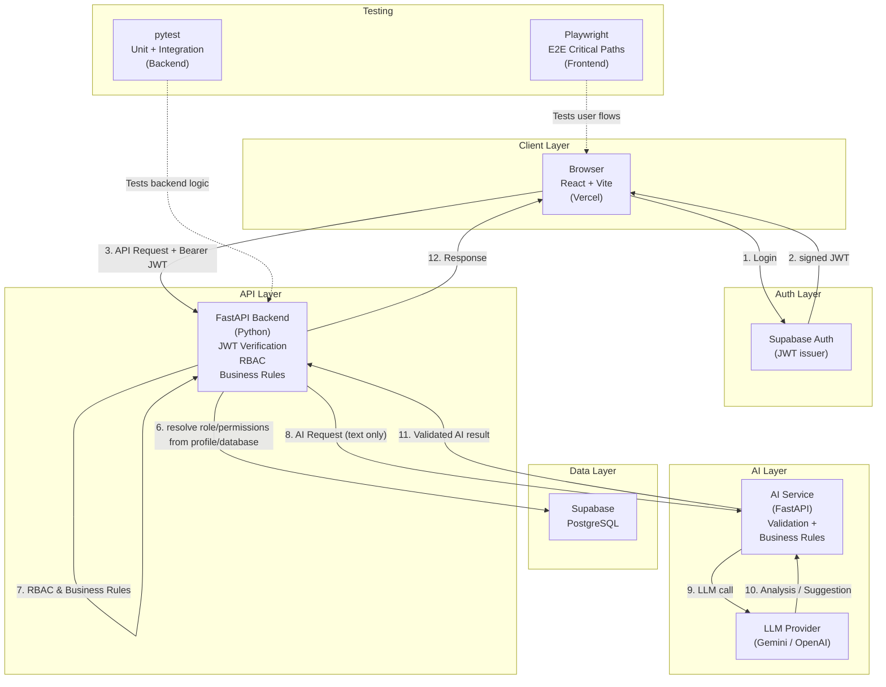
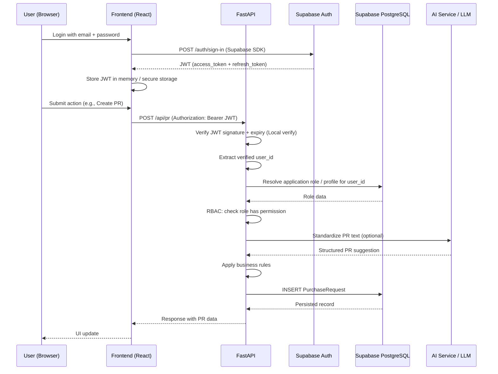
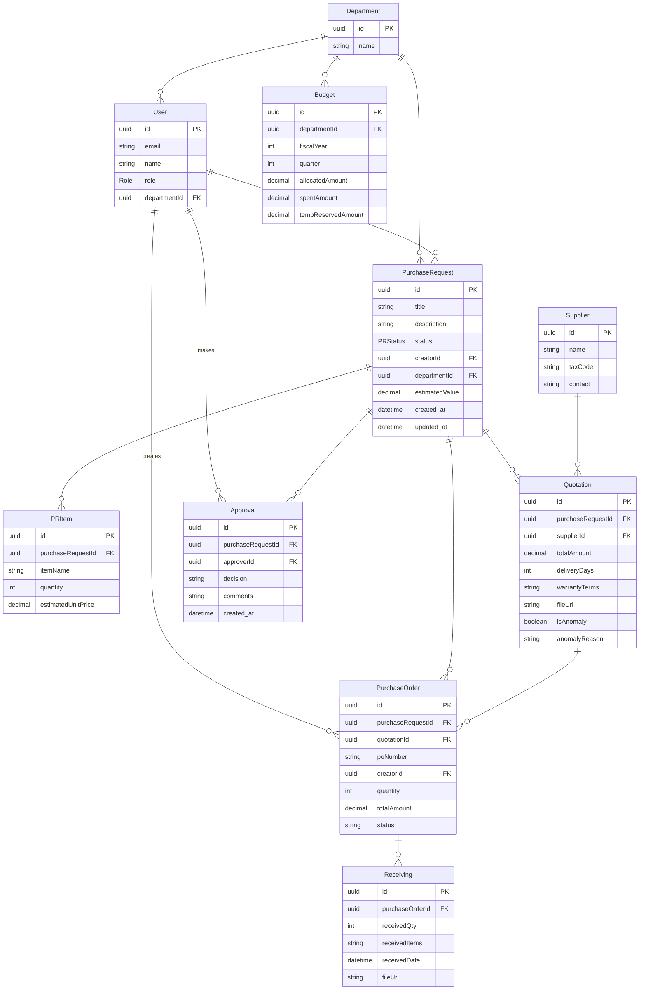

# Target Architecture
**Project:** AI Procurement & Purchase Approval System  
**Course:** Thực hành lập trình ứng dụng trong doanh nghiệp bằng AI  
**Group:** Group 01 · Branch: `final-delivery`  
**Date:** 2026-09-20  
**Status:** ARCHITECTURE FREEZE — APPROVED FOR IMPLEMENTATION

> This document freezes the technical direction chosen by the team based on HD-01 → HD-07 decisions before implementation begins. It describes both the **current state** (what exists) and the **target state** (what must be built).

---

## 1. Purpose

This document serves as the single source of architectural truth for the Final Delivery phase. It:

- Documents the **actual current state** based on code inspection (not documentation claims).
- Documents the **target state** as decided in HD-01 → HD-07.
- Identifies all **implementation gaps** that must be closed.
- Defines **what evidence** is required to call each phase "Done".

It does NOT claim that the target state is already implemented.

---

## 2. Current System Snapshot

The following represents the verified runtime state as of 2026-09-20, based on direct inspection of source files.

### 2.1 Frontend Architecture

**FACT.** `frontend/src/App.tsx` is the sole frontend file containing all UI logic.

| Aspect | Current State | Evidence |
|:---|:---|:---|
| Framework | React 18 + Vite | `frontend/package.json` |
| Routing | **NONE** — no `react-router-dom` in dependencies | `frontend/package.json` |
| Styling | Inline CSS (`style={{ ... }}`) throughout | `frontend/src/App.tsx` |
| State management | `useState` hooks only | `frontend/src/App.tsx` |
| Authentication | Role dropdown `<select>` — no real login | `frontend/src/App.tsx` |
| Component structure | Monolithic — all logic in single component | `frontend/src/App.tsx` |
| API calls | Present but not authenticated | `frontend/src/App.tsx` |
| Playwright | **NOT installed** — not in `package.json` devDependencies | `frontend/package.json` |
| Design alignment | Does not match Figma prototype (20 screens) | `docs/FIGMA_IMPLEMENTATION_SPEC.md` |

**TECHNICAL DEBT:** The frontend requires targeted refactoring to support routing, real authentication, and the Figma-aligned layout. Do not blindly rewrite the entire frontend; preserve reusable code.

### 2.2 Backend Architecture

**FACT.** Backend is FastAPI (Python) with 7 routers registered in `main.py`.

| Aspect | Current State | Evidence |
|:---|:---|:---|
| Framework | FastAPI 0.115+ | `backend/pyproject.toml` |
| Routers | `auth`, `assistant`, `pr`, `quotations`, `po`, `receiving`, `budget` | `backend/app/main.py` |
| CORS | `allow_origins=["*"]` (open) | `backend/app/main.py` |
| Data access | `MockDatabase` Python dict in-memory | `backend/app/services/procurement_service.py` |
| Prisma | Installed as dependency, schema exists, **NOT used at runtime** | `backend/pyproject.toml`, `backend/prisma/schema.prisma` |
| JWT library | `pyjwt>=2.9.0` listed in dependencies | `backend/pyproject.toml` |
| JWT verification | **NOT implemented** — no JWT middleware on any route | All router files |
| Authorization | Trusts client-provided `approverRole` in POST body | `backend/app/routers/pr.py` |

### 2.3 Database / Runtime

| Aspect | Current State | Evidence |
|:---|:---|:---|
| Runtime database | `MockDatabase` in-memory Python dict | `backend/app/services/procurement_service.py` L3-29 |
| Data persistence | **NONE** — all data lost on server restart | Code fact |
| Prisma schema | Exists with correct models, but compatibility must be verified | `backend/prisma/schema.prisma` |
| Migrations | **NONE** — no migration files in repository | Repository inspection |
| Supabase | Not connected — `.env` does not exist (only `.env.example`) | Directory inspection |
| Docker Compose | Configured for local PostgreSQL (port 5432) | `compose.yaml` |

### 2.4 Authentication / Authorization

| Aspect | Current State | Evidence |
|:---|:---|:---|
| Login endpoint | Returns `mock-jwt-token-for-{email}` | `backend/app/routers/auth.py` L25 |
| Password validation | Hardcoded `"password123"` for all users | `backend/app/routers/auth.py` L21 |
| Users | Hardcoded `MOCK_USERS` dict (5 users) | `backend/app/routers/auth.py` L10-16 |
| JWT verification | **NOT implemented** on any route | All router files |
| RBAC enforcement | **NOT enforced** server-side — client-provided role trusted | `backend/app/routers/pr.py` |
| Frontend auth | Role `<select>` dropdown — no token sent | `frontend/src/App.tsx` |

### 2.5 AI Implementation

| Aspect | Current State | Evidence |
|:---|:---|:---|
| PR Standardization | Regex keyword matching → hardcoded output | `backend/app/services/ai_service.py` L10-51 |
| Quotation Comparison | Price diff vs hardcoded `historical_avg_price = 25,000,000` | `backend/app/services/ai_service.py` L53-88 |
| Anomaly detection | 20% threshold — logic correct, data hardcoded | `backend/app/services/ai_service.py` L70 |
| LLM integration | **NONE** — no external AI API calls | Code inspection |
| Quotation file parsing | **NONE** — receives filename strings only, does not read files | `backend/app/routers/quotations.py` |
| Recommendation | **NOT IMPLEMENTED** — not in response schema | `backend/app/services/ai_service.py` |

### 2.6 Tests

| Aspect | Current State | Evidence |
|:---|:---|:---|
| Backend unit/integration | 2 files: `test_all_endpoints.py`, `test_business_rules.py` | `backend/tests/` |
| Backend test runner | pytest | `backend/pyproject.toml` |
| Tests target | MockDatabase only — not real DB | Code inspection |
| E2E Playwright spec | File exists at `docs/06-testing/playwright-e2e-us09.spec.ts` | Repository |
| Playwright installed | **NOT installed** — not in `frontend/package.json` | `frontend/package.json` |
| E2E executable | **NO** — selectors reference DOM that does not exist in `App.tsx` | Code inspection |
| E2E execution evidence | **NONE** — UNVERIFIED CLAIM | No test output found |

### 2.7 Deployment

| Aspect | Current State | Evidence |
|:---|:---|:---|
| Local Docker | `compose.yaml` for local PostgreSQL only | `compose.yaml` |
| Vercel config | **NOT EXISTS** — no `vercel.json` in repository | Repository inspection |
| Production URL | **NOT EXISTS** | No evidence found |
| Staging URL | **NOT EXISTS** | No evidence found |
| Backend hosting | Not configured | Repository inspection |

### 2.8 Known Technical Debt

1. **CRITICAL:** MockDB has no persistence — all data lost on restart.
2. **CRITICAL:** No JWT verification on any API route — RBAC completely client-side.
3. **CRITICAL:** `create_po()` missing PR APPROVED status guard (BUG-001).
4. **HIGH:** `close_pr()` missing Receiving completion check.
5. **HIGH:** Frontend lacks routing — Playwright tests cannot execute. Needs targeted refactoring.
6. **HIGH:** AI implementation is pure regex with hardcoded values.
7. **MEDIUM:** `allow_origins=["*"]` in CORS — should be restricted in production.
8. **MEDIUM:** No `.env` file — Supabase credentials not configured.

---

## 3. Architecture Principles

These principles govern implementation decisions:

| # | Principle | Rationale |
|:---|:---|:---|
| P-01 | **Requirements over implementation** | When code conflicts with a requirement, the requirement is correct. Code must change. |
| P-02 | **Backend is business-rule authority** | All business rules (budget check, approval guard, receiving guard) are enforced server-side. |
| P-03 | **Frontend is NOT a security boundary** | The frontend role selector is UI convenience only. Authorization is enforced by the backend using the verified authenticated identity and server-resolved application role/permissions. |
| P-04 | **AI is assistant, not business authority** | LLM can analyze, suggest, explain. LLM cannot approve PRs, set prices, or close PRs. Backend decides. |
| P-05 | **Evidence over claims** | "Tests pass" requires actual test output. "Deployed" requires a live URL. No unsupported claims. |
| P-06 | **Testable acceptance criteria** | Every feature must have a test (unit, integration, or E2E) that can be inspected and re-run. |
| P-07 | **Figma is UI reference, not business-rule source** | If Figma conflicts with a written business requirement, the written requirement takes precedence. Conflict is recorded. |
| P-08 | **Secrets in environment only** | No credentials in source code or committed files. Only `.env.example` in repository. |

---

## 4. Target Architecture

### 4.1 System Diagram



### 4.2 Request Flow (Authenticated API Call)



---

## 5. Component Responsibilities

| Component | Responsibilities | NOT Responsible For |
|:---|:---|:---|
| **Frontend (React/Vite)** | Render UI; collect user input; display AI suggestions; navigate routes; store JWT in memory; send Bearer token with every request | Enforce business rules; determine user roles; validate quotation prices |
| **FastAPI API** | Route requests; verify JWT; enforce RBAC; apply business rules; orchestrate AI calls; read/write database | Store session state; generate UI; make final AI recommendations visible as authoritative decisions |
| **Supabase Auth** | Issue JWTs; manage user sessions; verify token signatures | Application business rules; RBAC per feature |
| **RBAC (Backend)** | Map the server-resolved application role/permissions to permitted operations; return 403 if unauthorized | Determine what the user "sees" in UI (that is the frontend's job) |
| **Business Rules (Backend)** | Budget check on PR creation; approval guard on PO creation; receiving check on PR close; price lock from quotation | AI analysis; UI rendering |
| **Supabase PostgreSQL** | Persist all application data; enforce FK constraints and data integrity | Business logic |
| **AI Service (FastAPI)** | Call LLM for text extraction, comparison, anomaly explanation, recommendation; validate and structure LLM output before returning | Make authoritative approval/rejection decisions; set prices used in business logic; directly read/write database |
| **pytest** | Test backend business logic, API endpoints, database interactions | Test UI behavior |
| **Playwright E2E** | Test critical user flows in the browser against a running application | Unit testing of individual functions |
| **Vercel (Frontend)** | Host static React build | Backend compute; database |

---

## 6. Authentication and Authorization

### 6.1 Current State (FACT)

The current authentication is mock-only. `auth.py` returns a hardcoded fake JWT string. No route verifies any token. A client can set `approverRole: "FINANCE"` in any POST request body and the backend accepts it.

**This is a critical security gap.**

### 6.2 Target Authentication Flow

1. User submits email + password to **Supabase Auth** via Supabase JS SDK (frontend).
2. Supabase Auth validates credentials and returns a **signed JWT** containing `user_id`, `email`, `role` (from `user_metadata` or a custom claim).
3. Frontend stores JWT in memory (not localStorage) and attaches it as `Authorization: Bearer <token>` on every API request.
4. **FastAPI** verifies the JWT signature using Supabase's JWT secret (from environment variable).
5. FastAPI extracts `user_id` from verified token claims. It then resolves the user's role via `profile/database` lookup (or alternatively, reads a clearly configured custom claim).
6. RBAC middleware checks whether the resolved role is permitted for the requested operation.
7. Business logic executes with verified identity — never trusting any client-provided role.

### 6.3 Why Frontend Role Selector Cannot Be Security Boundary

The current `<select role>` in `App.tsx` is purely UI state. Any user can open browser DevTools and change the selected value, or craft a direct HTTP request with any `approverRole`. Without backend JWT verification, the system has no true authorization.

### 6.4 Role → Permission Matrix (Target)

| Role | Create PR | Approve PR | Collect Quotations | Create PO | Record Receiving | Close PR | View Budget |
|:---|:---|:---|:---|:---|:---|:---|:---|
| EMPLOYEE | ✅ | ❌ | ❌ | ❌ | ❌ | ❌ | Own dept only |
| MANAGER | ❌ | ✅ (Step 1) | ❌ | ❌ | ❌ | ❌ | Own dept |
| FINANCE | ❌ | ✅ (Step 2, >50M) | ❌ | ❌ | ❌ | ✅ | All |
| PROCUREMENT | ❌ | ❌ | ✅ | ✅ | ✅ | ❌ | Read |
| ADMIN | ✅ | ✅ | ✅ | ✅ | ✅ | ✅ | All |

*Source: requirements.md REQ-NFR-02, CON-02*

---

## 7. Data Architecture

Based on `backend/prisma/schema.prisma` (FACT) and project requirements.

### 7.1 Entity Relationship (Target)



**Important Note on Authentication:** Authentication credentials/passwords are managed entirely by Supabase Auth. The application `User` entity shown above stores only application profile and authorization data, and is linked to the authenticated Supabase user by `id` or `email`.

### 7.2 Key Constraints

- `PurchaseRequest.estimatedValue` = SUM(PRItem.quantity × PRItem.estimatedUnitPrice).
- `Budget.tempReservedAmount` is incremented on PR creation and decremented on PR Close.
- `Quotation.totalAmount` is locked into `PurchaseOrder.totalAmount` 100% — no modification.
- `SUM(Receiving.receivedQty) <= PurchaseOrder.quantity` (ASM-06). **Note (Implementation Gap):** CURRENT STATE: `PurchaseOrder.quantity` currently DOES NOT EXIST in the Prisma schema. TARGET STATE: `PurchaseOrder.quantity` is a data-model requirement that MUST be added during implementation/migration to support this business rule (HD-07).

---

## 8. Business Rule Enforcement

| Rule ID | Requirement | Current Implementation | Target Enforcement Layer | Test Required |
|:---|:---|:---|:---|:---|
| REQ-BR-01 | PR estimatedValue ≤ department available budget | IMPLEMENTED in `create_pr()` (MockDB) | Backend service + DB constraint | `test_req_br_01` (exists, MockDB only — needs real DB test) |
| REQ-BR-02 | PR >50M VND requires Manager then Finance approval | IMPLEMENTED in `approve_pr()` (MockDB) | Backend service + JWT role verification | `test_req_br_02` (exists, MockDB only) |
| REQ-BR-03 | Manager approves PRs within their scope | PARTIALLY — role check exists, no department scope check | Backend service + JWT claims | Integration test needed |
| REQ-BR-04 | Finance checks budget before final approval | Approval step 2 gated to FINANCE role | Backend service + JWT role check | Integration test needed |
| REQ-BR-05 | Warn when PR exceeds budget | Budget check raises ValueError | Backend — return warning in response | Unit test for warning |
| REQ-BR-06 | Procurement collects quotations after PR approved | No explicit gate on quotation collection | Backend — check PR status = APPROVED before adding quotation | Integration test needed |
| REQ-BR-07 | Quotations linked to PR | Quotation model has `purchaseRequestId` FK | Database FK constraint | Schema constraint |
| REQ-BR-08 | AI only recommends, Procurement decides | IMPLEMENTED by design — AI returns suggestions only | Architecture principle | E2E test: verify Procurement must click button |
| REQ-BR-10 | PO only created if PR is APPROVED | **NOT IMPLEMENTED — BUG-001** | Backend `create_po()` must check `pr.status == APPROVED` | Unit test + E2E TC-09-02 |
| REQ-BR-11 | PR only closed after Receiving complete | **NOT IMPLEMENTED** | Backend `close_pr()` must check SUM(receivedQty) >= PO.quantity | Unit test + E2E |
| ASM-05 | PR >50M requires 2-level approval | IMPLEMENTED in `approve_pr()` | Backend service | `test_req_br_02` (exists) |
| ASM-06 | Total receivedQty ≤ PO quantity | IMPLEMENTED in `receive_goods()` | Backend service | `test_req_br_04` (exists) |

---

## 9. AI Architecture

### 9.1 Hybrid Architecture Principle

The LLM is responsible for **language understanding** and **decision support**. The backend is responsible for **authoritative decisions**. These responsibilities must never be mixed.

### 9.2 Responsibility Boundary

```mermaid
flowchart LR
    subgraph LLM_Layer["LLM Layer (Language Intelligence)"]
        STD["PR Text\nStandardization"]
        EXT["Quotation\nExtraction"]
        ANA["Quotation\nComparative Analysis"]
        REC["Recommendation\nExplanation"]
        ANO["Anomaly\nExplanation"]
    end

    subgraph Backend_Layer["Backend Layer (Business Authority)"]
        BUDGET["Budget Check\n(REQ-BR-01)"]
        APPR["Approval Guard\n(REQ-BR-02/03/04)"]
        POGUARD["PO Creation Guard\n(REQ-BR-10 / BUG-001)"]
        PRICELOCK["Price Lock\n(REQ-BR-12)"]
        RECGUARD["Receiving Guard\n(REQ-BR-11)"]
        RBAC["RBAC\n(REQ-NFR-02)"]
    end

    LLM_Layer -- "AI output reviewed by human\nbefore action" --> User((Procurement\nUser))
    User -- "Human decision\n(CON-03)" --> Backend_Layer
```



### 9.3 LLM Integration (Target)

- LLM call is made from `backend/app/services/ai_service.py`.
- Input to LLM: PR raw text OR quotation file content (parsed to text first).
- Output from LLM: structured JSON validated by Pydantic before use.
- If LLM is unavailable or returns invalid output: **fallback to current Regex implementation**.
- LLM output is **suggestion only** — backend never accepts LLM output as authoritative for prices, approval decisions, or business state changes.

### 9.4 Current Implementation Gap

**FACT.** Current `ai_service.py` contains no LLM calls. It uses `re.search()` regex with hardcoded prices. The current implementation does not satisfy REQ-FR-13 (Must) because it relies on regex matching and hardcoded historical averages rather than the required dynamic AI/data-driven behavior.

**IMPLEMENTATION REQUIRED:** Replace regex implementation with LLM API call + validation wrapper + Regex fallback.

---

## 10. Testing Architecture

### 10.1 Testing Pyramid (Target)

| Layer | Target Coverage | Tools | Current State |
|:---|:---|:---|:---|
| Unit | Business logic: budget check, approval rules, receiving guard, price lock | pytest | PARTIAL — tests exist against MockDB |
| Integration | API endpoints + real database operations | pytest + httpx + Supabase test DB | NOT IMPLEMENTED |
| E2E | Critical user flows in browser | Playwright | NOT IMPLEMENTED — spec exists but is not executable |

### 10.2 E2E Critical Path Mapping

| E2E Flow | User Story | Acceptance Criteria | Current Status |
|:---|:---|:---|:---|
| Employee creates and submits PR | US-01 | AC1: validation; AC3: submit allowed when complete | NOT IMPLEMENTED |
| Manager approves PR | US-03 | AC2: approve recorded; AC4: workflow advances | NOT IMPLEMENTED |
| Procurement creates PO from APPROVED PR | US-09 | AC1: PO creation succeeds | NOT IMPLEMENTED |
| System BLOCKS PO creation for non-APPROVED PR | US-09 | **AC2: system rejects** | NOT IMPLEMENTED |
| Procurement records Receiving | US-10 | AC1: recorded; AC2: blocked if qty exceeds PO | NOT IMPLEMENTED |
| Close PR after Receiving complete | US-11 | AC1: allowed when complete | NOT IMPLEMENTED |
| System BLOCKS Close when Receiving incomplete | US-11 | **AC2: system rejects** | NOT IMPLEMENTED |

### 10.3 Test Environment Requirements

- E2E tests require a running frontend (with React Router) at `http://localhost:5173`.
- E2E tests require a running backend at `http://localhost:8000`.
- E2E tests require seeded test data (known users, PRs, POs).
- Playwright must be installed: `npm install --save-dev @playwright/test`.
- Test configuration file (`playwright.config.ts`) must be created.

### 10.4 Evidence Requirements per Test

Every test must produce verifiable output:
- pytest: `pytest --tb=short -v` terminal output.
- Playwright: HTML test report (`playwright show-report`).
- CI: test run output in Git commit or PR comments.

---

## 11. Deployment Architecture

**FACT:** No production or staging deployment exists at this time. The following is the **target** deployment architecture.

| Component | Target Platform | Current State | Notes |
|:---|:---|:---|:---|
| Frontend | Vercel | NOT DEPLOYED | Requires `vite build` + Vercel project |
| Backend | TBD — Vercel Serverless (if compatible) or Railway/Render | NOT DEPLOYED | FastAPI on Vercel requires adapter; verify compatibility |
| Database | Supabase PostgreSQL | NOT CONNECTED | Requires project creation + `DATABASE_URL` |
| Auth | Supabase Auth | NOT CONFIGURED | Requires Supabase project + `SUPABASE_URL` + `SUPABASE_ANON_KEY` |
| AI | External LLM API (Gemini/OpenAI) | NOT INTEGRATED | Requires API key in environment |

### 11.1 Environment Variables Required (Target)

```
# .env.example (already exists — must be filled for real deployment)
DATABASE_URL=postgresql://...      # Supabase DB connection string
SUPABASE_URL=https://...           # Supabase project URL
SUPABASE_ANON_KEY=...              # Supabase anonymous key (frontend)
SUPABASE_JWT_SECRET=...            # JWT verification secret (backend)
LLM_API_KEY=...                    # LLM provider API key (Gemini/OpenAI)
```

---

## 12. Security Considerations

| Risk | Current State | Target Mitigation |
|:---|:---|:---|
| No JWT verification | CRITICAL — any client can impersonate any role | Supabase Auth JWT + FastAPI verification middleware |
| Client-controlled authorization | CRITICAL — `approverRole` sent in POST body | Role/permissions are resolved server-side from the verified user identity and application profile/database; client-provided role values are ignored. |
| Open CORS | `allow_origins=["*"]` in `main.py` | Restrict to Vercel frontend URL in production |
| No input validation on AI output | AI output passed directly | Pydantic schema validation on all LLM responses |
| Hardcoded secrets | None in code currently | Maintain `.env.example` pattern; never commit `.env` |
| MockDB data loss | CRITICAL for demo | Resolved when Supabase PostgreSQL is connected |
| PO price manipulation | `quotation` data comes entirely from client POST body | Validate quotation against database record by ID |
| SQL injection | N/A with Prisma ORM | Maintain use of parameterized queries via Prisma |

---

## 13. Migration Plan

### Phase 1 — Architecture & Documentation (CURRENT)
- **Goal:** Freeze technical direction; create TARGET_ARCHITECTURE.md and DECISION_LOG.md.
- **Dependencies:** None.
- **Evidence:** Both documents committed to `final-delivery` branch.

### Phase 2 — Supabase Database Migration
- **Goal:** Connect runtime to real PostgreSQL via Supabase and eliminate MockDB. Prisma is conditional.
- **Work:** 1. Configure Supabase PostgreSQL. 2. Verify compatibility of Prisma schema/client with backend runtime and deployment target. 3. If compatible, use Prisma; if not, use an alternative appropriate PostgreSQL data-access layer. 4. Refactor backend data-access layer to use the chosen real PostgreSQL implementation. 5. Validate with real tests.
- **Dependencies:** Supabase project created; credentials available.
- **Evidence:** `GET /api/budget/DEPT-IT` returns data from PostgreSQL (verify via Supabase dashboard). pytest tests pass against real DB.

### Phase 3 — Supabase Auth + JWT + RBAC
- **Goal:** Replace mock authentication with real Supabase Auth. All routes enforce JWT.
- **Work:** Implement JWT verification middleware in FastAPI; extract verified `user_id`; resolve application role from profile/database; enforce RBAC server-side; update frontend to use Supabase JS SDK login; send Bearer token on all API calls. (Custom JWT claims only if clearly configured).
- **Dependencies:** Phase 2 complete (users table must exist in real DB).
- **Evidence:** Login with wrong credentials returns 401. Access protected route without token returns 401. Access protected route with wrong role returns 403.

### Phase 4 — Business Rule Fixes (BUG-001 + HD-07)
- **Goal:** Fix `create_po()` PR status guard (BUG-001) and `close_pr()` Receiving completion guard.
- **Work:** Add `if pr.status != "APPROVED": raise ValueError(...)` to `create_po()`; add `SUM(receivedQty) >= po.quantity` check to `close_pr()`.
- **Dependencies:** Phase 2 (need real DB to verify receiving records).
- **Evidence:** New unit tests pass for both guards. E2E tests TC-09-02 and US-11 AC2 pass.

### Phase 5 — AI Implementation (LLM Integration)
- **Goal:** Replace Regex AI with LLM API + deterministic validation wrapper.
- **Work:** Add LLM client to `ai_service.py`; define Pydantic response schema; implement fallback to Regex if LLM unavailable; implement quotation file text extraction (ASM-07).
- **Dependencies:** LLM API key available in environment.
- **Evidence:** `POST /api/assistant/standardize-pr` returns structured result for arbitrary Vietnamese text input. Anomaly detection returns correct flag for price >20% above average.

### Phase 6 — Frontend Architecture + Figma Implementation
- **Goal:** Refactor frontend with React Router + component structure aligned to Figma, preserving reusable code.
- **Work:** Install `react-router-dom`; define routes; refactor/rebuild only where required to implement Login, PR list, PR create, PR detail, Quotation comparison, PO create, Receiving screens.
- **Dependencies:** Phase 3 (Auth) for real login flow; Phase 2 (DB) for real data.
- **Evidence:** Application navigates between pages via URL. All critical screens render with correct data from API.

### Phase 7 — Automated Tests
- **Goal:** All critical paths have automated test evidence.
- **Work:** Update pytest tests to run against real DB (integration tests); install Playwright; write E2E specs for all 7 critical flows listed in Section 10.2.
- **Dependencies:** Phase 6 (frontend must have real routes and DOM).
- **Evidence:** `pytest -v` output shows PASS. `playwright test` output shows all critical flows PASS with HTML report.

### Phase 8 — Deployment
- **Goal:** Application accessible at a real URL.
- **Work:** Configure Vercel project for frontend; configure backend hosting; set environment variables; run smoke test on live URL.
- **Dependencies:** All previous phases complete.
- **Evidence:** Live URL accessible; login works; PR creation works; Receiving checklist runs.

### Phase 9 — Evidence & Final Verification
- **Goal:** All course requirements have traceable evidence.
- **Work:** Complete Traceability Matrix; finalize AI Usage Log; prepare individual reports.
- **Dependencies:** Phase 8 complete.
- **Evidence:** Every Must story can be traced from requirement → story → code/PR → test → release.

---

## 14. Risks

| Risk | Likelihood | Impact | Mitigation |
|:---|:---|:---|:---|
| Supabase migration breaks existing MockDB tests | HIGH | HIGH | Keep MockDB tests; add separate integration test suite targeting Supabase |
| FastAPI not compatible with Vercel Serverless | MEDIUM | HIGH | Test with `vercel dev` early; consider Railway/Render as fallback |
| LLM API rate limits or latency in demo | MEDIUM | MEDIUM | Maintain Regex fallback; demo with pre-warmed API |
| Frontend refactoring scope too large for timeline | HIGH | HIGH | Prioritize routing + critical screens first; defer secondary screens; preserve existing code where possible. |
| Playwright tests depend on final DOM — written too early | HIGH | MEDIUM | Write E2E specs only after routes and components are stable |
| Figma screens conflict with business requirements | LOW | MEDIUM | Apply P-07: business requirement wins; document conflict |
| Data loss during Supabase migration if seed fails | LOW | HIGH | Verify seed.py on staging first; keep MockDB as read-only reference |
| Team unfamiliar with Supabase Auth JWT flow | MEDIUM | HIGH | Follow Supabase official Next.js/React guide; test with Postman first |

---

## 15. Definition of Ready for Implementation

Before a task can begin coding:

- [ ] The target behavior is specified in a User Story with Acceptance Criteria.
- [ ] The API contract for the feature is documented.
- [ ] The database schema for the feature is agreed.
- [ ] Dependencies (e.g., Auth must exist before RBAC) are resolved.
- [ ] Test cases (unit + E2E if applicable) are defined.
- [ ] No unresolved Human Decisions block the feature.

---

## 16. Definition of Done

The Final Delivery is considered complete when:

- [ ] All Must-have User Stories (US-01, US-02, US-03, US-04, US-05, US-09, US-10, US-11) have implementation, tests, and verified execution evidence.
- [ ] BUG-001 (`create_po()` approval guard) is fixed and has a passing test.
- [ ] `close_pr()` Receiving guard is implemented and has a passing test.
- [ ] Application connects to Supabase PostgreSQL (not MockDB).
- [ ] JWT authentication is verified server-side on all protected routes.
- [ ] RBAC is enforced server-side using the verified authenticated identity and server-resolved application role/permissions; client-provided role values are never trusted.
- [ ] Critical-path E2E tests (Playwright) PASS with actual execution evidence (HTML report).
- [ ] Application is deployed to a live URL accessible to the teacher.
- [ ] AI Usage Log is complete with entries for all major tasks.
- [ ] Traceability Matrix has no "orphan" Must requirements.
- [ ] README / runbook enables a new team member to run the application in under 10 minutes.
