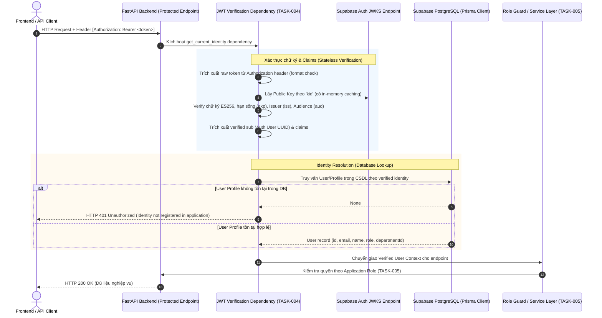

# THIẾT KẾ KIẾN TRÚC XÁC THỰC JWT SUPABASE (TASK-004)

**Dự án:** Hệ thống Mua sắm & Phê duyệt Mua sắm Tích hợp AI (Group 01)
**Tác vụ:** TASK-004 — Implement Supabase Auth JWT Verification Middleware
**Nhánh:** `final-delivery`
**Giai đoạn:** STEP 2 — Authentication Verification Design Only (Chỉ thiết kế, không sửa code)
**Cơ sở quyết định:** `docs/DECISION_LOG.md` (Quyết định HD-02), `docs/IMPLEMENTATION_PLAN.md`

---

## 1. Goals (Mục tiêu thiết kế)

Triển khai cơ chế xác thực danh tính người dùng bằng JSON Web Token (JWT) theo chuẩn **Zero-Trust Client** cho toàn bộ các endpoint được bảo vệ trong hệ thống:

```text
HTTP Request
  └─► Header: "Authorization: Bearer <Supabase Access Token>"
        └─► Kiểm tra định dạng & cấu trúc token
              └─► Xác thực chữ ký mã hóa (Signature) qua JWKS (Khóa bất đối xứng ES256)
                    └─► Xác thực các Claims bắt buộc: exp, iss, aud, sub
                          └─► Trích xuất danh tính đã xác thực (Verified user_id / sub)
                                └─► Truy vấn Application User / Profile từ PostgreSQL CSDL
                                      └─► Cung cấp Verified Identity & Role cho nghiệp vụ / TASK-005 RBAC
```

**Nguyên tắc bảo mật cốt lõi (HD-02):**
- **Tuyệt đối không tin tưởng client:** Không chấp nhận `email`, `role`, `approverRole`, hay `userId` tự khai báo trong Request Body, URL Param, hoặc Header tùy biến.
- **Phân tách ranh giới rõ ràng:** TASK-004 chịu trách nhiệm toàn diện về **Authentication & Identity Resolution** (Ai đang gửi request? Token có hợp lệ không? User có profile trong DB không?). TASK-005 sẽ chịu trách nhiệm về **Authorization & RBAC** (User này có quyền thực hiện hành động này không?).
- **Fail-Secure (Không fallback mở):** Nếu JWT thiếu, sai định dạng, sai chữ ký, hết hạn, hoặc user không tồn tại trong hệ thống, hệ thống lập tức từ chối với HTTP 401 Unauthorized. Tuyệt đối không fallback sang danh tính mẫu (`MOCK_USERS`) hay bypass kiểm tra.

---

## 2. Current Runtime (Hiện trạng hệ thống sau Step 1 Audit)

| Thành phần | Hiện trạng thực tế (Audit Step 1) | Đánh giá rủi ro |
| :--- | :--- | :--- |
| **`auth.py` Router** | Sử dụng từ điển tĩnh `MOCK_USERS`, kiểm tra mật khẩu dạng thô `password == "password123"`, trả về chuỗi giả lập `"mock-jwt-token-for-{email}"`. | **Nghiêm trọng (GAP-02):** Không phải JWT, không có chữ ký mã hóa, bất kỳ ai cũng có thể giả mạo. |
| **Bảo vệ Endpoint** | `main.py` và các router (`pr.py`, `po.py`, `receiving.py`, `budget.py`) không sử dụng middleware hoặc `Depends()` bảo vệ. | Toàn bộ API đang mở hoặc chỉ lọc dữ liệu theo tham số client gửi. |
| **Identity Lookup** | `procurement_service.py` dùng `resolve_user_id_by_email(email)` đọc email từ payload do client truyền lên. | **Trust-Client Identity:** Vi phạm trực tiếp HD-02, người dùng có thể mạo danh bất kỳ email nào. |
| **Application Users** | Bảng `User` trong PostgreSQL trên Supabase đã có **5 users chuẩn** với mật khẩu hash bcrypt (`$2b$12$...`) và vai trò (`EMPLOYEE`, `MANAGER`, `PROCUREMENT`, `FINANCE`, `ADMIN`). | Dữ liệu ứng dụng đã sẵn sàng trên DB thật, nhưng chưa được liên kết với Supabase Auth identity. |
| **Thư viện JWT** | `PyJWT==2.14.0` đã cài đặt trong `.venv`. Gói `cryptography` **chưa được cài đặt**. Gói `supabase` Python client **chưa cài đặt**. | `PyJWT` cần `cryptography` để hỗ trợ giải mã thuật toán bất đối xứng ES256/RS256. |
| **Supabase JWKS** | Endpoint `https://sthjkfssmvoswocnttrw.supabase.co/auth/v1/.well-known/jwks.json` hoạt động tốt (`HTTP 200`), trả về 1 khóa công khai Elliptic Curve: `alg: ES256`, `kty: EC`, `kid: f8bc18f2-2852-44d4-b153-a66c85e8a8a5`. | Supabase project đang dùng chuẩn mã hóa bất đối xứng hiện đại (ES256). |

---

## 3. Authentication Architecture (Kiến trúc xác thực tổng thể)

Kiến trúc xác thực theo mô hình Stateless JWT Verification kết hợp Stateful Profile Lookup:



---

## 4. JWT Verification Strategy (Phân tích & Lựa chọn phương án xác thực)

Chúng tôi đã phân tích 3 phương án xác thực JWT khả thi cho backend FastAPI:

| Tiêu chí | Phương án A: JWKS + PyJWT (Asymmetric ES256) | Phương án B: Supabase Python Client (`supabase.auth.get_user`) | Phương án C: Shared Secret (Symmetric HS256 Legacy) |
| :--- | :--- | :--- | :--- |
| **Bản chất kỹ thuật** | Backend tải Public Key từ JWKS của Supabase qua HTTPS, xác thực chữ ký cục bộ bằng thuật toán `ES256`. | Backend gọi API `GET /auth/v1/user` của Supabase qua HTTP client cho mỗi request. | Backend dùng chuỗi bí mật `SUPABASE_JWT_SECRET` đối xứng để giải mã HMAC-SHA256. |
| **Mức độ bảo mật (Security)** | **Rất cao (Zero-Secret Backend):** Backend chỉ cần Public Key. Không lưu khóa bí mật ký token ở backend, loại bỏ rủi ro lộ secret. | **Rất cao:** Uỷ thác hoàn toàn cho server Supabase xác nhận phiên làm việc. | **Trung bình - Thấp:** Nếu lộ JWT secret ở backend, kẻ tấn công có thể tự ký token giả mạo bất kỳ ai. |
| **Độ trễ & Hiệu năng (Performance)** | **Cực nhanh (~1-2 ms):** Verify signature bằng CPU local sau khi JWKS được cache trong bộ nhớ. Không tốn round-trip mạng. | **Chậm (~150-400 ms):** Mỗi request phải gọi thêm một HTTP request mạng sang máy chủ Supabase. | **Cực nhanh (~1 ms):** Tính toán HMAC local. |
| **Phụ thuộc thư viện (Dependencies)** | Cần thêm `cryptography` vào `pyproject.toml` (để `PyJWT` giải mã toán học Elliptic Curve). | Cần cài gói `supabase-py` (kéo theo rất nhiều dependency: `gotrue`, `postgrest`, `storage3`, v.v.). | Chỉ dùng `PyJWT` hiện có (không cần thêm dependency). |
| **Tương thích Supabase Project** | **Hoàn toàn khớp:** Endpoint JWKS của dự án hiện tại trả về khóa `alg: ES256`. | Hoàn toàn khớp với Supabase Auth. | **Không khớp / Rủi ro:** Dự án Supabase mới mặc định dùng mã hóa bất đối xứng; cấu hình HS256 có thể bị deprecated hoặc không khớp với token JWT do SDK mới sinh. |
| **Khả năng viết Unit / Mock Test** | **Rất tốt:** Dễ dàng mock `PyJWKClient` hoặc inject key RSA/EC giả lập trong môi trường test độc lập mà không cần mạng. | **Phức tạp:** Phải mock toàn bộ client class của Supabase và đối tượng HTTP session. | **Tốt:** Dễ mock secret cục bộ. |

### Đề xuất lựa chọn (Recommendation):
**Chọn PHƯƠNG ÁN A (JWKS + PyJWT với thuật toán ES256):**
- Đây là tiêu chuẩn bảo mật doanh nghiệp hiện đại nhất (RFC 7517, OIDC/OAuth2).
- Khớp chính xác 100% với cấu hình hiện tại của Supabase Project `sthjkfssmvoswocnttrw` (đang phân phối khóa công khai ES256 qua JWKS).
- Đảm bảo hiệu năng tối đa cho API gateway / backend (không nghẽn cổ chai mạng Supabase).
- Yêu cầu duy nhất: Bổ sung dependency `cryptography` vào backend.

---

## 5. Phân tích Identity Mapping (Ráp nối danh tính Supabase Auth và Application User)

Đây là vấn đề cấu trúc cốt lõi nhất được chỉ định trong chỉ thị TASK-004.

### 5.1. Bản chất sự khác biệt giữa hai lớp Danh tính
1. **Lớp Xác thực (Authentication Identity - Supabase Auth):**
   - Nằm ở bảng nội bộ `auth.users` do Supabase quản lý.
   - Định danh người dùng bằng UUID được Supabase sinh ra khi tài khoản được tạo trên Supabase Auth.
   - Xuất hiện trong JWT claim dưới trường: **`sub`** (Subject).
2. **Lớp Ứng dụng (Application Identity / Profile - CSDL Procurement):**
   - Nằm ở bảng `public."User"` do Prisma quản lý.
   - Chứa thông tin nghiệp vụ: `name`, `role` (EMPLOYEE, MANAGER,...), `departmentId` (`DEPT-IT`), và các ràng buộc khóa ngoại với `PurchaseRequest`, `Approval`, `PurchaseOrder`.

### 5.2. Đánh giá thực tế hiện tại
- **Câu hỏi 1:** `JWT sub` có phải chính là `User.id` trong CSDL hiện tại không?
  **Trả lời:** **KHÔNG THỂ KHẲNG ĐỊNH (UNKNOWN).** Hiện tại 5 user trong bảng `User` được sinh ra ngẫu nhiên qua script `backend/prisma/seed.py` (sử dụng `@default(uuid())`). Chưa có bằng chứng nào cho thấy 5 UUID này đã được liên kết hay khởi tạo tương ứng trong bảng `auth.users` của Supabase Auth.
- **Câu hỏi 2:** Supabase Auth user identity và application User identity hiện là gì?
  **Trả lời:** **DIFFERENT ID / UNKNOWN.** Nếu người dùng đăng nhập bằng Supabase Auth ở frontend (TASK-011), Supabase Auth sẽ cấp một token có `sub` là UUID của `auth.users`, giá trị này khác hoàn toàn với UUID hiện có trong bảng `public."User"`.

### 5.3. Các phương án giải quyết Identity Mapping

#### Phương án 1: Mapping qua Email đã được Supabase Verify (`email_verified == true`)
- **Cơ chế:** Khi JWT được verify hợp lệ (chữ ký đúng, issuer/audience đúng, chưa hết hạn), backend kiểm tra claim `email` và claim bảo đảm của Supabase. Backend sau đó query CSDL: `SELECT * FROM "User" WHERE email = :jwt_email`.
- **Ưu điểm:**
  - **Không làm thay đổi schema CSDL (`schema.prisma` giữ nguyên 100%)**.
  - Tương thích ngay lập tức với 5 Users hiện tại trong DB (`employee@company.com`, `manager@company.com`,...).
  - Nghiệp vụ mua sắm nội bộ doanh nghiệp luôn định danh nhân viên theo email công ty (`@company.com`).
- **Rủi ro bảo mật & Biện pháp khắc phục (Mitigation):**
  - *Rủi ro:* Client có thể tự gửi email giả mạo nếu backend tin tưởng email không qua xác thực.
  - *Khắc phục:* Backend **chỉ đọc email nằm trong payload JWT đã được kiểm tra chữ ký số ES256 của Supabase** (và xác nhận claim `email_verified` hoặc cấu hình Supabase cấm unconfirmed email). Tuyệt đối không đọc email từ Request Body/Query.

#### Phương án 2: Thêm trường `authUserId` vào bảng `User` (Migration Schema)
- **Cơ chế:** Sửa `schema.prisma`: bổ sung trường `authUserId String? @unique` vào model `User`. Khi user đăng nhập lần đầu hoặc được admin liên kết, `authUserId` sẽ lưu giá trị `sub` từ JWT. Sau đó truy vấn bằng `WHERE authUserId = :sub`.
- **Ưu điểm:** Tách biệt hoàn toàn khóa định danh Auth và Email, đúng chuẩn OAuth2 federated identity.
- **Nhược điểm:**
  - **Bắt buộc phải thay đổi Schema CSDL (`schema.prisma`) và chạy migration/push.**
  - Cần cơ chế đồng bộ hoặc cơ chế "JIT binding" (kết nối tài khoản lần đầu qua email rồi ghi nhận `authUserId`).

#### Phương án 3: Bảng ánh xạ trung gian độc lập (`IdentityMapping`)
- **Cơ chế:** Tạo bảng riêng `UserIdentityMapping(id, appUserId, authProvider, authSub)`.
- **Nhược điểm:** Quá phức tạp cho quy mô môn học và phạm vi dự án hiện tại, tạo thêm bảng và truy vấn join không cần thiết.

---

## 6. Phân tích 5 Users hiện tại và Quản lý Mật khẩu

### 6.1. Trạng thái của 5 tài khoản mẫu
Trong database hiện tại có 5 bản ghi User:
- `employee@company.com` (EMPLOYEE)
- `manager@company.com` (MANAGER)
- `procurement@company.com` (PROCUREMENT)
- `finance@company.com` (FINANCE)
- `admin@company.com` (ADMIN)

### 6.2. Các câu hỏi định hướng kiến trúc:
1. **Có cần tạo 5 Supabase Auth users không?**
   - **CÓ (Cho môi trường End-to-End / TASK-011 Frontend):** Để frontend có thể đăng nhập thật qua Supabase Auth SDK, 5 tài khoản này cần được đăng ký trên Supabase Auth Dashboard hoặc qua Auth Admin API với cùng email.
   - **KHÔNG CẦN NGAY Ở TASK-004:** Trong phạm vi TASK-004, backend chỉ đóng vai trò Verifier. Backend kiểm tra JWT token được gửi lên từ client. Trong các bài test của TASK-004, chúng ta có thể kiểm thử bằng token được tạo ra đúng chuẩn mã hóa hoặc kiểm thử tích hợp.
2. **Role lấy từ đâu?**
   - **Tuyệt đối lấy từ CSDL ứng dụng (Bảng `User.role`):** Khi JWT được verify hợp lệ, backend đọc `role` từ bản ghi của user trong CSDL PostgreSQL. Không bao giờ tin tưởng custom claim `role` từ token nếu claim đó có thể bị can thiệp ở phía client.
3. **Mật khẩu `passwordHash` trong bảng `User` có còn được dùng để login không?**
   - Khi hoàn tất chuyển đổi sang Supabase Auth (TASK-011), việc xác thực mật khẩu diễn ra hoàn toàn trên máy chủ Supabase Auth.
   - Trường `passwordHash` trong bảng `User` là tàn dư từ giai đoạn Mock/Base Seed (HD-REQ-05). Nó **không còn tham gia vào luồng xác thực của JWT Middleware**. Tuy nhiên, để tuân thủ quy tắc không phá vỡ schema hiện tại, ta **giữ nguyên trường này trong database** mà không xóa bỏ, tránh gây lỗi migration.

---

## 7. Thiết kế FastAPI Dependency (FastAPI Architecture)

Để đảm bảo nguyên tắc Clean Architecture và DRY (Don't Repeat Yourself), logic xác thực được gói gọn thành các module độc lập trong thư mục `backend/app/dependencies/auth.py` và `backend/app/services/jwt_service.py`.

### 7.1. Cấu trúc module đề xuất
```text
backend/app/
  ├── core/
  │    └── auth_config.py        # Cấu hình Supabase JWKS URL, Issuer, Audience
  ├── services/
  │    └── jwt_service.py        # Service kết nối JWKS, cache public key, decode & verify JWT
  └── dependencies/
       └── auth.py               # FastAPI Dependencies: get_current_user, get_current_identity
```

### 7.2. Chi tiết Dependency: `get_current_identity` & `get_current_user`

```python
# MÔ TẢ THIẾT KẾ KHÁI NIỆM (CONCEPTUAL SPECIFICATION - CHƯA PHẢI CODE THI HÀNH)

class AuthenticatedUser(BaseModel):
    id: str                 # Application User UUID (trong bảng User)
    email: str              # Email đã xác thực từ JWT
    name: str               # Tên người dùng trong DB
    role: str               # Application Role (EMPLOYEE, MANAGER, FINANCE,...)
    department_id: str      # Phòng ban của user trong DB
    auth_sub: str           # UUID định danh từ Supabase Auth (claim 'sub')

async def get_current_identity(
    credentials: HTTPAuthorizationCredentials = Depends(HTTPBearer(auto_error=True))
) -> AuthenticatedUser:
    """
    FastAPI Dependency chịu trách nhiệm bảo vệ toàn bộ protected routes:
    1. Trích xuất Bearer token từ header Authorization.
    2. Giải mã và verify chữ ký số (ES256) thông qua Supabase JWKS.
    3. Kiểm tra hạn sống (exp), issuer (iss == https://<ref>.supabase.co/auth/v1), audience (aud == authenticated).
    4. Trích xuất verified `sub` và verified `email`.
    5. Truy vấn CSDL Prisma để lấy Application User profile.
    6. Nếu User không tồn tại trong CSDL -> Raise HTTPException 401.
    7. Trả về đối tượng AuthenticatedUser đã được xác thực an toàn tuyệt đối.
    """
```

### 7.3. Sử dụng ở các Router được bảo vệ
Sau này (ở các task tiếp theo và TASK-005), router chỉ cần khai báo đơn giản:
```python
@router.post("/api/pr")
async def create_pr(
    payload: CreatePRSchema,
    current_user: AuthenticatedUser = Depends(get_current_identity)
):
    # current_user.id và current_user.role đã được bảo đảm 100% server-side!
    # Không còn đọc creatorId giả mạo từ payload!
```

---

## 8. HTTP Security Behavior (Mô hình mã lỗi HTTP)

Hệ thống phải tuân thủ nghiêm ngặt ranh giới giữa **401 Unauthorized** (Xác thực thất bại) và **403 Forbidden** (Ủy quyền thất bại):

| Trường hợp kiểm tra | Tình trạng kiểm tra | Mã HTTP trả về | Chi tiết lỗi (`detail`) |
| :--- | :--- | :---: | :--- |
| **Không có Header Authorization** | Không tìm thấy header `Authorization: Bearer ...` | **`401`** | `"Yêu cầu xác thực. Vui lòng cung cấp Authorization header."` |
| **Header sai định dạng** | Header không có tiền tố `Bearer ` hoặc token rỗng | **`401`** | `"Định dạng Authorization header không hợp lệ. Chuẩn yêu cầu: Bearer <token>."` |
| **Token không hợp lệ / Rác** | Token không đúng cấu trúc JWT (không đủ 3 phần header.payload.sig) | **`401`** | `"Mã xác thực JWT không đúng định dạng."` |
| **Chữ ký số sai (Invalid Signature)** | Chữ ký không khớp với Public Key tương ứng từ JWKS | **`401`** | `"Chữ ký số JWT không hợp lệ hoặc token đã bị chỉnh sửa."` |
| **Token hết hạn (Expired Token)** | Claim `exp` < `current_timestamp` | **`401`** | `"Mã xác thực JWT đã hết hạn sử dụng."` |
| **Issuer hoặc Audience không khớp** | `iss` khác Supabase Auth URL hoặc `aud` khác `authenticated` | **`401`** | `"Nguồn phát hành hoặc đối tượng của token không hợp lệ."` |
| **Khuyết thiếu claim `sub`** | Payload JWT không có `sub` | **`401`** | `"Token không chứa định danh người dùng hợp lệ."` |
| **Token hợp lệ nhưng User không có profile trong DB** | Token chuẩn từ Supabase nhưng user chưa được cấp tài khoản trong CSDL nội bộ | **`401`** | `"Tài khoản người dùng chưa được cấu hình hồ sơ trong hệ thống mua sắm."` *(Không bypass)* |
| **User hợp lệ nhưng thiếu quyền nghiệp vụ** | Ví dụ: `EMPLOYEE` cố tình duyệt PR thay vì `MANAGER` | **`403`** | *(Thuộc phạm vi TASK-005)* `"Quyền truy cập bị từ chối: Thao tác yêu cầu quyền [MANAGER]."` |

---

## 9. JWKS / Key Rotation & Cache Strategy

Để đảm bảo hiệu năng cao và thích ứng với cơ chế xoay vòng khóa (Key Rotation) của Supabase:
1. **Lấy khóa công khai linh hoạt (kid-based lookup):**
   - Header của JWT chứa trường `kid` (Key ID).
   - Backend sử dụng `PyJWKClient` tra cứu đúng `kid` trong tập hợp khóa lấy từ `https://<project-ref>.supabase.co/auth/v1/.well-known/jwks.json`.
2. **Cơ chế Cache trong bộ nhớ (In-Memory Key Caching):**
   - Các Public Key được lưu trong cache bộ nhớ với thời gian sống (TTL) khuyến nghị là **1 giờ (3600 giây)**.
   - Nhờ đó, backend không cần gửi request HTTP ra ngoài cho từng lời gọi API, giữ độ trễ xác thực ở mức cực thấp (~1ms).
3. **Xử lý xoay vòng khóa (Key Rotation Handling):**
   - Nếu client gửi một token có `kid` mới mà trong cache chưa có, `PyJWKClient` sẽ tự động vô hiệu hóa cache cũ và thực hiện 1 lần tải lại JWKS mới nhất từ Supabase.
   - Nếu sau khi tải lại mà vẫn không tìm thấy `kid`, từ chối ngay với HTTP 401.
4. **Xử lý sự cố mạng (Network Resilience):**
   - Đặt timeout tối đa là **5 giây** khi kết nối tới Supabase JWKS.
   - Nếu không thể kết nối tới Supabase JWKS (rớt mạng bên ngoài) và trong cache không có khóa: Hệ thống **Fail-Closed** (trả về lỗi HTTP 503 Service Unavailable hoặc 401), **tuyệt đối không bao giờ Fail-Open (cho phép đi qua mà không kiểm tra chữ ký)**.

---

## 10. Mock Auth Transition (Kế hoạch chuyển đổi từ Mock sang Real JWT)

Chuyển đổi từ cơ chế Mock hiện tại sang Real JWT tuân thủ triệt để nguyên tắc **Không thỏa hiệp bảo mật**:

1. **Ranh giới bảo mật (Security Boundary):**
   - **Môi trường Production / Protected Routes:** Hoàn toàn loại bỏ mọi fallback sang `MOCK_USERS`. Mọi request vào protected routes bắt buộc phải có JWT hợp lệ.
   - **Tập tin `auth.py` hiện tại:**
     - Endpoint `/api/auth/login` hiện tại đang trả về token giả lập.
     - Trong TASK-004, chúng ta có thể đánh dấu deprecate hoặc nâng cấp endpoint này cho local dev testing nếu chưa có frontend Supabase Login (TASK-011).
     - Tuy nhiên, **nếu login endpoint tạo token cho dev/test, nó phải tạo JWT thật có chữ ký mã hóa hoặc test runner phải sử dụng mock verifier chuyên dụng**.
2. **Không có Fallback âm thầm:**
   - Cấm hoàn toàn cấu trúc:
     ```python
     # NGUY HIỂM - TUYỆT ĐỐI CẤM:
     try:
         user = verify_jwt(token)
     except Exception:
         user = MOCK_USERS.get("employee@company.com") # CẤM TUYỆT ĐỐI
     ```

---

## 11. Test Strategy (Chiến lược kiểm thử & Ma trận Test Case)

Xây dựng bộ test toàn diện tại `backend/tests/test_jwt_auth.py` bao gồm cả Unit Test và Integration Test:

| STT | Mã Test Case | Mô tả kịch bản kiểm thử | Loại kiểm thử | Kỳ vọng kết quả |
| :---: | :--- | :--- | :---: | :---: |
| 1 | `TC-AUTH-001` | Gửi request không có Header `Authorization` | Unit / API | **HTTP 401 Unauthorized** |
| 2 | `TC-AUTH-002` | Header `Authorization` sai định dạng (không có `Bearer `, thiếu token) | Unit / API | **HTTP 401 Unauthorized** |
| 3 | `TC-AUTH-003` | Token là chuỗi rác hoặc sai cấu trúc JWT (không thể decode) | Unit / API | **HTTP 401 Unauthorized** |
| 4 | `TC-AUTH-004` | Token hết hạn sử dụng (`exp` trong quá khứ) | Unit / API | **HTTP 401 Unauthorized** |
| 5 | `TC-AUTH-005` | Chữ ký số token bị sai hoặc payload bị chỉnh sửa giả mạo (Invalid Sig) | Unit / API | **HTTP 401 Unauthorized** |
| 6 | `TC-AUTH-006` | Token có Issuer (`iss`) hoặc Audience (`aud`) không hợp lệ | Unit / API | **HTTP 401 Unauthorized** |
| 7 | `TC-AUTH-007` | Token hợp lệ nhưng user `sub` / email không tồn tại trong CSDL ứng dụng | Unit / Integration | **HTTP 401 Unauthorized** (Không bypass) |
| 8 | `TC-AUTH-008` | Token hợp lệ, khớp với user `employee@company.com` trong CSDL | Unit / Integration | **HTTP 200 OK**, trích xuất đúng `id`, `role: EMPLOYEE` |
| 9 | `TC-AUTH-009` | Token hợp lệ của Employee nhưng cố tình gửi body `{"role": "MANAGER"}` | Unit / Integration | **Bỏ qua body role**, context vẫn giữ vững `role: EMPLOYEE` |
| 10 | `TC-AUTH-010` | Test cơ chế Cache JWKS và xử lý khi JWKS endpoint không phản hồi | Unit (Mocked JWKS) | Xử lý an toàn, không crash server, Fail-Closed |

---

## 12. Security Threat Model (Mô hình rủi ro & Biện pháp phòng vệ)

| Mối đe dọa bảo mật (Threat) | Kịch bản tấn công | Giải pháp kỹ thuật phòng vệ (Mitigation) |
| :--- | :--- | :--- |
| **Forged JWT (Token giả mạo)** | Kẻ tấn công tự sinh JWT với payload tùy ý và ký bằng khóa ngẫu nhiên. | Bắt buộc verify chữ ký bằng Public Key chính thức từ Supabase JWKS. |
| **Client Role Injection** | Kẻ tấn công gửi `{"role": "ADMIN"}` trong body request tạo PO hoặc duyệt PR. | Backend bỏ qua 100% role từ body; Role được đọc trực tiếp từ bảng `User` trong PostgreSQL sau khi xác thực token. |
| **Algorithm Confusion Attack** | Kẻ tấn công đổi header JWT thành `"alg": "none"` hoặc `"alg": "HS256"` dùng public key làm secret. | Khóa cứng danh sách thuật toán hợp lệ: `algorithms=["ES256"]`. Từ chối bất kỳ thuật toán nào khác. |
| **Token Replay / Expired Token** | Kẻ tấn công chặn bắt token cũ đã hết hạn để gọi lại API. | PyJWT tự động xác thực trường `exp` với thời gian thực tế của hệ thống. |
| **Identity Impersonation via Email** | Kẻ tấn công tạo tài khoản Supabase với email người khác chưa confirm để mạo danh. | Kiểm tra claim `email_verified` hoặc cấu hình Supabase cấm unconfirmed sign-in. |
| **Fail-Open Failure** | Hệ thống gặp lỗi ngoại lệ khi parse token và vô tình cho phép request đi qua. | Bọc toàn bộ quy trình xác thực trong khối `try...except`, mặc định raise `HTTPException(401)` khi có bất kỳ ngoại lệ nào. |

---

## 13. File Impact (Dự kiến phạm vi tập tin thay đổi ở Step 3 & 4)

*Lưu ý: Không thực hiện sửa đổi bất kỳ file nào trong Step 2 này.*

1. **Cấu hình & Quản lý Phụ thuộc:**
   - `backend/pyproject.toml`: Bổ sung gói `cryptography>=42.0.0` (cần thiết cho PyJWT ES256).
   - `backend/.env.example`: Bổ sung mẫu biến cấu hình `SUPABASE_URL` (không chứa secret).
2. **Mã nguồn Backend:**
   - `backend/app/config.py`: Thêm cấu hình đọc `SUPABASE_URL`, `SUPABASE_JWKS_URL`, `SUPABASE_JWT_AUDIENCE`.
   - `backend/app/services/jwt_service.py` *(Tạo mới)*: Lớp dịch vụ lấy JWKS và verify JWT token.
   - `backend/app/dependencies/auth.py` *(Tạo mới)*: Dependency `get_current_identity` trích xuất và resolve user từ DB.
   - `backend/app/main.py`: Đăng ký dependency cho các router cần bảo vệ.
3. **Kiểm thử (Tests):**
   - `backend/tests/test_jwt_auth.py` *(Tạo mới)*: Bộ test 10 test case theo ma trận đã thiết kế.

---

## 14. Open Questions & Human Decision Gate

### CỔNG RA QUYẾT ĐỊNH CỦA CON NGƯỜI (HUMAN DECISION GATE)

> [!NOTE]
> **QUYẾT ĐỊNH ĐÃ ĐƯỢC CHỐT (HUMAN DECISION CONFIRMED)**
> Human đã chính thức phê duyệt **Option B (Mapping qua `authUserId`)** và ban hành quyết định **HD-12: Authentication Identity Binding via Supabase Auth User ID** trong `docs/DECISION_LOG.md`.

---

## 15. Recommendation (Khuyến nghị kỹ thuật của AI)

1. **Về cơ chế xác thực:** Triển khai **Phương án A (JWKS + PyJWT ES256)** với thư viện `cryptography`. Đây là phương án bảo mật cao nhất, hiệu năng tốt nhất, không làm lộ secret và tương thích hoàn toàn với Supabase Auth hiện tại.
2. **Về Identity Mapping:** Thực hiện theo quyết định chính thức **HD-12 (Option B)** — Bổ sung `authUserId String? @unique` vào model `User` để liên kết trực tiếp với Supabase Auth `sub`.
3. **Về tiến độ:** Hoàn tất giai đoạn thiết kế (Step 2) và tài liệu hóa quyết định (HD-12 Formalization). Chuẩn bị chuyển sang STEP 3 (Dependencies/Config) khi có yêu cầu.

---

## HUMAN DECISION: HD-12 — DECIDED

Căn cứ theo quyết định bảo mật kiến trúc **HD-02** (`Verified JWT → user_id → application profile/database → role → RBAC`) và quyết định chính thức **HD-12**:

### Quyết định chính thức: OPTION B = APPROVED / DECIDED

- **Luồng xử lý chính thức:**
  ```text
  Verified Supabase JWT
    └─► extract verified sub (Supabase Auth User UUID)
          └─► lookup User where authUserId = sub
                └─► resolve Application User profile
                      └─► extract Application Role (User.role)
                            └─► TASK-005 Server-side RBAC
  ```
- **Thay đổi Schema (`schema.prisma`):**
  Thêm trường mới vào model `User`:
  ```prisma
  authUserId String? @unique
  ```
- **Lý do lựa chọn:**
  - Tách bạch hoàn toàn giữa Authentication Identity (do Supabase Auth quản lý tại `auth.users`) và Application Identity (do bảng `public."User"` trong CSDL Mua sắm quản lý).
  - Sử dụng định danh bền vững (stable immutable Auth User ID) thay vì phụ thuộc vào trường `email` làm khóa liên kết.
  - Tuân thủ chuẩn mực thiết kế bảo mật OAuth2/OIDC trong môi trường doanh nghiệp.
- **Phương án thay thế (Option A — Mapping qua Verified Email):**
  Đã được xem xét và chính thức **KHÔNG sử dụng**.
