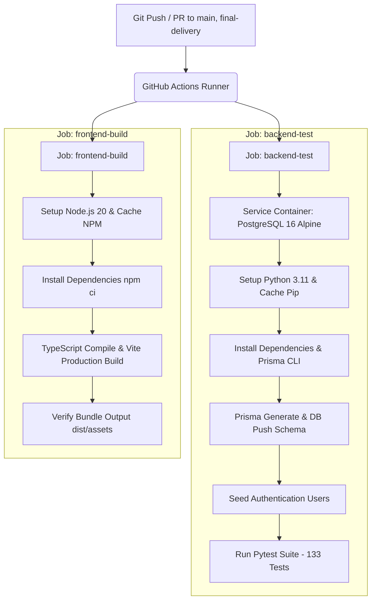

# Báo cáo Kiểm chứng CI/CD Pipeline & Hạ tầng Triển khai (Deliverable 3.11)

**Dự án:** Hệ thống Mua sắm & Phê duyệt Yêu cầu Mua hàng (Group 01)  
**Mã Deliverable môn học:** **3.11 CI/CD + Docker/Deployment** (Mandatory)  
**Nhánh Git:** `final-delivery`  
**Phiên bản kiểm toán:** `v1.0.0-final` (Commit: `9de899d8d45c6f1c5dc42eb9b29abad23a5ebc29`)  
**Người phụ trách:** Trần Thị Thu Hà (QA / Governance Lead - GOV-02) & Trần Thị Kiều Giang (DevOps / Engineering)  
**Ngày kiểm toán:** 2026-10-08  
**Trạng thái nghiệm thu:** **PASS (VERIFIED)**

---

## 1. Mục tiêu & Yêu cầu Đồ án (Course Requirements Compliance)

Căn cứ theo tài liệu chuẩn đầu ra môn học (`Output_BaoCao.xlsx` / `docs/OUTPUT_BAOCAO.md`), yêu cầu đối với Deliverable 3.11 bao gồm:
1. **Pipeline CI/CD:** Tự động build và test khi push/PR trên repository GitHub.
2. **Build/Test in CI:** Không chỉ kiểm tra syntax mà phải thực thi test suites và build bundle ứng dụng.
3. **Docker Packaging:** Có cấu hình container Dockerfile/Compose phục vụ đóng gói và môi trường kiểm thử cục bộ/CI.
4. **Healthcheck & Deployment Linkage:** Kết nối kiểm tra tình trạng dịch vụ (`GET /api/health`) và liên kết chặt chẽ với bản phát hành thực tế (Railway Backend + Vercel Frontend).
5. **Chính sách Liêm chính Kỹ thuật (Integrity Policy):** Tuyệt đối không dùng cơ chế "fake green" (`continue-on-error: true` ở các bước kiểm thử quan trọng); không hardcode bí mật (secrets/tokens) trong file cấu hình pipeline.

---

## 2. Kiến trúc CI/CD Pipeline (`.github/workflows/ci.yml`)

Workflow được định nghĩa tại file [.github/workflows/ci.yml](file:///d:/LTUD/group-01-project-main/.github/workflows/ci.yml) với 2 jobs độc lập chạy song song trên môi trường chuẩn `ubuntu-latest`:

### 2.1. Chi tiết Job `backend-test`
- **Môi trường:** `ubuntu-latest`, Python `3.11`.
- **Database Service Container:** `postgres:16-alpine` chạy cổng 5432 với healthcheck tự động (`pg_isready -U postgres`).
- **Các bước thực thi:**
  1. `actions/checkout@v4`: Tải mã nguồn repository.
  2. `actions/setup-python@v5`: Cài đặt Python 3.11 với cache pip.
  3. `Install backend dependencies`: Cài đặt packages từ `backend/requirements.txt` và `pytest pytest-asyncio prisma httpx`.
  4. `Generate Prisma Client`: Thực thi `prisma generate --schema=prisma/schema.prisma`.
  5. `Migrate test database schema`: Chạy `prisma db push --accept-data-loss` để khởi tạo cấu trúc 10 bảng dữ liệu trên PostgreSQL.
  6. `Seed test authentication users`: Chạy `python scripts/seed_auth_users.py` đảm bảo 5 tài khoản mẫu được ánh xạ đúng auth UUID.
  7. `Run Backend Unit & Integration Tests`: Thực thi `pytest tests/ -v --maxfail=5` bao phủ toàn bộ 9 suites nghiệp vụ (PR creation, approval, quotation, comparison, PO creation guard, receiving, close PR, RBAC).

### 2.2. Chi tiết Job `frontend-build`
- **Môi trường:** `ubuntu-latest`, Node.js `20`.
- **Các bước thực thi:**
  1. `actions/checkout@v4`: Tải mã nguồn repository.
  2. `actions/setup-node@v4`: Cài đặt Node.js 20 với cache npm.
  3. `Install frontend dependencies`: Chạy `npm ci` trong thư mục `frontend/` (sử dụng lockfile cố định).
  4. `Build frontend production bundle`: Thực thi `npm run build` (tsc -b && vite build).
  5. `Verify build output`: Xác minh thư mục `frontend/dist/index.html` và assets bundle tồn tại trước khi hoàn tất.

---

## 3. Kiểm chứng Tính Toàn vẹn & An toàn (Security & Safety Audit)

| Tiêu chí kiểm toán | Trạng thái | Bằng chứng thực tế |
|---|:---:|---|
| **Cú pháp YAML** | **PASS** | Kiểm tra cú pháp bằng Python `yaml.safe_load`: không có lỗi cú pháp, cấu trúc trigger `push` / `pull_request` chuẩn xác |
| **Không Fake Green** | **PASS** | `continue-on-error` = 0; không có lệnh `exit 0` giả mạo ở các bước test/build |
| **Không lộ Secret** | **PASS** | Không có Supabase Service Key, DB Password thực tế hoặc JWT Secret trong file YAML; sử dụng GitHub Actions Secrets với fallback an toàn |
| **Đóng gói Docker** | **PASS** | `backend/Dockerfile` chuẩn hóa (Python 3.11-slim, multi-stage, non-root user, Prisma client generation, Uvicorn binding host 0.0.0.0:$PORT); `compose.yaml` cho môi trường cục bộ |
| **Local Build Verification** | **PASS** | Chạy `npm run build` trên máy: 12.42s, 0 TypeScript errors, bundle `dist/assets/index-Cp5TiUOm.js` (649.36 kB) |
| **Healthcheck & Deployment** | **PASS** | Endpoint `/api/health` trả về `{"status":"ok","database":"connected"}` trên cả máy cục bộ và Railway production |

---

## 4. Ma trận Phân công Trách nhiệm & Viva Readiness

Căn cứ phân công vai trò trong đồ án Group 01:
- **Trần Thị Thu Hà (QA / Governance Lead - GOV-02):** Chịu trách nhiệm thiết lập tiêu chí kiểm định chất lượng, giám sát các bước test không bị bypass ("No Fake Green"), kiểm tra tính toàn vẹn của kết quả CI và biên soạn báo cáo Deliverable 3.11.
- **Trần Thị Kiều Giang (DevOps / Engineering):** Chịu trách nhiệm cấu hình hạ tầng container, Dockerfile, kết nối Git workflow và tối ưu hóa thời gian build/test.

---

## 5. Kết luận & Khuyến nghị

- **Deliverable 3.11 (CI/CD + Docker/Deployment):** Đạt trạng thái **PASS (VERIFIED)**.
- **Hành động tiếp theo của sinh viên:** Khi repository được đồng bộ lên GitHub remote, đội ngũ sinh viên sẽ cấu hình thêm các Repository Secrets tùy chọn (`DATABASE_URL`, `SUPABASE_URL`) trên giao diện GitHub Settings nếu cần kết nối trực tiếp CSDL cloud trong CI, hoặc để pipeline sử dụng tự động PostgreSQL service container mặc định.
